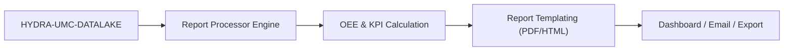

<p align="center">
  
</p>

# 📈 HYDRA-UMC-PRODUCTION-REPORTS

<p align="center">🇺🇸 <b>English</b> | <a href="README_spa.md">🇪🇸 Español</a> | <a href="README_fra.md">🇫🇷 Français</a> | <a href="README_ita.md">🇮🇹 Italiano</a> | <a href="README_deu.md">🇩🇪 Deutsch</a> | <a href="README_zho.md">🇨🇳 简体中文</a> | <a href="README_jpn.md">🇯🇵 日本語</a></p>

### 📑 Automated KPI & OEE Reporting Engine for Plant Managers

<p align="left">
  
  
  
</p>

---

## 1. 🛠️ TECHNICAL OVERVIEW

**HYDRA-UMC-PRODUCTION-REPORTS** is the analytical brain for factory management. It processes raw data from the Datalake to generate automated, high-level reports on production efficiency, quality, and machine availability.

It calculates the **OEE (Overall Equipment Effectiveness)** of the entire swarm, identifying bottlenecks in the production line and providing traceability for every component manufactured, from thermal solder profiles to Pick-and-Place accuracy.

### Key Features:
* 📈 **OEE Calculation:** Real-time metrics for Availability, Performance, and Quality.
* 📑 **Automated Reporting:** Daily, weekly, and monthly PDF/CSV summaries sent to managers.
* 🛠️ **Bottleneck Analysis:** Identifies which robots or tools are causing delays in the mission queue.
* 🌡️ **Quality Traceability:** Links every final product to its specific assembly logs (thermal, visual, mechanical).

---

## 2. 🔄 REPORTING FLOW



---

## 3. 🧱 ARCHITECTURE & DESIGN DECISIONS

* **Why this is a sibling, not a submodule, of HYDRA-UMC-DATALAKE.** Report generation is a periodic, read-only query+compute job against already-stored telemetry - keeping it separate means a report run never competes with HYDRA-UMC-TELEMETRY-COLLECTOR's own real-time writes for the same store's resources. This project holds no database of its own.
* **Real HTTP integration, not a shared library.** `datalake_client.py` talks to a running HYDRA-UMC-DATALAKE instance over plain HTTP (`GET /query`), and deliberately does **not** import DATALAKE's Python package directly even though both currently live in the same dev environment - real HTTP is the real, decoupled integration seam that matches how separate repos/services would actually talk to each other in production.
* **The `production_event` schema is this project's own v0 convention, not an ecosystem standard.** OEE needs to know, per completed cycle, whether the part was good and how long the cycle took. This project defines that as one DATALAKE `Sample` per cycle, `kind="production_event"`, with two fields written together at the same timestamp: `"good"` (1.0/0.0) and `"cycleTimeS"`. No other project writes this kind yet - HYDRA-UMC-JOB-DISPATCHER would be the real production source once it's wired to report completions this way (tracked in `mejoras_futuras.txt`).
* **Availability works against ANY existing telemetry stream, on purpose.** Unlike OEE, `availability.py` doesn't need the `production_event` convention at all - it takes any series of timestamps already sitting in DATALAKE (e.g. `motor_temp` samples HYDRA-UMC-TELEMETRY-COLLECTOR already writes) and flags a gap between consecutive samples larger than `expected_interval_ms x gap_factor` as real downtime. This is what actually lets this project "speak" with its telemetry siblings today, before any project writes `production_event` data for real.
* **Performance and Availability are clamped to `[0, 1]`.** A real cycle can run faster than a conservative "ideal" figure, or operating time can exceed a mis-set planned window; reporting >100% would be arithmetically defensible but practically misleading, so both are capped.
* **Unmatched `production_event` fields are counted and reported, never silently defaulted.** If a `"good"` reading has no matching `"cycleTimeS"` at the exact same timestamp (a partial/malformed write), it is excluded and the count of how many were excluded is included in the error/response rather than assuming a 0s cycle time, which would corrupt the Performance figure.

---

## 📂 DIRECTORY STRUCTURE

Pure-software service (report generation) - no hardware/firmware/os of its own, pruned from the template (see `SONNET/_papelera/` for ecosystem convention).

```text
HYDRA-UMC-PRODUCTION-REPORTS/
├── src/hydra_umc_production_reports/
│   ├── __init__.py           # Package version
│   ├── datalake_client.py    # Real HTTP client for HYDRA-UMC-DATALAKE's GET /query API
│   ├── oee.py                 # Real OEE formula (Availability x Performance x Quality)
│   ├── availability.py        # Real downtime-from-telemetry-gaps calculation
│   ├── reports.py             # Orchestration: DatalakeClient -> oee.py / availability.py
│   ├── api.py                  # Real HTTP API (GET /reports/oee, /reports/availability, /stats)
│   └── main.py                 # Entry point - starts the real HTTP server
├── tests/                    # Real tests, including round-trips against a fake DATALAKE HTTP server
├── pyproject.toml            # Package metadata + [dev] extras (pytest)
├── bump_version.py           # Odometer-style version bump (run by build)
├── build.sh / build.bat      # Real build: venv + editable install + real test suite
├── run.sh / run.bat          # Real run: starts the HTTP API
└── README.md
```

---

## 4. ⚙️ BUILD & RUN

Requires Python >= 3.10.

```bash
# Linux/macOS
./build.sh && ./run.sh --datalake-url http://localhost:8095

# Windows
build.bat
run.bat --datalake-url http://localhost:8095
```

`build` creates/activates a local `.venv`, installs the package in editable mode with dev extras, verifies the import, and runs the real `pytest` suite. `run` starts the real HTTP API (default port `8099`) against a HYDRA-UMC-DATALAKE instance at `--datalake-url` (default `http://localhost:8095`).

```bash
# Real OEE report for source "robot-1" over a 5-second window
curl "http://localhost:8099/reports/oee?sourceId=robot-1&start=0&end=5000&plannedTimeS=10.0&idealCycleTimeS=2.0"

# Real availability report for the same source's motor_temp stream
curl "http://localhost:8099/reports/availability?sourceId=robot-1&kind=motor_temp&field=value&start=0&end=10000&expectedIntervalMs=1000"
```

---

## 🚀 ROADMAP
* **Done (v0):** real OEE and availability calculation, real HTTP integration with HYDRA-UMC-DATALAKE, real HTTP API.
* **Next:** a real `production_event` data source - wiring HYDRA-UMC-JOB-DISPATCHER to report cycle completions in this schema.
* **Next:** persistent/scheduled reports (currently every report is computed live, on request).
* **Later:** PDF/CSV export and a dashboard, per the original roadmap below.
* AI-driven ROI analysis for tool upgrades, ties into the same OEE data once historical trends are stored.

---

## 🔗 Related Projects

This project is part of a larger robotics ecosystem by the same author (JuanenRac / Electro Hobby 3D), spanning firmware, control software, AI nodes, and fleet tooling. Worth knowing about, since a request might actually be about one of these rather than this repository.

### Family

**Parent:** **[HYDRA-UMC-DATALAKE](https://github.com/JuanenRac/HYDRA-UMC-DATALAKE)** — the integration parent whose stored telemetry this project reports on.

**Siblings:**
- **[HYDRA-UMC-TELEMETRY-COLLECTOR](https://github.com/JuanenRac/HYDRA-UMC-TELEMETRY-COLLECTOR)** — sibling analytics service, same parent.
- **[HYDRA-UMC-ANOMALY-DETECTOR](https://github.com/JuanenRac/HYDRA-UMC-ANOMALY-DETECTOR)** — sibling analytics service, same parent.

### Directly Related (outside the family)

This project has no direct relation outside the Data & Analytics family (per the ecosystem's own relationship map) - see "Rest of the Ecosystem" below for everything else.

### Rest of the Ecosystem

**HYDRA-UMC platform** — the multi-robot micro-factory cell
- **[HYDRA-UMC](https://github.com/JuanenRac/HYDRA-UMC)** — the CM5 + STM32H745 motherboard orchestrating up to 8 robot arms.
- **[HYDRA-UMC-SERVER](https://github.com/JuanenRac/HYDRA-UMC-SERVER)** — the Express/WebSocket backend every control client talks to.
- **[HYDRA-UMC-STUDIO](https://github.com/JuanenRac/HYDRA-UMC-STUDIO)** — web-based control dashboard, multi-robot 3D visualization.
- **[HYDRA-UMC-ANDROID-CONTROL](https://github.com/JuanenRac/HYDRA-UMC-ANDROID-CONTROL)** — Android control app over Wi-Fi/Bluetooth.
- **[HYDRA-UMC-IOS-CONTROL](https://github.com/JuanenRac/HYDRA-UMC-IOS-CONTROL)** — iOS/iPadOS control app built in Flutter.
- **[HYDRA-UMC-SUITE](https://github.com/JuanenRac/HYDRA-UMC-SUITE)** — desktop swarm command center (Python/PySide6).
- **[HYDRA-UMC-EDITOR-URDF](https://github.com/JuanenRac/HYDRA-UMC-EDITOR-URDF)** — desktop URDF model editor for the robot catalog.
- **[HYDRA-UMC-DSI](https://github.com/JuanenRac/HYDRA-UMC-DSI)** — native touch UI for the onboard DSI touchscreen.

**URTC platform** — the tool head controller every HYDRA-UMC robot arm carries
- **[URTC](https://github.com/JuanenRac/URTC)** — CAN bus tool head controller, 25 tool profiles.
- **[URTC-FLASHER](https://github.com/JuanenRac/URTC-FLASHER)** — desktop CAN-OTA + SWD/JTAG flashing tool.
- **[URTC-TESTER](https://github.com/JuanenRac/URTC-TESTER)** — desktop live CAN-bus diagnostic tool.
- **[URTC-WEB-STUDIO](https://github.com/JuanenRac/URTC-WEB-STUDIO)** — browser-based alternative via Web Serial API.

**🎥 Vision AI Node (Hailo-8)**
- [HYDRA-UMC-VISION-NODE](https://github.com/JuanenRac/HYDRA-UMC-VISION-NODE)
- [HYDRA-UMC-VISION-STREAMER](https://github.com/JuanenRac/HYDRA-UMC-VISION-STREAMER)
- [HYDRA-UMC-DETECTION-HEF](https://github.com/JuanenRac/HYDRA-UMC-DETECTION-HEF)
- [HYDRA-UMC-SAFETY-ZONES](https://github.com/JuanenRac/HYDRA-UMC-SAFETY-ZONES)
- [HYDRA-UMC-VISUAL-SERVOING-API](https://github.com/JuanenRac/HYDRA-UMC-VISUAL-SERVOING-API)

**🧠 Cognitive AI Node (Hailo-10)**
- [HYDRA-UMC-COGNITIVE-NODE](https://github.com/JuanenRac/HYDRA-UMC-COGNITIVE-NODE)
- [HYDRA-UMC-VLA-ENGINE](https://github.com/JuanenRac/HYDRA-UMC-VLA-ENGINE)
- [HYDRA-UMC-VOICE-UI](https://github.com/JuanenRac/HYDRA-UMC-VOICE-UI)
- [HYDRA-UMC-SEMANTIC-PLANNER](https://github.com/JuanenRac/HYDRA-UMC-SEMANTIC-PLANNER)
- [HYDRA-UMC-DOCS-QA](https://github.com/JuanenRac/HYDRA-UMC-DOCS-QA)

**🐝 Orchestration & Swarm**
- [HYDRA-UMC-ORCHESTRATOR](https://github.com/JuanenRac/HYDRA-UMC-ORCHESTRATOR)
- [HYDRA-UMC-SWARM-SYNC](https://github.com/JuanenRac/HYDRA-UMC-SWARM-SYNC)
- [HYDRA-UMC-PATH-PLANNER-3D](https://github.com/JuanenRac/HYDRA-UMC-PATH-PLANNER-3D)
- [HYDRA-UMC-JOB-DISPATCHER](https://github.com/JuanenRac/HYDRA-UMC-JOB-DISPATCHER)
- [HYDRA-UMC-NODE-HEALING](https://github.com/JuanenRac/HYDRA-UMC-NODE-HEALING)

**🎮 Digital Twin & Simulation**
- [HYDRA-UMC-TWIN](https://github.com/JuanenRac/HYDRA-UMC-TWIN)
- [HYDRA-UMC-PHYSICS-REPLICA](https://github.com/JuanenRac/HYDRA-UMC-PHYSICS-REPLICA)
- [HYDRA-UMC-HIL-BRIDGE](https://github.com/JuanenRac/HYDRA-UMC-HIL-BRIDGE)
- [HYDRA-UMC-SYNTHETIC-DATA-GEN](https://github.com/JuanenRac/HYDRA-UMC-SYNTHETIC-DATA-GEN)

**🏭 Industrial Gateway**
- [HYDRA-UMC-GATEWAY-INDUSTRIAL](https://github.com/JuanenRac/HYDRA-UMC-GATEWAY-INDUSTRIAL)
- [HYDRA-UMC-OPCUA-SERVER](https://github.com/JuanenRac/HYDRA-UMC-OPCUA-SERVER)
- [HYDRA-UMC-MQTT-BROKER](https://github.com/JuanenRac/HYDRA-UMC-MQTT-BROKER)
- [HYDRA-UMC-MTCONNECT-ADAPTER](https://github.com/JuanenRac/HYDRA-UMC-MTCONNECT-ADAPTER)

**🛠️ Complementary Tools**
- [URTC-SMART-RACK](https://github.com/JuanenRac/URTC-SMART-RACK)
- [URTC-VISION-TOOL](https://github.com/JuanenRac/URTC-VISION-TOOL)
- [HYDRA-UMC-WATCH](https://github.com/JuanenRac/HYDRA-UMC-WATCH)
- [HYDRA-UMC-TOOL-CLI](https://github.com/JuanenRac/HYDRA-UMC-TOOL-CLI)
- [HYDRA-UMC-DASHBOARD-AI](https://github.com/JuanenRac/HYDRA-UMC-DASHBOARD-AI)


## 👤 AUTHOR
**JuanenRac** (Electro Hobby 3D)
📧 electrohobby3d@gmail.com

## 📜 LICENSE
GPL-3.0 - See LICENSE for details.
