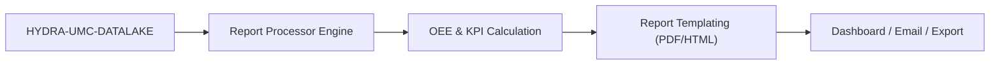

<p align="center">
  
</p>

# 📈 HYDRA-UMC-PRODUCTION-REPORTS

<p align="center">🇺🇸 <b>English</b> | <a href="README_spa.md">🇪🇸 Español</a> | <a href="README_fra.md">🇫🇷 Français</a> | <a href="README_ita.md">🇮🇹 Italiano</a> | <a href="README_deu.md">🇩🇪 Deutsch</a> | <a href="README_zho.md">🇨🇳 简体中文</a> | <a href="README_jpn.md">🇯🇵 日本語</a></p>

### 📑 Automated KPI & OEE Reporting Engine for Plant Managers

<p align="left">
  
  
  
</p>

---

## 1. 🛠️ TECHNICAL OVERVIEW

**HYDRA-UMC-PRODUCTION-REPORTS** is the analytical brain for factory management. It processes raw data from the Datalake to generate automated, high-level reports on production efficiency, quality, and machine availability.

It calculates the **OEE (Overall Equipment Effectiveness)** of the entire swarm, identifying bottlenecks in the production line and providing traceability for every component manufactured, from thermal solder profiles to Pick-and-Place accuracy.

### Key Features:
* 📈 **OEE Calculation:** Real-time metrics for Availability, Performance, and Quality.
* 📑 **Automated Reporting:** Daily, weekly, and monthly PDF/CSV summaries sent to managers.
* 🛠️ **Bottleneck Analysis:** Identifies which robots or tools are causing delays in the mission queue.
* 🌡️ **Quality Traceability:** Links every final product to its specific assembly logs (thermal, visual, mechanical).
* 🕐 **Shift/Day Boundaries:** `shift.py` gives every report a single, real source of truth for where a shift or calendar day starts/ends - including a real night shift crossing midnight. *(implemented)*
* 🧾 **Versioned Formulas + Traceability:** Every report carries its real `formula_version` and a sha256 `input_fingerprint` over the exact data that produced it. *(implemented)*
* 📤 **Reproducible CSV Export:** `GET /reports/{oee,availability}/export` - byte-for-byte identical output for identical inputs, not just "close enough". *(implemented)*

---

## 2. 🔄 REPORTING FLOW



---

## 3. 🧱 ARCHITECTURE & DESIGN DECISIONS

* **Why this is a sibling, not a submodule, of HYDRA-UMC-DATALAKE.** Report generation is a periodic, read-only query+compute job against already-stored telemetry - keeping it separate means a report run never competes with HYDRA-UMC-TELEMETRY-COLLECTOR's own real-time writes for the same store's resources. This project holds no database of its own.
* **Real HTTP integration, not a shared library.** `datalake_client.py` talks to a running HYDRA-UMC-DATALAKE instance over plain HTTP (`GET /query`), and deliberately does **not** import DATALAKE's Python package directly even though both currently live in the same dev environment - real HTTP is the real, decoupled integration seam that matches how separate repos/services would actually talk to each other in production.
* **The `production_event` schema is this project's own v0 convention, not an ecosystem standard.** OEE needs to know, per completed cycle, whether the part was good and how long the cycle took. This project defines that as one DATALAKE `Sample` per cycle, `kind="production_event"`, with two fields written together at the same timestamp: `"good"` (1.0/0.0) and `"cycleTimeS"`. No other project writes this kind yet - HYDRA-UMC-JOB-DISPATCHER would be the real production source once it's wired to report completions this way (tracked in `mejoras_futuras.txt`).
* **Availability works against ANY existing telemetry stream, on purpose.** Unlike OEE, `availability.py` doesn't need the `production_event` convention at all - it takes any series of timestamps already sitting in DATALAKE (e.g. `motor_temp` samples HYDRA-UMC-TELEMETRY-COLLECTOR already writes) and flags a gap between consecutive samples larger than `expected_interval_ms x gap_factor` as real downtime. This is what actually lets this project "speak" with its telemetry siblings today, before any project writes `production_event` data for real.
* **Performance and Availability are clamped to `[0, 1]`.** A real cycle can run faster than a conservative "ideal" figure, or operating time can exceed a mis-set planned window; reporting >100% would be arithmetically defensible but practically misleading, so both are capped.
* **Unmatched `production_event` fields are counted and reported, never silently defaulted.** If a `"good"` reading has no matching `"cycleTimeS"` at the exact same timestamp (a partial/malformed write), it is excluded and the count of how many were excluded is included in the error/response rather than assuming a 0s cycle time, which would corrupt the Performance figure.
* **Why `shift.py` is a separate module, not inline math in `oee.py`/`availability.py`.** Two reports that quietly disagree about where a shift or calendar day cuts off produce two different, both-defensible numbers for the same real window - the exact contradiction the promotion audit called out. Making shift/day boundaries their own real, tested module (with a real night shift crossing midnight, and a real inverse timestamp-to-shift lookup) gives every report the same source of truth instead of each caller re-deriving its own.
* **Why `formula_version` and `input_fingerprint` are on the report, not just in the CSV.** A report consumed as JSON (by a dashboard, another service) deserves the same traceability as one exported to a file - both fields are additive on the existing `GET /reports/oee`/`GET /reports/availability` responses, not something only visible in `export.py`'s output.
* **Why the CSV export is a new endpoint, not a `?format=csv` flag on the existing routes.** Keeping `GET /reports/oee`/`GET /reports/availability` untouched (still real, still JSON, still exactly what `tests/test_api.py` already asserted) meant the export feature could be added and proven reproducible without touching a single already-tested response.

---

## 📂 DIRECTORY STRUCTURE

Pure-software service (report generation) - no hardware, firmware or OS of its own; those folders are omitted by repository structure policy.

```text
HYDRA-UMC-PRODUCTION-REPORTS/
├── src/hydra_umc_production_reports/
│   ├── __init__.py           # Package version
│   ├── datalake_client.py    # Real HTTP client for HYDRA-UMC-DATALAKE's GET /query API
│   ├── oee.py                 # Real OEE formula (Availability x Performance x Quality)
│   ├── availability.py        # Real downtime-from-telemetry-gaps calculation
│   ├── reports.py             # Orchestration: DatalakeClient -> oee.py / availability.py
│   ├── shift.py                # Real shift/day-boundary computation (source of truth)
│   ├── export.py               # Real, byte-for-byte reproducible CSV export
│   ├── api.py                  # Real HTTP API (GET /reports/oee, /reports/availability, /stats, /export)
│   └── main.py                 # Entry point - starts the real HTTP server
├── tests/                    # Real tests: OEE/availability/shift/export math, fake-DATALAKE round-trips
├── docs/
│   └── API.md                 # Real HTTP endpoint reference (requests, responses, status codes)
├── images/                   # Media and diagrams
├── systemd/
│   └── hydra-umc-production-reports.service # Local CM5 reports API systemd unit
├── tools/
│   ├── build_test.py         # Non-versioning build/compile check
│   └── ci_validate.py        # Manifest/CHANGELOG/docs validation used by CI
├── pyproject.toml            # Package metadata + [dev] extras (pytest)
├── bump_version.py           # Odometer-style native version bump (run by build)
├── bump_manifest_version.py  # Syncs hydra-umc.project.json's version to the native one (--sync)
├── build.sh / build.bat      # Real build: venv + editable install + real test suite
├── run.sh / run.bat          # Real run: starts the HTTP API
└── README.md
```

See [`docs/API.md`](docs/API.md) for the full HTTP endpoint reference.

---

## 4. ⚙️ BUILD & RUN GUIDE

Requires Python >= 3.10.

```bash
# Linux/macOS
./build.sh && ./run.sh --datalake-url http://localhost:8095

# Windows
build.bat
run.bat --datalake-url http://localhost:8095
```

`build` creates/activates a local `.venv`, installs the package in editable mode with dev extras, verifies the import, and runs the real `pytest` suite. `run` starts the real HTTP API (default port `8099`) against a HYDRA-UMC-DATALAKE instance at `--datalake-url` (default `http://localhost:8095`).

```bash
# Real OEE report for source "robot-1" over a 5-second window
curl "http://localhost:8099/reports/oee?sourceId=robot-1&start=0&end=5000&plannedTimeS=10.0&idealCycleTimeS=2.0"

# Real availability report for the same source's motor_temp stream
curl "http://localhost:8099/reports/availability?sourceId=robot-1&kind=motor_temp&field=value&start=0&end=10000&expectedIntervalMs=1000"
```

---

## 🚀 ROADMAP
* **Done (v0):** real OEE and availability calculation, real HTTP integration with HYDRA-UMC-DATALAKE, real HTTP API.
* **Next:** a real `production_event` data source - wiring HYDRA-UMC-JOB-DISPATCHER to report cycle completions in this schema.
* **Next:** persistent/scheduled reports (currently every report is computed live, on request).
* **Later:** PDF/CSV export and a dashboard, per the original roadmap below.
* AI-driven ROI analysis for tool upgrades, ties into the same OEE data once historical trends are stored.

---

## 🔗 Related Projects

This project is part of the HYDRA-UMC robotics ecosystem by the same author (JuanenRac / Electro Hobby 3D). Worth knowing about, since a request might actually be about one of these rather than this repository.

**Parent Project**
- **[HYDRA-UMC-DATALAKE](https://github.com/JuanenRac/HYDRA-UMC-DATALAKE)** — real sqlite3-backed time-series store with a real ingest/query HTTP API; the parent this repo is one specific analytics service of, within its own data-and-analytics layer.

**Sibling Projects** — the other analytics services of HYDRA-UMC-DATALAKE's own data-and-analytics layer
- **[HYDRA-UMC-TELEMETRY-COLLECTOR](https://github.com/JuanenRac/HYDRA-UMC-TELEMETRY-COLLECTOR)** — real CAN/WebSocket ingestion pipeline into DATALAKE, with sequence deduplication — also a real data source today: this report's own `availability.py` reads its `motor_temp` samples (and any other series it writes) straight out of Datalake, no `production_event` convention needed for that report.
- **[HYDRA-UMC-ANOMALY-DETECTOR](https://github.com/JuanenRac/HYDRA-UMC-ANOMALY-DETECTOR)** — real FFT + statistical baseline anomaly detector with drift monitoring.

**Directly Related**
- **[HYDRA-UMC-JOB-DISPATCHER](https://github.com/JuanenRac/HYDRA-UMC-JOB-DISPATCHER)** — real priority-based job queue with deduplication, over a real HTTP API — the intended real source of `production_event` samples (OEE's own good/cycle-time convention) once mission completions are wired to write them; nothing writes that kind yet, tracked honestly as future work rather than claimed as done.

**Also Part of the Ecosystem**

*Core Hardware & Platform*
- **[HYDRA-UMC](https://github.com/JuanenRac/HYDRA-UMC)** — the physical robot-arm motherboard: CM5 host + dual-core STM32H745, orchestrating up to 8 tool arms over CAN-OTA/SPI-OTA.
- **[HYDRA-UMC-OS](https://github.com/JuanenRac/HYDRA-UMC-OS)** — reproducible Raspberry Pi OS product layer for the CM5: read-only agent, validated config/profiles, WiFi first-contact provisioning.
- **[HYDRA-UMC-SDK](https://github.com/JuanenRac/HYDRA-UMC-SDK)** — the shared JSON-Schema contract and safety-gate boundary every bridge validates its commands against.

*Core Backend & Clients*
- **[HYDRA-UMC-SERVER](https://github.com/JuanenRac/HYDRA-UMC-SERVER)** — the real headless backend (REST/WebSocket) every control client actually talks to.
- **[HYDRA-UMC-STUDIO](https://github.com/JuanenRac/HYDRA-UMC-STUDIO)** — web control dashboard with real-time multi-robot 3D visualization.
- **[HYDRA-UMC-SUITE](https://github.com/JuanenRac/HYDRA-UMC-SUITE)** — desktop (PySide6) swarm command center for multiple servers at once, packaged as a standalone executable.
- **[HYDRA-UMC-ANDROID-CONTROL](https://github.com/JuanenRac/HYDRA-UMC-ANDROID-CONTROL)** — native Android control app with biometric login and a paired Wear OS companion.
- **[HYDRA-UMC-IOS-CONTROL](https://github.com/JuanenRac/HYDRA-UMC-IOS-CONTROL)** — iOS/iPadOS control app (Flutter) with real-time WebSocket sync.
- **[HYDRA-UMC-DSI](https://github.com/JuanenRac/HYDRA-UMC-DSI)** — native touch UI for the onboard 7" DSI touchscreen, embedded on the CM5 itself.
- **[HYDRA-UMC-EDITOR-URDF](https://github.com/JuanenRac/HYDRA-UMC-EDITOR-URDF)** — desktop graphical URDF creator/editor that pushes finished models into STUDIO's own catalog.
- **[HYDRA-UMC-BRIDGE-AMR](https://github.com/JuanenRac/HYDRA-UMC-BRIDGE-AMR)** — coordination boundary for AGV/AMR fleets via a real VDA 5050 MQTT publisher.
- **[HYDRA-UMC-BRIDGE-CNC](https://github.com/JuanenRac/HYDRA-UMC-BRIDGE-CNC)** — high-level CNC-cell coordinator with real GRBL status/control-byte access.
- **[HYDRA-UMC-BRIDGE-DROIDS](https://github.com/JuanenRac/HYDRA-UMC-BRIDGE-DROIDS)** — coordination boundary for legged/humanoid droids, with a real Boston Dynamics Spot command sender.
- **[HYDRA-UMC-BRIDGE-LASER](https://github.com/JuanenRac/HYDRA-UMC-BRIDGE-LASER)** — laser-cell safety coordinator reading 3 real key/enclosure/interlock GPIO safeguards.
- **[HYDRA-UMC-BRIDGE-OPENPNP](https://github.com/JuanenRac/HYDRA-UMC-BRIDGE-OPENPNP)** — safe high-level board-flow coordinator for OpenPnP pick-and-place.
- **[HYDRA-UMC-BRIDGE-PRINTER3D](https://github.com/JuanenRac/HYDRA-UMC-BRIDGE-PRINTER3D)** — safe coordination boundary for Moonraker/Klipper 3D printers, with real gated job commands.
- **[HYDRA-UMC-BRIDGE-ROS2](https://github.com/JuanenRac/HYDRA-UMC-BRIDGE-ROS2)** — safety coordinator with a real, lazily-imported rclpy ROS 2 transport.
- **[HYDRA-UMC-BRIDGE-UAV](https://github.com/JuanenRac/HYDRA-UMC-BRIDGE-UAV)** — coordination boundary for camera-equipped UAVs, with a real MAVLink command sender.

*URTC Tool Platform*
- **[URTC](https://github.com/JuanenRac/URTC)** — firmware for the physical Universal Robot Tool Controller PCB, 25+ tool profiles over CAN bus.
- **[URTC-FLASHER](https://github.com/JuanenRac/URTC-FLASHER)** — desktop GUI flashing tool for URTC boards, CAN-OTA plus full-chip SWD/JTAG.
- **[URTC-TESTER](https://github.com/JuanenRac/URTC-TESTER)** — desktop live CAN-bus diagnostic tool for URTC boards, one panel per tool profile.
- **[URTC-WEB-STUDIO](https://github.com/JuanenRac/URTC-WEB-STUDIO)** — browser-based alternative to URTC-TESTER via the Web Serial API, no local install needed.

*Vision AI Node (Hailo-8)*
- **[HYDRA-UMC-VISION-NODE](https://github.com/JuanenRac/HYDRA-UMC-VISION-NODE)** — integration hub for the Hailo-8 vision pipeline, with a real per-stage hardware-readiness check.
- **[HYDRA-UMC-DETECTION-HEF](https://github.com/JuanenRac/HYDRA-UMC-DETECTION-HEF)** — real compiled-model registry with Hailo-architecture/checksum safe-load verification.
- **[HYDRA-UMC-VISION-STREAMER](https://github.com/JuanenRac/HYDRA-UMC-VISION-STREAMER)** — real GStreamer pipeline + MediaMTX config generator with a real HailoRT integration boundary.
- **[HYDRA-UMC-VISUAL-SERVOING-API](https://github.com/JuanenRac/HYDRA-UMC-VISUAL-SERVOING-API)** — real Position-Based Visual Servoing correction law, safety-gated on upstream zone state.
- **[HYDRA-UMC-SAFETY-ZONES](https://github.com/JuanenRac/HYDRA-UMC-SAFETY-ZONES)** — real zone-breach checking and E-STOP requesting, with calibration-freshness enforcement.

*Cognitive AI Node (Hailo-10)*
- **[HYDRA-UMC-COGNITIVE-NODE](https://github.com/JuanenRac/HYDRA-UMC-COGNITIVE-NODE)** — integration hub for the Hailo-10 cognitive pipeline (LLM/VLA/voice orchestration).
- **[HYDRA-UMC-VLA-ENGINE](https://github.com/JuanenRac/HYDRA-UMC-VLA-ENGINE)** — real action-token encoding/decoding and trajectory generation for a Vision-Language-Action model.
- **[HYDRA-UMC-VOICE-UI](https://github.com/JuanenRac/HYDRA-UMC-VOICE-UI)** — real voice front-end (VAD + intent parser) with a bounded, confirmation-gated Watch relay.
- **[HYDRA-UMC-SEMANTIC-PLANNER](https://github.com/JuanenRac/HYDRA-UMC-SEMANTIC-PLANNER)** — real rule-based task decomposition and semantic error recovery over MCU error codes.
- **[HYDRA-UMC-DOCS-QA](https://github.com/JuanenRac/HYDRA-UMC-DOCS-QA)** — real stdlib-only TF-IDF document search over this ecosystem's own Markdown docs.

*Orchestration & Swarm*
- **[HYDRA-UMC-ORCHESTRATOR](https://github.com/JuanenRac/HYDRA-UMC-ORCHESTRATOR)** — integration hub with a real gRPC/Protobuf health-report contract and mission state machine.
- **[HYDRA-UMC-NODE-HEALING](https://github.com/JuanenRac/HYDRA-UMC-NODE-HEALING)** — real gRPC-based fleet health watchdog with retry/backoff and identity-mismatch detection.
- **[HYDRA-UMC-PATH-PLANNER-3D](https://github.com/JuanenRac/HYDRA-UMC-PATH-PLANNER-3D)** — real RRT-based 3D path planner with real obstacle/workspace collision validation.
- **[HYDRA-UMC-SWARM-SYNC](https://github.com/JuanenRac/HYDRA-UMC-SWARM-SYNC)** — real CRDT LWW-Element-Map state sync, property-tested for multi-cell convergence.

*Digital Twin & Simulation*
- **[HYDRA-UMC-TWIN](https://github.com/JuanenRac/HYDRA-UMC-TWIN)** — integration hub for the digital-twin engine, with a real version-compatibility sync contract.
- **[HYDRA-UMC-HIL-BRIDGE](https://github.com/JuanenRac/HYDRA-UMC-HIL-BRIDGE)** — real hardware-in-the-loop safety interlock routing commands between simulation and real hardware.
- **[HYDRA-UMC-PHYSICS-REPLICA](https://github.com/JuanenRac/HYDRA-UMC-PHYSICS-REPLICA)** — real forward kinematics and joint-limit validation over a real URDF subset.
- **[HYDRA-UMC-SYNTHETIC-DATA-GEN](https://github.com/JuanenRac/HYDRA-UMC-SYNTHETIC-DATA-GEN)** — real procedural 2D scene generator with YOLO/COCO annotation export.

*Industrial Gateway*
- **[HYDRA-UMC-GATEWAY-INDUSTRIAL](https://github.com/JuanenRac/HYDRA-UMC-GATEWAY-INDUSTRIAL)** — integration hub relaying to industrial protocols, with a real command allowlist/backpressure layer.
- **[HYDRA-UMC-OPCUA-SERVER](https://github.com/JuanenRac/HYDRA-UMC-OPCUA-SERVER)** — real OPC-UA address space, verified with a real binary-protocol client session.
- **[HYDRA-UMC-MQTT-BROKER](https://github.com/JuanenRac/HYDRA-UMC-MQTT-BROKER)** — real MQTT broker with optional per-client authentication and topic ACLs.
- **[HYDRA-UMC-MTCONNECT-ADAPTER](https://github.com/JuanenRac/HYDRA-UMC-MTCONNECT-ADAPTER)** — real MTConnect `/probe` and `/current` XML endpoints with degraded-mode output.

*Complementary Tools & Ecosystem Operations*
- **[HYDRA-UMC-DASHBOARD-AI](https://github.com/JuanenRac/HYDRA-UMC-DASHBOARD-AI)** — Smart Summaries and Anomaly Highlighting panels over DATALAKE/ANOMALY-DETECTOR, with an honest statistical fallback.
- **[HYDRA-UMC-TOOL-CLI](https://github.com/JuanenRac/HYDRA-UMC-TOOL-CLI)** — fleet CLI with a real, stable exit-code contract, a genuine live client of HYDRA-UMC-SERVER's own API.
- **[HYDRA-UMC-WATCH](https://github.com/JuanenRac/HYDRA-UMC-WATCH)** — WearOS companion app with real haptic alerts and a paired-phone voice relay.
- **[URTC-SMART-RACK](https://github.com/JuanenRac/URTC-SMART-RACK)** — firmware for a board-mounting rack with real tool-ID decoding and Smart Idle pre-heating logic.
- **[URTC-VISION-TOOL](https://github.com/JuanenRac/URTC-VISION-TOOL)** — firmware plus a real Python vision companion for a thermal/RGB inspection tool head.
- **[HYDRA-UMC-UPDATER](https://github.com/JuanenRac/HYDRA-UMC-UPDATER)** — administrative desktop tool that discovers, clones and updates every repo in this ecosystem.


## 👤 AUTHOR
**JuanenRac** (Electro Hobby 3D)
📧 electrohobby3d@gmail.com
📺 [youtube.com/@electrohobby3d](https://youtube.com/@electrohobby3d)

## 📜 LICENSE
GPL-3.0 - See LICENSE for details.
