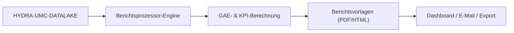

<p align="center">
  
</p>

# 📈 HYDRA-UMC-PRODUCTION-REPORTS

<p align="center"><a href="README.md">🇺🇸 English</a> | <a href="README_spa.md">🇪🇸 Español</a> | <a href="README_fra.md">🇫🇷 Français</a> | <a href="README_ita.md">🇮🇹 Italiano</a> | 🇩🇪 <b>Deutsch</b> | <a href="README_zho.md">🇨🇳 简体中文</a> | <a href="README_jpn.md">🇯🇵 日本語</a></p>

### 📑 Automatisierte KPI- & GAE-Berichts-Engine für Betriebsleiter

<p align="left">
  
  
  
</p>

---

## 1. 🛠️ TECHNISCHER ÜBERBLICK

**HYDRA-UMC-PRODUCTION-REPORTS** ist das analytische Gehirn für das Fabrikmanagement. Es verarbeitet Rohdaten aus dem Datalake, um automatisierte High-Level-Berichte über Produktionseffizienz, Qualität und Maschinenverfügbarkeit zu erstellen.

Es berechnet die **GAE (Gesamtanlageneffektivität / OEE)** des gesamten Schwarms, identifiziert Engpässe in der Produktionslinie und bietet Rückverfolgbarkeit für jede hergestellte Komponente, von thermischen Lötprofilen bis hin zur Pick-and-Place-Genauigkeit.

### Hauptmerkmale:
* 📈 **GAE-Berechnung:** Echtzeit-Metriken für Verfügbarkeit, Leistung und Qualität.
* 📑 **Automatisierte Berichterstattung:** Tägliche, wöchentliche und monatliche PDF/CSV-Zusammenfassungen für das Management.
* 🛠️ **Engpassanalyse:** Identifiziert, welche Roboter oder Werkzeuge Verzögerungen in der Missionswarteschlange verursachen.
* 🌡️ **Qualitätsrückverfolgbarkeit:** Verknüpft jedes Endprodukt mit seinen spezifischen Montageprotokollen (thermisch, visuell, mechanisch).

---

## 2. 🔄 BERICHTSABLAUF



---

## 3. 🧱 ARCHITEKTUR & DESIGNENTSCHEIDUNGEN

* **Warum es Geschwister, kein Submodul, von HYDRA-UMC-DATALAKE ist.** Berichtserstellung ist ein periodischer Abfrage+Berechnungs-Job über bereits gespeicherte Telemetrie - sie getrennt zu halten bedeutet, dass ein Berichtslauf nie mit den eigenen Echtzeit-Schreibvorgängen von HYDRA-UMC-TELEMETRY-COLLECTOR um die Ressourcen desselben Speichers konkurriert. Dieses Projekt besitzt keine eigene Datenbank.
* **Echte HTTP-Integration statt einer gemeinsamen Bibliothek.** `datalake_client.py` spricht über einfaches HTTP (`GET /query`) mit einer laufenden HYDRA-UMC-DATALAKE-Instanz und importiert bewusst NICHT das Python-Paket von DATALAKE direkt, obwohl beide heute in derselben Dev-Umgebung liegen - echtes HTTP ist die echte, entkoppelte Integrationsnaht, die dem entspricht, wie getrennte Repos/Dienste in der Produktion tatsächlich miteinander sprechen würden.
* **Das `production_event`-Schema ist die eigene v0-Konvention dieses Projekts, kein Ökosystem-Standard.** Für OEE muss für jeden abgeschlossenen Zyklus bekannt sein, ob das Teil gut war und wie lange der Zyklus dauerte. Dieses Projekt definiert das als ein DATALAKE-`Sample` pro Zyklus, `kind="production_event"`, mit zwei gemeinsam zum selben Zeitstempel geschriebenen Feldern: `"good"` (1.0/0.0) und `"cycleTimeS"`. Noch kein anderes Projekt schreibt diesen kind - HYDRA-UMC-JOB-DISPATCHER wäre die echte Produktionsquelle, sobald es angebunden ist, um Zyklusabschlüsse auf diese Weise zu melden (verfolgt in `mejoras_futuras.txt`).
* **Verfügbarkeit funktioniert absichtlich gegen JEDEN vorhandenen Telemetrie-Stream.** Anders als OEE benötigt `availability.py` überhaupt nicht die `production_event`-Konvention - es nimmt jede bereits in DATALAKE vorhandene Zeitstempel-Serie (z. B. `motor_temp`-Samples, die HYDRA-UMC-TELEMETRY-COLLECTOR bereits schreibt) und markiert eine Lücke zwischen aufeinanderfolgenden Samples, die größer als `expected_interval_ms x gap_factor` ist, als echte Ausfallzeit. Genau das erlaubt es diesem Projekt schon heute, mit seinen Telemetrie-Geschwistern zu "sprechen", noch bevor irgendein Projekt echte `production_event`-Daten schreibt.
* **Performance und Availability sind auf `[0, 1]` begrenzt.** Ein echter Zyklus kann schneller laufen als eine vorsichtige "Ideal"-Zahl, oder die Betriebszeit kann ein falsch eingestelltes Planfenster überschreiten; eine Meldung von >100% wäre rechnerisch vertretbar, aber praktisch irreführend, daher werden beide begrenzt.
* **Nicht zugeordnete `production_event`-Felder werden gezählt und gemeldet, niemals still auf einen Standardwert gesetzt.** Wenn ein `"good"`-Wert keinen passenden `"cycleTimeS"`-Wert zum exakt gleichen Zeitstempel hat (ein partieller/fehlerhafter Schreibvorgang), wird er ausgeschlossen, und die Anzahl der ausgeschlossenen Werte wird im Fehler/in der Antwort angegeben, statt eine Zykluszeit von 0s anzunehmen, was die Performance-Zahl verfälschen würde.

---

## 📂 VERZEICHNISSTRUKTUR

Reiner Software-Dienst (Berichtserstellung) - ohne eigene Hardware, Firmware oder Betriebssystem; diese Ordner werden gemäß der Repository-Strukturpolitik ausgelassen.

```text
HYDRA-UMC-PRODUCTION-REPORTS/
├── src/hydra_umc_production_reports/
│   ├── __init__.py           # Paketversion
│   ├── datalake_client.py    # Echter HTTP-Client für die GET /query API von HYDRA-UMC-DATALAKE
│   ├── oee.py                 # Echte OEE-Formel (Verfügbarkeit x Leistung x Qualität)
│   ├── availability.py        # Echte Downtime-Berechnung aus Telemetrie-Lücken
│   ├── reports.py             # Orchestrierung: DatalakeClient -> oee.py / availability.py
│   ├── api.py                  # Echte HTTP-API (GET /reports/oee, /reports/availability, /stats)
│   └── main.py                 # Einstiegspunkt - startet den echten HTTP-Server
├── tests/                    # Echte Tests, inklusive Round-Trips gegen ein simuliertes DATALAKE
├── pyproject.toml            # Paketmetadaten + [dev]-Extras (pytest)
├── bump_version.py           # Versionserhöhung im "Kilometerzähler"-Stil (vom Build ausgeführt)
├── build.sh / build.bat      # Echter Build: venv + editierbare Installation + echte Test-Suite
├── run.sh / run.bat          # Echte Ausführung: startet die HTTP-API
└── README.md
```

---

## 4. ⚙️ BUILD & AUSFÜHRUNG

Erfordert Python >= 3.10.

```bash
# Linux/macOS
./build.sh && ./run.sh --datalake-url http://localhost:8095

# Windows
build.bat
run.bat --datalake-url http://localhost:8095
```

`build` erstellt/aktiviert eine lokale `.venv`, installiert das Paket im editierbaren Modus mit Dev-Extras, prüft den Import und führt die echte `pytest`-Test-Suite aus. `run` startet die echte HTTP-API (Standardport `8099`) gegen eine HYDRA-UMC-DATALAKE-Instanz unter `--datalake-url` (Standard `http://localhost:8095`).

```bash
# Echter OEE-Bericht für Quelle "robot-1" über ein 5-Sekunden-Fenster
curl "http://localhost:8099/reports/oee?sourceId=robot-1&start=0&end=5000&plannedTimeS=10.0&idealCycleTimeS=2.0"

# Echter Verfügbarkeitsbericht für den motor_temp-Stream derselben Quelle
curl "http://localhost:8099/reports/availability?sourceId=robot-1&kind=motor_temp&field=value&start=0&end=10000&expectedIntervalMs=1000"
```

---

## 🚀 ROADMAP
* **Erledigt (v0):** echte OEE- und Verfügbarkeitsberechnung, echte HTTP-Integration mit HYDRA-UMC-DATALAKE, echte HTTP-API.
* **Als Nächstes:** eine echte `production_event`-Datenquelle - HYDRA-UMC-JOB-DISPATCHER anbinden, damit es Zyklusabschlüsse in diesem Schema meldet.
* **Als Nächstes:** persistente/geplante Berichte (heute wird jeder Bericht live, auf Anfrage berechnet).
* **Später:** echter PDF/CSV-Export und ein Dashboard, gemäß der ursprünglichen Roadmap unten.
* KI-gestützte ROI-Analyse für Werkzeug-Upgrades, verknüpft mit denselben OEE-Daten, sobald historische Trends gespeichert werden.

---

## 🔗 Verwandte Projekte

Dieses Projekt ist Teil eines größeren Robotik-Ökosystems desselben Autors (JuanenRac / Electro Hobby 3D), das Firmware, Steuerungssoftware, KI-Knoten und Flotten-Tools umfasst. Gut zu wissen, denn eine Anfrage könnte tatsächlich eines dieser Projekte betreffen statt dieses Repository.

### Familie

**Elternteil:** **[HYDRA-UMC-DATALAKE](https://github.com/JuanenRac/HYDRA-UMC-DATALAKE)** — der Integrations-Elternteil, über dessen gespeicherte Telemetrie dieses Projekt berichtet.

**Geschwister:**
- **[HYDRA-UMC-TELEMETRY-COLLECTOR](https://github.com/JuanenRac/HYDRA-UMC-TELEMETRY-COLLECTOR)** — Geschwister-Analysedienst, gleicher Elternteil.
- **[HYDRA-UMC-ANOMALY-DETECTOR](https://github.com/JuanenRac/HYDRA-UMC-ANOMALY-DETECTOR)** — Geschwister-Analysedienst, gleicher Elternteil.

### Direkte Beziehung (außerhalb der Familie)

Dieses Projekt hat keine direkte Beziehung außerhalb der Data & Analytics-Familie (laut der eigenen Beziehungskarte des Ökosystems) - siehe "Restliches Ökosystem" unten für alles andere.

### Restliches Ökosystem

**HYDRA-UMC-Plattform** — die Multi-Roboter-Mikrofabrikzelle
- **[HYDRA-UMC](https://github.com/JuanenRac/HYDRA-UMC)** — das CM5 + STM32H745-Motherboard, das bis zu 8 Roboterarme orchestriert.
- **[HYDRA-UMC-SERVER](https://github.com/JuanenRac/HYDRA-UMC-SERVER)** — das Express/WebSocket-Backend, mit dem jeder Steuerungsclient spricht.
- **[HYDRA-UMC-STUDIO](https://github.com/JuanenRac/HYDRA-UMC-STUDIO)** — webbasiertes Steuerungs-Dashboard, Multi-Roboter-3D-Visualisierung.
- **[HYDRA-UMC-ANDROID-CONTROL](https://github.com/JuanenRac/HYDRA-UMC-ANDROID-CONTROL)** — Android-Steuerungs-App über Wi-Fi/Bluetooth.
- **[HYDRA-UMC-IOS-CONTROL](https://github.com/JuanenRac/HYDRA-UMC-IOS-CONTROL)** — iOS/iPadOS-Steuerungs-App, gebaut in Flutter.
- **[HYDRA-UMC-SUITE](https://github.com/JuanenRac/HYDRA-UMC-SUITE)** — Desktop-Schwarm-Kommandozentrale (Python/PySide6).
- **[HYDRA-UMC-EDITOR-URDF](https://github.com/JuanenRac/HYDRA-UMC-EDITOR-URDF)** — Desktop-URDF-Modelleditor für den Roboterkatalog.
- **[HYDRA-UMC-DSI](https://github.com/JuanenRac/HYDRA-UMC-DSI)** — native Touch-UI für den eingebauten DSI-Touchscreen.

**URTC-Plattform** — der Werkzeugkopf-Controller, den jeder HYDRA-UMC-Roboterarm trägt
- **[URTC](https://github.com/JuanenRac/URTC)** — CAN-Bus-Werkzeugkopf-Controller, 25 Werkzeugprofile.
- **[URTC-FLASHER](https://github.com/JuanenRac/URTC-FLASHER)** — Desktop-Tool für CAN-OTA + SWD/JTAG-Flashing.
- **[URTC-TESTER](https://github.com/JuanenRac/URTC-TESTER)** — Desktop-Tool für Live-CAN-Bus-Diagnose.
- **[URTC-WEB-STUDIO](https://github.com/JuanenRac/URTC-WEB-STUDIO)** — browserbasierte Alternative über die Web-Serial-API.

**🎥 Vision AI Node (Hailo-8)**
- [HYDRA-UMC-VISION-NODE](https://github.com/JuanenRac/HYDRA-UMC-VISION-NODE)
- [HYDRA-UMC-VISION-STREAMER](https://github.com/JuanenRac/HYDRA-UMC-VISION-STREAMER)
- [HYDRA-UMC-DETECTION-HEF](https://github.com/JuanenRac/HYDRA-UMC-DETECTION-HEF)
- [HYDRA-UMC-SAFETY-ZONES](https://github.com/JuanenRac/HYDRA-UMC-SAFETY-ZONES)
- [HYDRA-UMC-VISUAL-SERVOING-API](https://github.com/JuanenRac/HYDRA-UMC-VISUAL-SERVOING-API)

**🧠 Cognitive AI Node (Hailo-10)**
- [HYDRA-UMC-COGNITIVE-NODE](https://github.com/JuanenRac/HYDRA-UMC-COGNITIVE-NODE)
- [HYDRA-UMC-VLA-ENGINE](https://github.com/JuanenRac/HYDRA-UMC-VLA-ENGINE)
- [HYDRA-UMC-VOICE-UI](https://github.com/JuanenRac/HYDRA-UMC-VOICE-UI)
- [HYDRA-UMC-SEMANTIC-PLANNER](https://github.com/JuanenRac/HYDRA-UMC-SEMANTIC-PLANNER)
- [HYDRA-UMC-DOCS-QA](https://github.com/JuanenRac/HYDRA-UMC-DOCS-QA)

**🐝 Orchestration & Swarm**
- [HYDRA-UMC-ORCHESTRATOR](https://github.com/JuanenRac/HYDRA-UMC-ORCHESTRATOR)
- [HYDRA-UMC-SWARM-SYNC](https://github.com/JuanenRac/HYDRA-UMC-SWARM-SYNC)
- [HYDRA-UMC-PATH-PLANNER-3D](https://github.com/JuanenRac/HYDRA-UMC-PATH-PLANNER-3D)
- [HYDRA-UMC-JOB-DISPATCHER](https://github.com/JuanenRac/HYDRA-UMC-JOB-DISPATCHER)
- [HYDRA-UMC-NODE-HEALING](https://github.com/JuanenRac/HYDRA-UMC-NODE-HEALING)

**🎮 Digital Twin & Simulation**
- [HYDRA-UMC-TWIN](https://github.com/JuanenRac/HYDRA-UMC-TWIN)
- [HYDRA-UMC-PHYSICS-REPLICA](https://github.com/JuanenRac/HYDRA-UMC-PHYSICS-REPLICA)
- [HYDRA-UMC-HIL-BRIDGE](https://github.com/JuanenRac/HYDRA-UMC-HIL-BRIDGE)
- [HYDRA-UMC-SYNTHETIC-DATA-GEN](https://github.com/JuanenRac/HYDRA-UMC-SYNTHETIC-DATA-GEN)

**🏭 Industrial Gateway**
- [HYDRA-UMC-GATEWAY-INDUSTRIAL](https://github.com/JuanenRac/HYDRA-UMC-GATEWAY-INDUSTRIAL)
- [HYDRA-UMC-OPCUA-SERVER](https://github.com/JuanenRac/HYDRA-UMC-OPCUA-SERVER)
- [HYDRA-UMC-MQTT-BROKER](https://github.com/JuanenRac/HYDRA-UMC-MQTT-BROKER)
- [HYDRA-UMC-MTCONNECT-ADAPTER](https://github.com/JuanenRac/HYDRA-UMC-MTCONNECT-ADAPTER)

**🛠️ Complementary Tools**
- [URTC-SMART-RACK](https://github.com/JuanenRac/URTC-SMART-RACK)
- [URTC-VISION-TOOL](https://github.com/JuanenRac/URTC-VISION-TOOL)
- [HYDRA-UMC-WATCH](https://github.com/JuanenRac/HYDRA-UMC-WATCH)
- [HYDRA-UMC-TOOL-CLI](https://github.com/JuanenRac/HYDRA-UMC-TOOL-CLI)
- [HYDRA-UMC-DASHBOARD-AI](https://github.com/JuanenRac/HYDRA-UMC-DASHBOARD-AI)


## 👤 AUTOR
**JuanenRac** (Electro Hobby 3D)
📧 electrohobby3d@gmail.com

## 📜 LIZENZ
GPL-3.0 - Siehe LICENSE für Details.

## 🛠️ BUILD & RUN

Verwenden Sie den Build-Check ohne Versionierung vor einem Release-Build:

| Aktion | Windows | Linux / macOS |
|---|---|---|
| Build-Check (ohne Änderung von Version oder CHANGELOG) | `build-test.bat` | `./build-test.sh` |
| Ausführung / Entwicklung (falls vorhanden) | `run*.bat` oder `dev*.bat` | `./run*.sh` oder `./dev*.sh` |

`build-test.bat` und `build-test.sh` kompilieren oder validieren den Projekt-Stack, ohne `hydra-umc.project.json` zu erhöhen oder `CHANGELOG.md` zu verändern. Sie dürfen nur normale Compiler-Ausgaben erzeugen. Die vorhandenen Skripte `build*.bat`, `build*.sh`, `run*` und `dev*` behalten ihr projektbezogenes Versions- oder Laufzeitverhalten bei; verwenden Sie sie, wenn dieses Verhalten benötigt wird.