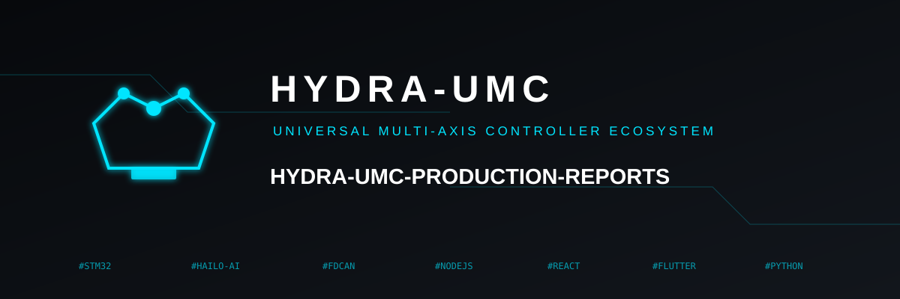
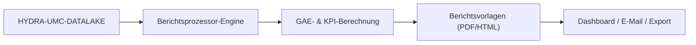

<p align="center">
  
</p>

# 📈 HYDRA-UMC-PRODUCTION-REPORTS

<p align="center"><a href="README.md">🇺🇸 English</a> | <a href="README_spa.md">🇪🇸 Español</a> | <a href="README_fra.md">🇫🇷 Français</a> | <a href="README_ita.md">🇮🇹 Italiano</a> | 🇩🇪 <b>Deutsch</b> | <a href="README_zho.md">🇨🇳 简体中文</a> | <a href="README_jpn.md">🇯🇵 日本語</a></p>

### 📑 Automatisierte KPI- & GAE-Berichts-Engine für Betriebsleiter

<p align="left">
  
  
  
</p>

---

## 1. 🛠️ TECHNISCHER ÜBERBLICK

**HYDRA-UMC-PRODUCTION-REPORTS** ist das analytische Gehirn für das Fabrikmanagement. Es verarbeitet Rohdaten aus dem Datalake, um automatisierte High-Level-Berichte über Produktionseffizienz, Qualität und Maschinenverfügbarkeit zu erstellen.

Es berechnet die **GAE (Gesamtanlageneffektivität / OEE)** des gesamten Schwarms, identifiziert Engpässe in der Produktionslinie und bietet Rückverfolgbarkeit für jede hergestellte Komponente, von thermischen Lötprofilen bis hin zur Pick-and-Place-Genauigkeit.

### Hauptmerkmale:
* 📈 **GAE-Berechnung:** Echtzeit-Metriken für Verfügbarkeit, Leistung und Qualität.
* 📑 **Automatisierte Berichterstattung:** Tägliche, wöchentliche und monatliche PDF/CSV-Zusammenfassungen für das Management.
* 🛠️ **Engpassanalyse:** Identifiziert, welche Roboter oder Werkzeuge Verzögerungen in der Missionswarteschlange verursachen.
* 🌡️ **Qualitätsrückverfolgbarkeit:** Verknüpft jedes Endprodukt mit seinen spezifischen Montageprotokollen (thermisch, visuell, mechanisch).
* 🕐 **Schicht-/Tagesgrenzen:** `shift.py` gibt jedem Bericht eine einzige, echte Quelle der Wahrheit dafür, wo eine Schicht oder ein Kalendertag beginnt/endet - einschließlich einer echten Nachtschicht, die über Mitternacht hinausgeht. *(implementiert)*
* 🧾 **Versionierte Formeln + Rückverfolgbarkeit:** Jeder Bericht trägt seine echte `formula_version` und einen sha256-`input_fingerprint` über die exakten Daten, die ihn erzeugt haben. *(implementiert)*
* 📤 **Reproduzierbarer CSV-Export:** `GET /reports/{oee,availability}/export` - byteidentische Ausgabe für identische Eingaben, nicht nur "nah genug". *(implementiert)*

---

## 2. 🔄 BERICHTSABLAUF



---

## 3. 🧱 ARCHITEKTUR & DESIGNENTSCHEIDUNGEN

* **Warum es Geschwister, kein Submodul, von HYDRA-UMC-DATALAKE ist.** Berichtserstellung ist ein periodischer Abfrage+Berechnungs-Job über bereits gespeicherte Telemetrie - sie getrennt zu halten bedeutet, dass ein Berichtslauf nie mit den eigenen Echtzeit-Schreibvorgängen von HYDRA-UMC-TELEMETRY-COLLECTOR um die Ressourcen desselben Speichers konkurriert. Dieses Projekt besitzt keine eigene Datenbank.
* **Echte HTTP-Integration statt einer gemeinsamen Bibliothek.** `datalake_client.py` spricht über einfaches HTTP (`GET /query`) mit einer laufenden HYDRA-UMC-DATALAKE-Instanz und importiert bewusst NICHT das Python-Paket von DATALAKE direkt, obwohl beide heute in derselben Dev-Umgebung liegen - echtes HTTP ist die echte, entkoppelte Integrationsnaht, die dem entspricht, wie getrennte Repos/Dienste in der Produktion tatsächlich miteinander sprechen würden.
* **Das `production_event`-Schema ist die eigene v0-Konvention dieses Projekts, kein Ökosystem-Standard.** Für OEE muss für jeden abgeschlossenen Zyklus bekannt sein, ob das Teil gut war und wie lange der Zyklus dauerte. Dieses Projekt definiert das als ein DATALAKE-`Sample` pro Zyklus, `kind="production_event"`, mit zwei gemeinsam zum selben Zeitstempel geschriebenen Feldern: `"good"` (1.0/0.0) und `"cycleTimeS"`. Noch kein anderes Projekt schreibt diesen kind - HYDRA-UMC-JOB-DISPATCHER wäre die echte Produktionsquelle, sobald es angebunden ist, um Zyklusabschlüsse auf diese Weise zu melden (verfolgt in `mejoras_futuras.txt`).
* **Verfügbarkeit funktioniert absichtlich gegen JEDEN vorhandenen Telemetrie-Stream.** Anders als OEE benötigt `availability.py` überhaupt nicht die `production_event`-Konvention - es nimmt jede bereits in DATALAKE vorhandene Zeitstempel-Serie (z. B. `motor_temp`-Samples, die HYDRA-UMC-TELEMETRY-COLLECTOR bereits schreibt) und markiert eine Lücke zwischen aufeinanderfolgenden Samples, die größer als `expected_interval_ms x gap_factor` ist, als echte Ausfallzeit. Genau das erlaubt es diesem Projekt schon heute, mit seinen Telemetrie-Geschwistern zu "sprechen", noch bevor irgendein Projekt echte `production_event`-Daten schreibt.
* **Performance und Availability sind auf `[0, 1]` begrenzt.** Ein echter Zyklus kann schneller laufen als eine vorsichtige "Ideal"-Zahl, oder die Betriebszeit kann ein falsch eingestelltes Planfenster überschreiten; eine Meldung von >100% wäre rechnerisch vertretbar, aber praktisch irreführend, daher werden beide begrenzt.
* **Nicht zugeordnete `production_event`-Felder werden gezählt und gemeldet, niemals still auf einen Standardwert gesetzt.** Wenn ein `"good"`-Wert keinen passenden `"cycleTimeS"`-Wert zum exakt gleichen Zeitstempel hat (ein partieller/fehlerhafter Schreibvorgang), wird er ausgeschlossen, und die Anzahl der ausgeschlossenen Werte wird im Fehler/in der Antwort angegeben, statt eine Zykluszeit von 0s anzunehmen, was die Performance-Zahl verfälschen würde.
* **Warum `shift.py` ein eigenständiges Modul ist, keine Inline-Mathematik in `oee.py`/`availability.py`.** Zwei Berichte, die sich still darüber uneinig sind, wo eine Schicht oder ein Kalendertag endet, erzeugen zwei unterschiedliche, beide vertretbare Zahlen für dasselbe reale Zeitfenster - genau der Widerspruch, den das Promotion-Audit bemängelt hat. Schicht-/Tagesgrenzen zu einem eigenen, echten, getesteten Modul zu machen (mit einer echten Nachtschicht über Mitternacht hinweg und einer echten inversen Zeitstempel-zu-Schicht-Suche) gibt jedem Bericht dieselbe Quelle der Wahrheit, statt dass jeder Aufrufer sie sich selbst neu herleitet.
* **Warum `formula_version` und `input_fingerprint` im Bericht stehen, nicht nur in der CSV.** Ein als JSON konsumierter Bericht (von einem Dashboard, einem anderen Dienst) verdient dieselbe Rückverfolgbarkeit wie einer, der in eine Datei exportiert wird - beide Felder sind additiv zu den bestehenden Antworten von `GET /reports/oee`/`GET /reports/availability`, nicht etwas, das nur in der Ausgabe von `export.py` sichtbar ist.
* **Warum der CSV-Export ein neuer Endpunkt ist, kein `?format=csv`-Flag auf den bestehenden Routen.** `GET /reports/oee`/`GET /reports/availability` unangetastet zu lassen (weiterhin echt, weiterhin JSON, weiterhin genau das, was `tests/test_api.py` bereits geprüft hat) bedeutete, dass die Export-Funktion hinzugefügt und als reproduzierbar nachgewiesen werden konnte, ohne eine einzige bereits getestete Antwort zu berühren.

---

## 📂 VERZEICHNISSTRUKTUR

Reiner Software-Dienst (Berichtserstellung) - ohne eigene Hardware, Firmware oder Betriebssystem; diese Ordner werden gemäß der Repository-Strukturpolitik ausgelassen.

```text
HYDRA-UMC-PRODUCTION-REPORTS/
├── src/hydra_umc_production_reports/
│   ├── __init__.py           # Paketversion
│   ├── datalake_client.py    # Echter HTTP-Client für die GET /query API von HYDRA-UMC-DATALAKE
│   ├── oee.py                 # Echte OEE-Formel (Verfügbarkeit x Leistung x Qualität)
│   ├── availability.py        # Echte Downtime-Berechnung aus Telemetrie-Lücken
│   ├── reports.py             # Orchestrierung: DatalakeClient -> oee.py / availability.py
│   ├── shift.py                # Echte Schicht-/Tagesgrenzen-Berechnung (Quelle der Wahrheit)
│   ├── export.py               # Echter, byteidentisch reproduzierbarer CSV-Export
│   ├── api.py                  # Echte HTTP-API (GET /reports/oee, /reports/availability, /stats, /export)
│   └── main.py                 # Einstiegspunkt - startet den echten HTTP-Server
├── tests/                    # Echte Tests: OEE-/Verfügbarkeits-/Schicht-/Export-Berechnungen, Round-Trips gegen ein simuliertes DATALAKE
├── docs/
│   └── API.md                 # Echte HTTP-Endpunktreferenz (Requests, Responses, Statuscodes)
├── images/                   # Medien und Diagramme
├── systemd/
│   └── hydra-umc-production-reports.service # systemd-Unit der lokalen CM5-Berichts-API
├── tools/
│   ├── build_test.py         # Nicht-versionierender Build-Check
│   └── ci_validate.py        # Manifest/CHANGELOG/Docs-Validierung, von CI genutzt
├── pyproject.toml            # Paketmetadaten + [dev]-Extras (pytest)
├── bump_version.py           # Native Versionserhöhung im "Kilometerzähler"-Stil (vom Build ausgeführt)
├── bump_manifest_version.py  # Synchronisiert die Version von hydra-umc.project.json mit der nativen (--sync)
├── build.sh / build.bat      # Echter Build: venv + editierbare Installation + echte Test-Suite
├── run.sh / run.bat          # Echte Ausführung: startet die HTTP-API
└── README.md
```

Siehe [`docs/API.md`](docs/API.md) für die vollständige HTTP-Endpunktreferenz.

---

## 4. ⚙️ BUILD & AUSFÜHRUNG

Erfordert Python >= 3.10.

```bash
# Linux/macOS
./build.sh && ./run.sh --datalake-url http://localhost:8095

# Windows
build.bat
run.bat --datalake-url http://localhost:8095
```

`build` erstellt/aktiviert eine lokale `.venv`, installiert das Paket im editierbaren Modus mit Dev-Extras, prüft den Import und führt die echte `pytest`-Test-Suite aus. `run` startet die echte HTTP-API (Standardport `8099`) gegen eine HYDRA-UMC-DATALAKE-Instanz unter `--datalake-url` (Standard `http://localhost:8095`).

```bash
# Echter OEE-Bericht für Quelle "robot-1" über ein 5-Sekunden-Fenster
curl "http://localhost:8099/reports/oee?sourceId=robot-1&start=0&end=5000&plannedTimeS=10.0&idealCycleTimeS=2.0"

# Echter Verfügbarkeitsbericht für den motor_temp-Stream derselben Quelle
curl "http://localhost:8099/reports/availability?sourceId=robot-1&kind=motor_temp&field=value&start=0&end=10000&expectedIntervalMs=1000"
```

---

## 🚀 FAHRPLAN
* **Erledigt (v0):** echte OEE- und Verfügbarkeitsberechnung, echte HTTP-Integration mit HYDRA-UMC-DATALAKE, echte HTTP-API.
* **Als Nächstes:** eine echte `production_event`-Datenquelle - HYDRA-UMC-JOB-DISPATCHER anbinden, damit es Zyklusabschlüsse in diesem Schema meldet.
* **Als Nächstes:** persistente/geplante Berichte (heute wird jeder Bericht live, auf Anfrage berechnet).
* **Später:** echter PDF/CSV-Export und ein Dashboard, gemäß der ursprünglichen Roadmap unten.
* KI-gestützte ROI-Analyse für Werkzeug-Upgrades, verknüpft mit denselben OEE-Daten, sobald historische Trends gespeichert werden.

---

## 🔗 Verwandte Projekte

Dieses Projekt ist Teil des HYDRA-UMC-Robotik-Ökosystems desselben Autors (JuanenRac / Electro Hobby 3D). Gut zu wissen, da eine Anfrage eigentlich eines dieser Projekte betreffen könnte statt dieses Repositorys.

**Übergeordnetes Projekt**
- **[HYDRA-UMC-DATALAKE](https://github.com/JuanenRac/HYDRA-UMC-DATALAKE)** — echter sqlite3-gestützter Zeitreihenspeicher mit einer echten Ingest-/Abfrage-HTTP-API; das übergeordnete Projekt, dessen spezifischer Analysedienst dieses Repository innerhalb seiner eigenen Daten- und Analytik-Schicht ist.

**Geschwisterprojekte** — die übrigen Analysedienste der eigenen Daten- und Analytik-Schicht von HYDRA-UMC-DATALAKE
- **[HYDRA-UMC-TELEMETRY-COLLECTOR](https://github.com/JuanenRac/HYDRA-UMC-TELEMETRY-COLLECTOR)** — echte CAN/WebSocket-Ingestion-Pipeline in DATALAKE, mit Sequenz-Deduplizierung — heute auch eine echte Datenquelle: das eigene `availability.py` dieses Reports liest dessen `motor_temp`-Samples (und jede andere Serie, die es schreibt) direkt aus Datalake, ohne dass für diesen Report die `production_event`-Konvention nötig wäre.
- **[HYDRA-UMC-ANOMALY-DETECTOR](https://github.com/JuanenRac/HYDRA-UMC-ANOMALY-DETECTOR)** — echter FFT- + statistischer Basislinien-Anomaliedetektor mit Drift-Überwachung.

**Direkt verwandt**
- **[HYDRA-UMC-JOB-DISPATCHER](https://github.com/JuanenRac/HYDRA-UMC-JOB-DISPATCHER)** — echte prioritätsbasierte Job-Queue mit Deduplizierung, über eine echte HTTP-API — die vorgesehene reale Quelle für `production_event`-Samples (OEEs eigene Gut-/Zykluszeit-Konvention), sobald Missionsabschlüsse zum Schreiben verdrahtet sind; bisher schreibt nichts diese Art, ehrlich als zukünftige Arbeit nachverfolgt statt als erledigt behauptet.

**Ebenfalls Teil des Ökosystems**

*Kern-Hardware & Plattform*
- **[HYDRA-UMC](https://github.com/JuanenRac/HYDRA-UMC)** — das physische Motherboard des Roboterarms: CM5-Host + Dual-Core-STM32H745, koordiniert bis zu 8 Werkzeugarme über CAN-OTA/SPI-OTA.
- **[HYDRA-UMC-OS](https://github.com/JuanenRac/HYDRA-UMC-OS)** — reproduzierbare Raspberry-Pi-OS-Produktschicht für den CM5: schreibgeschützter Agent, validierte Konfiguration/Profile, WiFi-Ersteinrichtung.
- **[HYDRA-UMC-SDK](https://github.com/JuanenRac/HYDRA-UMC-SDK)** — der gemeinsame JSON-Schema-Vertrag und die Sicherheitsschranke, gegen die jede Bridge ihre Befehle validiert.

*Kern-Backend & Clients*
- **[HYDRA-UMC-SERVER](https://github.com/JuanenRac/HYDRA-UMC-SERVER)** — das reale Headless-Backend (REST/WebSocket), mit dem jeder Steuerungsclient tatsächlich spricht.
- **[HYDRA-UMC-STUDIO](https://github.com/JuanenRac/HYDRA-UMC-STUDIO)** — Web-Steuerungs-Dashboard mit Echtzeit-3D-Visualisierung mehrerer Roboter.
- **[HYDRA-UMC-SUITE](https://github.com/JuanenRac/HYDRA-UMC-SUITE)** — Desktop-Schwarmleitstand (PySide6) für mehrere Server gleichzeitig, verpackt als eigenständige ausführbare Datei.
- **[HYDRA-UMC-ANDROID-CONTROL](https://github.com/JuanenRac/HYDRA-UMC-ANDROID-CONTROL)** — native Android-Steuerungs-App mit biometrischem Login und einer gekoppelten Wear-OS-Begleit-App.
- **[HYDRA-UMC-IOS-CONTROL](https://github.com/JuanenRac/HYDRA-UMC-IOS-CONTROL)** — iOS/iPadOS-Steuerungs-App (Flutter) mit Echtzeit-WebSocket-Synchronisierung.
- **[HYDRA-UMC-DSI](https://github.com/JuanenRac/HYDRA-UMC-DSI)** — native Touch-UI für das eingebaute 7"-DSI-Touchscreen, direkt auf dem CM5 eingebettet.
- **[HYDRA-UMC-EDITOR-URDF](https://github.com/JuanenRac/HYDRA-UMC-EDITOR-URDF)** — grafischer Desktop-URDF-Ersteller/-Editor, der fertige Modelle in STUDIOs eigenen Katalog überträgt.
- **[HYDRA-UMC-BRIDGE-AMR](https://github.com/JuanenRac/HYDRA-UMC-BRIDGE-AMR)** — Koordinationsschranke für AGV-/AMR-Flotten über einen echten VDA-5050-MQTT-Publisher.
- **[HYDRA-UMC-BRIDGE-CNC](https://github.com/JuanenRac/HYDRA-UMC-BRIDGE-CNC)** — High-Level-Koordinator für CNC-Zellen mit echtem GRBL-Status-/Steuerbyte-Zugriff.
- **[HYDRA-UMC-BRIDGE-DROIDS](https://github.com/JuanenRac/HYDRA-UMC-BRIDGE-DROIDS)** — Koordinationsschranke für laufende/humanoide Droiden, mit einem echten Boston-Dynamics-Spot-Befehlssender.
- **[HYDRA-UMC-BRIDGE-LASER](https://github.com/JuanenRac/HYDRA-UMC-BRIDGE-LASER)** — Sicherheitskoordinator für Laserzellen, liest 3 echte Schlüssel-/Gehäuse-/Verriegelungs-GPIO-Sicherungen.
- **[HYDRA-UMC-BRIDGE-OPENPNP](https://github.com/JuanenRac/HYDRA-UMC-BRIDGE-OPENPNP)** — sicherer High-Level-Koordinator für den Leiterplattenfluss von OpenPnP Pick-and-Place.
- **[HYDRA-UMC-BRIDGE-PRINTER3D](https://github.com/JuanenRac/HYDRA-UMC-BRIDGE-PRINTER3D)** — sichere Koordinationsschranke für Moonraker/Klipper-3D-Drucker, mit echten gesicherten Job-Befehlen.
- **[HYDRA-UMC-BRIDGE-ROS2](https://github.com/JuanenRac/HYDRA-UMC-BRIDGE-ROS2)** — Sicherheitskoordinator mit einem echten, träge importierten rclpy-ROS-2-Transport.
- **[HYDRA-UMC-BRIDGE-UAV](https://github.com/JuanenRac/HYDRA-UMC-BRIDGE-UAV)** — Koordinationsschranke für kameraausgestattete UAVs, mit einem echten MAVLink-Befehlssender.

*URTC-Werkzeugplattform*
- **[URTC](https://github.com/JuanenRac/URTC)** — Firmware für die physische Universal-Robot-Tool-Controller-Platine, 25+ Werkzeugprofile über CAN-Bus.
- **[URTC-FLASHER](https://github.com/JuanenRac/URTC-FLASHER)** — Desktop-GUI-Flash-Tool für URTC-Platinen, CAN-OTA plus Full-Chip-SWD/JTAG.
- **[URTC-TESTER](https://github.com/JuanenRac/URTC-TESTER)** — Desktop-Live-CAN-Bus-Diagnosetool für URTC-Platinen, ein Panel pro Werkzeugprofil.
- **[URTC-WEB-STUDIO](https://github.com/JuanenRac/URTC-WEB-STUDIO)** — browserbasierte Alternative zu URTC-TESTER über die Web-Serial-API, ohne lokale Installation.

*Vision-KI-Knoten (Hailo-8)*
- **[HYDRA-UMC-VISION-NODE](https://github.com/JuanenRac/HYDRA-UMC-VISION-NODE)** — Integrationsknoten für die Hailo-8-Vision-Pipeline, mit einer echten stufenweisen Hardware-Bereitschaftsprüfung.
- **[HYDRA-UMC-DETECTION-HEF](https://github.com/JuanenRac/HYDRA-UMC-DETECTION-HEF)** — echte Registry für kompilierte Modelle mit Hailo-Architektur-/Prüfsummen-Safe-Load-Verifizierung.
- **[HYDRA-UMC-VISION-STREAMER](https://github.com/JuanenRac/HYDRA-UMC-VISION-STREAMER)** — echter GStreamer-Pipeline- + MediaMTX-Konfigurationsgenerator mit einer echten HailoRT-Integrationsschranke.
- **[HYDRA-UMC-VISUAL-SERVOING-API](https://github.com/JuanenRac/HYDRA-UMC-VISUAL-SERVOING-API)** — echtes Position-Based-Visual-Servoing-Korrekturgesetz, sicherheitsgesteuert nach vorgelagertem Zonenstatus.
- **[HYDRA-UMC-SAFETY-ZONES](https://github.com/JuanenRac/HYDRA-UMC-SAFETY-ZONES)** — echte Zonenverletzungsprüfung und E-STOP-Anforderung, mit erzwungener Kalibrierungsaktualität.

*Kognitiver KI-Knoten (Hailo-10)*
- **[HYDRA-UMC-COGNITIVE-NODE](https://github.com/JuanenRac/HYDRA-UMC-COGNITIVE-NODE)** — Integrationsknoten für die Hailo-10-Cognitive-Pipeline (LLM-/VLA-/Sprach-Orchestrierung).
- **[HYDRA-UMC-VLA-ENGINE](https://github.com/JuanenRac/HYDRA-UMC-VLA-ENGINE)** — echte Aktions-Token-Kodierung/-Dekodierung und Trajektoriengenerierung für ein Vision-Language-Action-Modell.
- **[HYDRA-UMC-VOICE-UI](https://github.com/JuanenRac/HYDRA-UMC-VOICE-UI)** — echtes Sprach-Frontend (VAD + Intent-Parser) mit einem begrenzten, bestätigungsgesicherten Watch-Relay.
- **[HYDRA-UMC-SEMANTIC-PLANNER](https://github.com/JuanenRac/HYDRA-UMC-SEMANTIC-PLANNER)** — echte regelbasierte Aufgabenzerlegung und semantische Fehlerbehebung über MCU-Fehlercodes.
- **[HYDRA-UMC-DOCS-QA](https://github.com/JuanenRac/HYDRA-UMC-DOCS-QA)** — echte, nur auf der Standardbibliothek basierende TF-IDF-Dokumentensuche über die eigenen Markdown-Dokumente dieses Ökosystems.

*Orchestrierung & Schwarm*
- **[HYDRA-UMC-ORCHESTRATOR](https://github.com/JuanenRac/HYDRA-UMC-ORCHESTRATOR)** — Integrationsknoten mit einem echten gRPC/Protobuf-Health-Report-Vertrag und einer Missions-Zustandsmaschine.
- **[HYDRA-UMC-NODE-HEALING](https://github.com/JuanenRac/HYDRA-UMC-NODE-HEALING)** — echter gRPC-basierter Flotten-Health-Watchdog mit Retry/Backoff und Identitäts-Mismatch-Erkennung.
- **[HYDRA-UMC-PATH-PLANNER-3D](https://github.com/JuanenRac/HYDRA-UMC-PATH-PLANNER-3D)** — echter RRT-basierter 3D-Pfadplaner mit echter Hindernis-/Arbeitsraum-Kollisionsvalidierung.
- **[HYDRA-UMC-SWARM-SYNC](https://github.com/JuanenRac/HYDRA-UMC-SWARM-SYNC)** — echte CRDT-LWW-Element-Map-Zustandssynchronisation, eigenschaftsgetestet auf Multi-Zellen-Konvergenz.

*Digitaler Zwilling & Simulation*
- **[HYDRA-UMC-TWIN](https://github.com/JuanenRac/HYDRA-UMC-TWIN)** — Integrationsknoten für die Digital-Twin-Engine, mit einem echten Versionskompatibilitäts-Sync-Vertrag.
- **[HYDRA-UMC-HIL-BRIDGE](https://github.com/JuanenRac/HYDRA-UMC-HIL-BRIDGE)** — echte Hardware-in-the-Loop-Sicherheitsverriegelung, die Befehle zwischen Simulation und echter Hardware routet.
- **[HYDRA-UMC-PHYSICS-REPLICA](https://github.com/JuanenRac/HYDRA-UMC-PHYSICS-REPLICA)** — echte Vorwärtskinematik und Gelenkgrenzenvalidierung über eine echte URDF-Teilmenge.
- **[HYDRA-UMC-SYNTHETIC-DATA-GEN](https://github.com/JuanenRac/HYDRA-UMC-SYNTHETIC-DATA-GEN)** — echter prozeduraler 2D-Szenengenerator mit YOLO/COCO-Annotationsexport.

*Industrie-Gateway*
- **[HYDRA-UMC-GATEWAY-INDUSTRIAL](https://github.com/JuanenRac/HYDRA-UMC-GATEWAY-INDUSTRIAL)** — Integrationsknoten, der zu Industrieprotokollen weiterleitet, mit einer echten Befehls-Allowlist-/Backpressure-Schicht.
- **[HYDRA-UMC-OPCUA-SERVER](https://github.com/JuanenRac/HYDRA-UMC-OPCUA-SERVER)** — echter OPC-UA-Adressraum, verifiziert mit einer echten Binärprotokoll-Client-Session.
- **[HYDRA-UMC-MQTT-BROKER](https://github.com/JuanenRac/HYDRA-UMC-MQTT-BROKER)** — echter MQTT-Broker mit optionaler Pro-Client-Authentifizierung und Topic-ACLs.
- **[HYDRA-UMC-MTCONNECT-ADAPTER](https://github.com/JuanenRac/HYDRA-UMC-MTCONNECT-ADAPTER)** — echte MTConnect-`/probe`- und `/current`-XML-Endpunkte mit Degraded-Mode-Ausgabe.

*Ergänzende Tools & Ökosystembetrieb*
- **[HYDRA-UMC-DASHBOARD-AI](https://github.com/JuanenRac/HYDRA-UMC-DASHBOARD-AI)** — Smart-Summaries- und Anomaly-Highlighting-Panels über DATALAKE/ANOMALY-DETECTOR, mit einem ehrlichen statistischen Fallback.
- **[HYDRA-UMC-TOOL-CLI](https://github.com/JuanenRac/HYDRA-UMC-TOOL-CLI)** — Flotten-CLI mit einem echten, stabilen Exit-Code-Vertrag, ein echter Live-Client der eigenen API von HYDRA-UMC-SERVER.
- **[HYDRA-UMC-WATCH](https://github.com/JuanenRac/HYDRA-UMC-WATCH)** — WearOS-Begleit-App mit echten haptischen Alarmen und einem Sprach-Relay zum gekoppelten Telefon.
- **[URTC-SMART-RACK](https://github.com/JuanenRac/URTC-SMART-RACK)** — Firmware für ein Platinenmontagegestell mit echter Werkzeug-ID-Dekodierung und Smart-Idle-Vorheizlogik.
- **[URTC-VISION-TOOL](https://github.com/JuanenRac/URTC-VISION-TOOL)** — Firmware plus ein echter Python-Vision-Begleiter für einen Thermal-/RGB-Inspektionswerkzeugkopf.
- **[HYDRA-UMC-UPDATER](https://github.com/JuanenRac/HYDRA-UMC-UPDATER)** — administratives Desktop-Tool, das jedes Repository in diesem Ökosystem entdeckt, klont und aktualisiert.
- **[HYDRA-UMC-OS-REBUILDER](https://github.com/JuanenRac/HYDRA-UMC-OS-REBUILDER)** — Windows/Linux-Desktop-Tool, das ein flashbereites CM5-Image baut, vorgeladen mit den aktuellsten Versionen des Ökosystems, mit Ersteinrichtungs-Konfiguration für WLAN/Benutzer/SSH im Stil von Raspberry Pi Imager.


---

## 📚 Dokumentation & Community

- **[CONTRIBUTING.md](CONTRIBUTING.md)** — Technologie-Stack und Coding-Richtlinien für einen Pull Request.
- **[CODE_OF_CONDUCT.md](CODE_OF_CONDUCT.md)** — die in dieser Community erwarteten Verhaltensstandards.
- **[SECURITY.md](SECURITY.md)** — wie man eine Schwachstelle meldet, und die echten Sicherheitsschwerpunkte dieses Projekts.
- **[SUPPORT.md](SUPPORT.md)** — wo man Fragen stellt und Fehler meldet.
- **[LICENSE.md](LICENSE.md)** — die eigene Lizenz dieses Projekts.

## 👤 AUTOR
**JuanenRac** (Electro Hobby 3D)
📧 electrohobby3d@gmail.com
📺 [youtube.com/@electrohobby3d](https://youtube.com/@electrohobby3d)

## 📜 LIZENZ
GPL-3.0 - Siehe LICENSE für Details.
