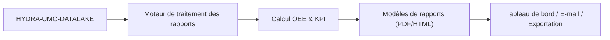

<p align="center">
  
</p>

# 📈 HYDRA-UMC-PRODUCTION-REPORTS

<p align="center"><a href="README.md">🇺🇸 English</a> | <a href="README_spa.md">🇪🇸 Español</a> | 🇫🇷 <b>Français</b> | <a href="README_ita.md">🇮🇹 Italiano</a> | <a href="README_deu.md">🇩🇪 Deutsch</a> | <a href="README_zho.md">🇨🇳 简体中文</a> | <a href="README_jpn.md">🇯🇵 日本語</a></p>

### 📑 Moteur de rapports KPI et OEE automatisés pour les directeurs d'usine

<p align="left">
  
  
  
</p>

---

## 1. 🛠️ APERÇU TECHNIQUE

**HYDRA-UMC-PRODUCTION-REPORTS** est le cerveau analytique pour la gestion de l'usine. Il traite les données brutes du Datalake pour générer des rapports automatisés de haut niveau sur l'efficacité de la production, la qualité et la disponibilité des machines.

Il calcule l'**OEE (Overall Equipment Effectiveness - Taux de Rendement Global)** de l'ensemble de l'essaim, identifiant les goulots d'étranglement dans la ligne de production et assurant la traçabilité de chaque composant fabriqué, des profils de soudure thermique à la précision du Pick-and-Place.

### Caractéristiques principales :
* 📈 **Calcul de l'OEE :** Métriques en temps réel pour la disponibilité, la performance et la qualité.
* 📑 **Rapports automatisés :** Résumés quotidiens, hebdomadaires et mensuels aux formats PDF/CSV envoyés aux gestionnaires.
* 🛠️ **Analyse des goulots d'étranglement :** Identifie les robots ou outils qui causent des retards dans la file d'attente des missions.
* 🌡️ **Traçabilité de la qualité :** Lie chaque produit final à ses journaux d'assemblage spécifiques (thermiques, visuels, mécaniques).
* 🕐 **Limites Équipe/Jour :** `shift.py` donne à chaque rapport une seule et unique source de vérité réelle pour savoir où commence et finit une équipe ou une journée civile - y compris une véritable équipe de nuit traversant minuit. *(implémenté)*
* 🧾 **Formules Versionnées + Traçabilité :** Chaque rapport porte son vrai `formula_version` et une `input_fingerprint` sha256 calculée sur les données exactes qui l'ont produit. *(implémenté)*
* 📤 **Export CSV Reproductible :** `GET /reports/{oee,availability}/export` - une sortie identique bit à bit pour des entrées identiques, pas seulement « à peu près ». *(implémenté)*

---

## 2. 🔄 FLUX DE RAPPORTS



---

## 3. 🧱 ARCHITECTURE & DÉCISIONS DE CONCEPTION

* **Pourquoi c'est un frère, pas un sous-module, de HYDRA-UMC-DATALAKE.** La génération de rapports est un travail de requête+calcul périodique et en lecture seule sur de la télémétrie déjà stockée - la garder séparée signifie qu'une génération de rapport ne concurrence jamais les propres écritures temps réel de HYDRA-UMC-TELEMETRY-COLLECTOR pour les ressources du même entrepôt. Ce projet ne possède aucune base de données propre.
* **Une vraie intégration HTTP, pas une bibliothèque partagée.** `datalake_client.py` parle à une instance réelle de HYDRA-UMC-DATALAKE via du HTTP simple (`GET /query`), et n'importe délibérément PAS le paquet Python de DATALAKE directement, même si les deux cohabitent aujourd'hui dans le même environnement de dev - le vrai HTTP est le vrai point d'intégration découplé, celui qui correspond à la façon dont des dépôts/services séparés se parleraient réellement en production.
* **Le schéma `production_event` est la propre convention v0 de ce projet, pas un standard de l'écosystème.** L'OEE a besoin de savoir, pour chaque cycle terminé, si la pièce était bonne et combien de temps le cycle a pris. Ce projet définit cela comme un `Sample` DATALAKE par cycle, `kind="production_event"`, avec deux champs écrits ensemble au même timestamp : `"good"` (1.0/0.0) et `"cycleTimeS"`. Aucun autre projet n'écrit encore ce kind - HYDRA-UMC-JOB-DISPATCHER serait la vraie source de production une fois connecté pour rapporter les fins de cycle de cette façon (suivi dans `mejoras_futuras.txt`).
* **La disponibilité fonctionne contre N'IMPORTE QUEL flux de télémétrie existant, volontairement.** Contrairement à l'OEE, `availability.py` n'a pas du tout besoin de la convention `production_event` - il prend n'importe quelle série de timestamps déjà présente dans DATALAKE (par ex. des échantillons `motor_temp` que HYDRA-UMC-TELEMETRY-COLLECTOR écrit déjà) et signale comme véritable temps d'arrêt un écart entre échantillons consécutifs supérieur à `expected_interval_ms x gap_factor`. C'est précisément ce qui permet à ce projet de "parler" dès aujourd'hui avec ses frères de télémétrie, avant même qu'aucun projet n'écrive de vraies données `production_event`.
* **Performance et Availability sont plafonnés à `[0, 1]`.** Un vrai cycle peut aller plus vite qu'un chiffre "idéal" prudent, ou le temps opérationnel peut dépasser une fenêtre planifiée mal configurée ; rapporter >100% serait arithmétiquement défendable mais trompeur en pratique, donc les deux sont plafonnés.
* **Les champs `production_event` non appariés sont comptés et signalés, jamais silencieusement remplacés par défaut.** Si une lecture `"good"` n'a pas de `"cycleTimeS"` apparié au même timestamp exact (une écriture partielle/malformée), elle est exclue et le nombre de lectures exclues est inclus dans l'erreur/la réponse plutôt que de supposer un temps de cycle de 0s, ce qui corromprait le chiffre de Performance.
* **Pourquoi `shift.py` est un module séparé, pas des calculs en ligne dans `oee.py`/`availability.py`.** Deux rapports qui divergent silencieusement sur l'endroit où une équipe ou une journée civile se termine produisent deux chiffres différents, tous deux défendables, pour la même fenêtre réelle - exactement la contradiction relevée par l'audit de promotion. Faire des limites équipe/jour un module propre, réel et testé (avec une véritable équipe de nuit traversant minuit, et une véritable recherche inverse timestamp-vers-équipe) donne à chaque rapport la même source de vérité au lieu que chaque appelant la redérive de son côté.
* **Pourquoi `formula_version` et `input_fingerprint` sont sur le rapport, pas seulement dans le CSV.** Un rapport consommé en JSON (par un tableau de bord, un autre service) mérite la même traçabilité qu'un rapport exporté vers un fichier - les deux champs s'ajoutent aux réponses existantes de `GET /reports/oee`/`GET /reports/availability`, ce n'est pas quelque chose de visible uniquement dans la sortie de `export.py`.
* **Pourquoi l'export CSV est un nouvel endpoint, pas un flag `?format=csv` sur les routes existantes.** Garder `GET /reports/oee`/`GET /reports/availability` intacts (toujours réels, toujours en JSON, toujours exactement ce que `tests/test_api.py` vérifiait déjà) a permis d'ajouter la fonctionnalité d'export et de prouver sa reproductibilité sans toucher à une seule réponse déjà testée.

---

## 📂 STRUCTURE DES RÉPERTOIRES

Service purement logiciel (génération de rapports) - sans matériel, micrologiciel ou système d'exploitation propres ; ces dossiers sont omis conformément à la politique de structure du dépôt.

```text
HYDRA-UMC-PRODUCTION-REPORTS/
├── src/hydra_umc_production_reports/
│   ├── __init__.py           # Version du paquet
│   ├── datalake_client.py    # Client HTTP réel pour l'API GET /query de HYDRA-UMC-DATALAKE
│   ├── oee.py                 # Vraie formule OEE (Disponibilité x Performance x Qualité)
│   ├── availability.py        # Vrai calcul de downtime à partir des écarts de télémétrie
│   ├── reports.py             # Orchestration : DatalakeClient -> oee.py / availability.py
│   ├── shift.py                # Vrai calcul des limites équipe/jour (source de vérité)
│   ├── export.py               # Vrai export CSV, reproductible bit à bit
│   ├── api.py                  # API HTTP réelle (GET /reports/oee, /reports/availability, /stats, /export)
│   └── main.py                 # Point d'entrée - démarre le vrai serveur HTTP
├── tests/                    # Vrais tests : calculs OEE/disponibilité/équipe/export, allers-retours contre un faux DATALAKE
├── docs/
│   └── API.md                 # Référence réelle des endpoints HTTP (requêtes, réponses, codes de statut)
├── images/                   # Médias et diagrammes
├── systemd/
│   └── hydra-umc-production-reports.service # Unité systemd de l'API de rapports locale sur la CM5
├── tools/
│   ├── build_test.py         # Contrôle build/compilation sans gestion de version
│   └── ci_validate.py        # Validation manifest/CHANGELOG/docs utilisée par la CI
├── pyproject.toml            # Métadonnées du paquet + extras [dev] (pytest)
├── bump_version.py           # Incrément de version type compteur kilométrique (exécuté par le build)
├── bump_manifest_version.py  # Synchronise la version de hydra-umc.project.json avec la version native (--sync)
├── build.sh / build.bat      # Build réel : venv + installation éditable + vraie suite de tests
├── run.sh / run.bat          # Exécution réelle : démarre l'API HTTP
└── README.md
```

Voir [`docs/API.md`](docs/API.md) pour la référence complète des endpoints HTTP.

---

## 4. ⚙️ BUILD ET EXÉCUTION

Nécessite Python >= 3.10.

```bash
# Linux/macOS
./build.sh && ./run.sh --datalake-url http://localhost:8095

# Windows
build.bat
run.bat --datalake-url http://localhost:8095
```

`build` crée/active un `.venv` local, installe le paquet en mode éditable avec les extras de dev, vérifie l'import et exécute la vraie suite de tests `pytest`. `run` démarre la vraie API HTTP (port par défaut `8099`) contre une instance HYDRA-UMC-DATALAKE à `--datalake-url` (par défaut `http://localhost:8095`).

```bash
# Vrai rapport OEE pour la source "robot-1" sur une fenêtre de 5 secondes
curl "http://localhost:8099/reports/oee?sourceId=robot-1&start=0&end=5000&plannedTimeS=10.0&idealCycleTimeS=2.0"

# Vrai rapport de disponibilité pour le flux motor_temp de la même source
curl "http://localhost:8099/reports/availability?sourceId=robot-1&kind=motor_temp&field=value&start=0&end=10000&expectedIntervalMs=1000"
```

---

## 🚀 FEUILLE DE ROUTE
* **Fait (v0) :** vrai calcul d'OEE et de disponibilité, vraie intégration HTTP avec HYDRA-UMC-DATALAKE, vraie API HTTP.
* **Ensuite :** une vraie source de données `production_event` - connecter HYDRA-UMC-JOB-DISPATCHER pour qu'il rapporte les fins de cycle selon ce schéma.
* **Ensuite :** rapports persistants/planifiés (aujourd'hui chaque rapport est calculé en direct, à la demande).
* **Plus tard :** un vrai export PDF/CSV et un tableau de bord, selon la roadmap d'origine ci-dessous.
* Analyse du ROI pilotée par l'IA pour les mises à niveau d'outils, connectée à ces mêmes données OEE une fois les tendances historiques stockées.

---

## 🔗 Projets Liés

Ce projet fait partie de l'écosystème robotique HYDRA-UMC du même auteur (JuanenRac / Electro Hobby 3D). Bon à savoir, car une demande pourrait en réalité concerner l'un de ceux-ci plutôt que ce dépôt.

**Projet Parent**
- **[HYDRA-UMC-DATALAKE](https://github.com/JuanenRac/HYDRA-UMC-DATALAKE)** — vrai magasin de séries temporelles basé sur sqlite3, avec une vraie API HTTP d'ingestion/requête ; le parent dont ce dépôt est un service d'analytique spécifique, au sein de sa propre couche de données et analytique.

**Projets Frères** — les autres services d'analytique de la propre couche de données et analytique de HYDRA-UMC-DATALAKE
- **[HYDRA-UMC-TELEMETRY-COLLECTOR](https://github.com/JuanenRac/HYDRA-UMC-TELEMETRY-COLLECTOR)** — vrai pipeline d'ingestion CAN/WebSocket vers DATALAKE, avec déduplication par séquence — aussi une vraie source de données aujourd'hui : le propre `availability.py` de ce rapport lit ses échantillons `motor_temp` (et toute autre série qu'il écrit) directement depuis Datalake, sans avoir besoin de la convention `production_event` pour ce rapport.
- **[HYDRA-UMC-ANOMALY-DETECTOR](https://github.com/JuanenRac/HYDRA-UMC-ANOMALY-DETECTOR)** — vrai détecteur d'anomalies FFT + ligne de base statistique, avec surveillance de dérive.

**Directement Liés**
- **[HYDRA-UMC-JOB-DISPATCHER](https://github.com/JuanenRac/HYDRA-UMC-JOB-DISPATCHER)** — vraie file de tâches basée sur la priorité avec déduplication, via une vraie API HTTP — la source réelle prévue des échantillons `production_event` (la propre convention bon/temps de cycle d'OEE) une fois les achèvements de mission câblés pour les écrire ; rien n'écrit encore ce type, suivi honnêtement comme travail futur plutôt que revendiqué comme terminé.

**Fait Également Partie de l'Écosystème**

*Matériel & Plateforme de Base*
- **[HYDRA-UMC](https://github.com/JuanenRac/HYDRA-UMC)** — la carte mère physique du bras robotique : hôte CM5 + coprocesseur STM32H745 double cœur, coordonnant jusqu'à 8 bras-outils via CAN-OTA/SPI-OTA.
- **[HYDRA-UMC-OS](https://github.com/JuanenRac/HYDRA-UMC-OS)** — couche produit reproductible sur Raspberry Pi OS pour le CM5 : agent en lecture seule, config/profils validés, provisionnement WiFi de premier contact.
- **[HYDRA-UMC-SDK](https://github.com/JuanenRac/HYDRA-UMC-SDK)** — le contrat JSON-Schema partagé et la barrière de sécurité contre laquelle chaque bridge valide ses commandes.

*Backend Central & Clients*
- **[HYDRA-UMC-SERVER](https://github.com/JuanenRac/HYDRA-UMC-SERVER)** — le vrai backend headless (REST/WebSocket) auquel parle réellement chaque client de contrôle.
- **[HYDRA-UMC-STUDIO](https://github.com/JuanenRac/HYDRA-UMC-STUDIO)** — tableau de bord de contrôle web avec visualisation 3D multi-robot en temps réel.
- **[HYDRA-UMC-SUITE](https://github.com/JuanenRac/HYDRA-UMC-SUITE)** — centre de commande d'essaim de bureau (PySide6) pour plusieurs serveurs à la fois, empaqueté en exécutable autonome.
- **[HYDRA-UMC-ANDROID-CONTROL](https://github.com/JuanenRac/HYDRA-UMC-ANDROID-CONTROL)** — application de contrôle Android native avec connexion biométrique et un compagnon Wear OS jumelé.
- **[HYDRA-UMC-IOS-CONTROL](https://github.com/JuanenRac/HYDRA-UMC-IOS-CONTROL)** — application de contrôle iOS/iPadOS (Flutter) avec synchronisation WebSocket en temps réel.
- **[HYDRA-UMC-DSI](https://github.com/JuanenRac/HYDRA-UMC-DSI)** — interface tactile native pour l'écran tactile DSI 7" embarqué, intégrée directement sur le CM5.
- **[HYDRA-UMC-EDITOR-URDF](https://github.com/JuanenRac/HYDRA-UMC-EDITOR-URDF)** — créateur/éditeur graphique de bureau pour URDF qui envoie les modèles terminés vers le propre catalogue de STUDIO.
- **[HYDRA-UMC-BRIDGE-AMR](https://github.com/JuanenRac/HYDRA-UMC-BRIDGE-AMR)** — frontière de coordination pour les flottes AGV/AMR via un éditeur MQTT VDA 5050 réel.
- **[HYDRA-UMC-BRIDGE-CNC](https://github.com/JuanenRac/HYDRA-UMC-BRIDGE-CNC)** — coordinateur haut niveau pour cellules CNC avec accès réel au statut/octets de contrôle GRBL.
- **[HYDRA-UMC-BRIDGE-DROIDS](https://github.com/JuanenRac/HYDRA-UMC-BRIDGE-DROIDS)** — frontière de coordination pour droïdes à pattes/humanoïdes, avec un véritable émetteur de commandes Boston Dynamics Spot.
- **[HYDRA-UMC-BRIDGE-LASER](https://github.com/JuanenRac/HYDRA-UMC-BRIDGE-LASER)** — coordinateur de sécurité pour cellules laser lisant 3 vraies sécurités GPIO de clé/enceinte/verrouillage.
- **[HYDRA-UMC-BRIDGE-OPENPNP](https://github.com/JuanenRac/HYDRA-UMC-BRIDGE-OPENPNP)** — coordinateur haut niveau sûr pour le flux de cartes du pick-and-place OpenPnP.
- **[HYDRA-UMC-BRIDGE-PRINTER3D](https://github.com/JuanenRac/HYDRA-UMC-BRIDGE-PRINTER3D)** — frontière de coordination sûre pour imprimantes 3D Moonraker/Klipper, avec de vraies commandes de tâche contrôlées.
- **[HYDRA-UMC-BRIDGE-ROS2](https://github.com/JuanenRac/HYDRA-UMC-BRIDGE-ROS2)** — coordinateur de sécurité avec un vrai transport ROS 2 rclpy à importation paresseuse.
- **[HYDRA-UMC-BRIDGE-UAV](https://github.com/JuanenRac/HYDRA-UMC-BRIDGE-UAV)** — frontière de coordination pour UAV équipés de caméra, avec un véritable émetteur de commandes MAVLink.

*Plateforme d'Outils URTC*
- **[URTC](https://github.com/JuanenRac/URTC)** — firmware pour la carte physique Universal Robot Tool Controller, plus de 25 profils d'outil sur bus CAN.
- **[URTC-FLASHER](https://github.com/JuanenRac/URTC-FLASHER)** — outil de bureau à interface graphique pour flasher les cartes URTC, CAN-OTA plus SWD/JTAG puce complète.
- **[URTC-TESTER](https://github.com/JuanenRac/URTC-TESTER)** — outil de bureau de diagnostic CAN-bus en direct pour cartes URTC, un panneau par profil d'outil.
- **[URTC-WEB-STUDIO](https://github.com/JuanenRac/URTC-WEB-STUDIO)** — alternative basée navigateur à URTC-TESTER via la Web Serial API, sans installation locale.

*Nœud IA de Vision (Hailo-8)*
- **[HYDRA-UMC-VISION-NODE](https://github.com/JuanenRac/HYDRA-UMC-VISION-NODE)** — hub d'intégration pour le pipeline de vision Hailo-8, avec une vraie vérification de disponibilité matérielle par étape.
- **[HYDRA-UMC-DETECTION-HEF](https://github.com/JuanenRac/HYDRA-UMC-DETECTION-HEF)** — registre réel de modèles compilés avec vérification de chargement sécurisé par architecture Hailo/checksum.
- **[HYDRA-UMC-VISION-STREAMER](https://github.com/JuanenRac/HYDRA-UMC-VISION-STREAMER)** — générateur réel de pipeline GStreamer + config MediaMTX, avec une vraie frontière d'intégration HailoRT.
- **[HYDRA-UMC-VISUAL-SERVOING-API](https://github.com/JuanenRac/HYDRA-UMC-VISUAL-SERVOING-API)** — vraie loi de correction Position-Based Visual Servoing, verrouillée sur l'état de zone en amont.
- **[HYDRA-UMC-SAFETY-ZONES](https://github.com/JuanenRac/HYDRA-UMC-SAFETY-ZONES)** — vraie vérification de violation de zone et demande d'E-STOP, avec application de la fraîcheur de calibration.

*Nœud IA Cognitif (Hailo-10)*
- **[HYDRA-UMC-COGNITIVE-NODE](https://github.com/JuanenRac/HYDRA-UMC-COGNITIVE-NODE)** — hub d'intégration pour le pipeline cognitif Hailo-10 (orchestration LLM/VLA/voix).
- **[HYDRA-UMC-VLA-ENGINE](https://github.com/JuanenRac/HYDRA-UMC-VLA-ENGINE)** — vrai encodage/décodage de jetons d'action et génération de trajectoire pour un modèle Vision-Language-Action.
- **[HYDRA-UMC-VOICE-UI](https://github.com/JuanenRac/HYDRA-UMC-VOICE-UI)** — vrai front-end vocal (VAD + analyseur d'intention) avec un relais Watch borné et soumis à confirmation.
- **[HYDRA-UMC-SEMANTIC-PLANNER](https://github.com/JuanenRac/HYDRA-UMC-SEMANTIC-PLANNER)** — vraie décomposition de tâches basée sur des règles et récupération sémantique d'erreurs sur les codes d'erreur MCU.
- **[HYDRA-UMC-DOCS-QA](https://github.com/JuanenRac/HYDRA-UMC-DOCS-QA)** — vraie recherche documentaire TF-IDF (bibliothèque standard uniquement) sur les propres documents Markdown de cet écosystème.

*Orchestration & Essaim*
- **[HYDRA-UMC-ORCHESTRATOR](https://github.com/JuanenRac/HYDRA-UMC-ORCHESTRATOR)** — hub d'intégration avec un vrai contrat de rapport de santé gRPC/Protobuf et une machine à états de mission.
- **[HYDRA-UMC-NODE-HEALING](https://github.com/JuanenRac/HYDRA-UMC-NODE-HEALING)** — vrai chien de garde de santé de flotte basé sur gRPC, avec retry/backoff et détection d'incohérence d'identité.
- **[HYDRA-UMC-PATH-PLANNER-3D](https://github.com/JuanenRac/HYDRA-UMC-PATH-PLANNER-3D)** — vrai planificateur de trajectoire 3D basé sur RRT, avec vraie validation des collisions obstacle/espace de travail.
- **[HYDRA-UMC-SWARM-SYNC](https://github.com/JuanenRac/HYDRA-UMC-SWARM-SYNC)** — vraie synchronisation d'état CRDT LWW-Element-Map, testée par propriétés pour la convergence multi-cellule.

*Jumeau Numérique & Simulation*
- **[HYDRA-UMC-TWIN](https://github.com/JuanenRac/HYDRA-UMC-TWIN)** — hub d'intégration pour le moteur de jumeau numérique, avec un vrai contrat de synchronisation par compatibilité de version.
- **[HYDRA-UMC-HIL-BRIDGE](https://github.com/JuanenRac/HYDRA-UMC-HIL-BRIDGE)** — vrai verrouillage de sécurité hardware-in-the-loop routant les commandes entre simulation et matériel réel.
- **[HYDRA-UMC-PHYSICS-REPLICA](https://github.com/JuanenRac/HYDRA-UMC-PHYSICS-REPLICA)** — vraie cinématique directe et validation des limites articulaires sur un vrai sous-ensemble URDF.
- **[HYDRA-UMC-SYNTHETIC-DATA-GEN](https://github.com/JuanenRac/HYDRA-UMC-SYNTHETIC-DATA-GEN)** — vrai générateur procédural de scènes 2D avec export d'annotations YOLO/COCO.

*Passerelle Industrielle*
- **[HYDRA-UMC-GATEWAY-INDUSTRIAL](https://github.com/JuanenRac/HYDRA-UMC-GATEWAY-INDUSTRIAL)** — hub d'intégration relayant vers les protocoles industriels, avec une vraie couche de liste blanche de commandes/contre-pression.
- **[HYDRA-UMC-OPCUA-SERVER](https://github.com/JuanenRac/HYDRA-UMC-OPCUA-SERVER)** — vrai espace d'adressage OPC-UA, vérifié avec une vraie session client du protocole binaire.
- **[HYDRA-UMC-MQTT-BROKER](https://github.com/JuanenRac/HYDRA-UMC-MQTT-BROKER)** — vrai broker MQTT avec authentification par client optionnelle et ACL de sujets.
- **[HYDRA-UMC-MTCONNECT-ADAPTER](https://github.com/JuanenRac/HYDRA-UMC-MTCONNECT-ADAPTER)** — vrais points de terminaison XML MTConnect `/probe` et `/current`, avec sortie en mode dégradé.

*Outils Complémentaires & Opérations de l'Écosystème*
- **[HYDRA-UMC-DASHBOARD-AI](https://github.com/JuanenRac/HYDRA-UMC-DASHBOARD-AI)** — panneaux Smart Summaries et Anomaly Highlighting sur DATALAKE/ANOMALY-DETECTOR, avec un repli statistique honnête.
- **[HYDRA-UMC-TOOL-CLI](https://github.com/JuanenRac/HYDRA-UMC-TOOL-CLI)** — CLI de flotte avec un vrai contrat de codes de sortie stable, un vrai client en direct de la propre API de HYDRA-UMC-SERVER.
- **[HYDRA-UMC-WATCH](https://github.com/JuanenRac/HYDRA-UMC-WATCH)** — application compagnon WearOS avec de vraies alertes haptiques et un relais vocal vers le téléphone jumelé.
- **[URTC-SMART-RACK](https://github.com/JuanenRac/URTC-SMART-RACK)** — firmware pour un rack de montage de cartes avec décodage réel d'ID d'outil et logique de préchauffage Smart Idle.
- **[URTC-VISION-TOOL](https://github.com/JuanenRac/URTC-VISION-TOOL)** — firmware plus un vrai compagnon de vision Python pour une tête d'outil d'inspection thermique/RGB.
- **[HYDRA-UMC-UPDATER](https://github.com/JuanenRac/HYDRA-UMC-UPDATER)** — outil administratif de bureau qui découvre, clone et met à jour chaque dépôt de cet écosystème.
- **[HYDRA-UMC-OS-REBUILDER](https://github.com/JuanenRac/HYDRA-UMC-OS-REBUILDER)** — outil de bureau Windows/Linux qui construit une image de la CM5 prête à graver, préchargée avec les versions les plus actuelles de l'écosystème, avec une configuration de premier démarrage Wi-Fi/utilisateur/SSH façon Raspberry Pi Imager.


---

## 📚 Documentation & Communauté

- **[CONTRIBUTING.md](CONTRIBUTING.md)** — pile technologique et lignes directrices de codage pour une pull request.
- **[CODE_OF_CONDUCT.md](CODE_OF_CONDUCT.md)** — les normes de comportement attendues dans cette communauté.
- **[SECURITY.md](SECURITY.md)** — comment signaler une vulnérabilité, et les véritables axes de sécurité de ce projet.
- **[SUPPORT.md](SUPPORT.md)** — où poser des questions et signaler des bugs.
- **[LICENSE.md](LICENSE.md)** — la licence propre de ce projet.

## 👤 AUTEUR
**JuanenRac** (Electro Hobby 3D)
📧 electrohobby3d@gmail.com
📺 [youtube.com/@electrohobby3d](https://youtube.com/@electrohobby3d)

## 📜 LICENCE
GPL-3.0 - Voir le fichier LICENSE pour plus de détails.
