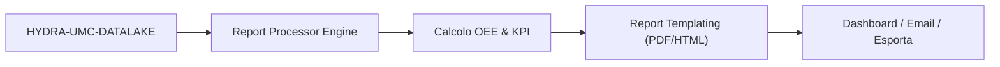

<p align="center">
  
</p>

# 📈 HYDRA-UMC-PRODUCTION-REPORTS

<p align="center"><a href="README.md">🇺🇸 English</a> | <a href="README_spa.md">🇪🇸 Español</a> | <a href="README_fra.md">🇫🇷 Français</a> | 🇮🇹 <b>Italiano</b> | <a href="README_deu.md">🇩🇪 Deutsch</a> | <a href="README_zho.md">🇨🇳 简体中文</a> | <a href="README_jpn.md">🇯🇵 日本語</a></p>

### 📑 Motore di reportistica KPI e OEE automatizzato per i direttori di stabilimento

<p align="left">
  
  
  
</p>

---

## 1. 🛠️ PANORAMICA TECNICA

**HYDRA-UMC-PRODUCTION-REPORTS** è il cervello analitico per la gestione della fabbrica. Elabora i dati grezzi dal Datalake per generare report automatizzati di alto livello sull'efficienza della produzione, la qualità e la disponibilità delle macchine.

Calcola l'**OEE (Overall Equipment Effectiveness)** dell'intero sciame, identificando i colli di bottiglia nella linea di produzione e fornendo la tracciabilità per ogni componente prodotto, dai profili di saldatura termica all'accuratezza del Pick-and-Place.

### Caratteristiche principali:
* 📈 **Calcolo OEE:** Metriche in tempo reale per disponibilità, prestazioni e qualità.
* 📑 **Reportistica automatizzata:** Riepiloghi PDF/CSV giornalieri, settimanali e mensili inviati ai manager.
* 🛠️ **Analisi dei colli di bottiglia:** Identifica quali robot o strumenti stanno causando ritardi nella coda delle missioni.
* 🌡️ **Tracciabilità della qualità:** Collega ogni prodotto finale ai suoi log di assemblaggio specifici (termici, visivi, meccanici).
* 🕐 **Confini Turno/Giorno:** `shift.py` fornisce a ogni report un'unica, vera fonte di verità su dove inizia e finisce un turno o un giorno di calendario - incluso un vero turno di notte che attraversa la mezzanotte. *(implementato)*
* 🧾 **Formule Versionate + Tracciabilità:** Ogni report porta il suo vero `formula_version` e un `input_fingerprint` sha256 calcolato sui dati esatti che lo hanno prodotto. *(implementato)*
* 📤 **Esportazione CSV Riproducibile:** `GET /reports/{oee,availability}/export` - output identico byte per byte per input identici, non solo "abbastanza vicino". *(implementato)*

---

## 2. 🔄 FLUSSO DI REPORTISTICA



---

## 3. 🧱 ARCHITETTURA E DECISIONI DI PROGETTAZIONE

* **Perché è fratello, non un sottomodulo, di HYDRA-UMC-DATALAKE.** La generazione di report è un lavoro di query+calcolo periodico e di sola lettura su telemetria già memorizzata - tenerla separata significa che una generazione di report non compete mai con le scritture in tempo reale proprie di HYDRA-UMC-TELEMETRY-COLLECTOR per le risorse dello stesso archivio. Questo progetto non ha un proprio database.
* **Integrazione HTTP reale, non una libreria condivisa.** `datalake_client.py` parla con un'istanza reale di HYDRA-UMC-DATALAKE tramite HTTP semplice (`GET /query`), e deliberatamente NON importa il pacchetto Python di DATALAKE direttamente anche se oggi entrambi convivono nello stesso ambiente di sviluppo - l'HTTP reale è il vero punto di integrazione disaccoppiato, coerente con come servizi/repository separati parlerebbero davvero tra loro in produzione.
* **Lo schema `production_event` è la convenzione propria v0 di questo progetto, non uno standard dell'ecosistema.** L'OEE deve sapere, per ogni ciclo completato, se il pezzo era buono e quanto è durato il ciclo. Questo progetto definisce ciò come un `Sample` DATALAKE per ciclo, `kind="production_event"`, con due campi scritti insieme allo stesso timestamp: `"good"` (1.0/0.0) e `"cycleTimeS"`. Nessun altro progetto scrive ancora questo kind - HYDRA-UMC-JOB-DISPATCHER sarebbe la vera fonte di produzione una volta collegato per riportare i completamenti dei cicli in questo modo (tracciato in `mejoras_futuras.txt`).
* **La disponibilità funziona contro QUALSIASI stream di telemetria esistente, di proposito.** A differenza dell'OEE, `availability.py` non ha affatto bisogno della convenzione `production_event` - prende qualsiasi serie di timestamp già presente in DATALAKE (es. campioni `motor_temp` che HYDRA-UMC-TELEMETRY-COLLECTOR già scrive) e segnala come vero downtime un intervallo tra campioni consecutivi maggiore di `expected_interval_ms x gap_factor`. Questo è esattamente ciò che oggi permette a questo progetto di "parlare" con i suoi fratelli di telemetria, prima ancora che qualsiasi progetto scriva dati `production_event` reali.
* **Performance e Availability sono limitati a `[0, 1]`.** Un ciclo reale può andare più veloce di una cifra "ideale" prudente, oppure il tempo operativo può superare una finestra pianificata mal configurata; riportare >100% sarebbe aritmeticamente difendibile ma fuorviante nella pratica, quindi entrambi sono limitati.
* **I campi `production_event` non abbinati vengono contati e segnalati, mai sostituiti silenziosamente con un valore predefinito.** Se una lettura `"good"` non ha un `"cycleTimeS"` corrispondente allo stesso timestamp esatto (una scrittura parziale/malformata), viene esclusa e il numero di letture escluse è incluso nell'errore/risposta invece di assumere un tempo di ciclo di 0s, il che corromperebbe la cifra di Performance.
* **Perché `shift.py` è un modulo separato, non matematica inline in `oee.py`/`availability.py`.** Due report che discordano silenziosamente su dove taglia un turno o un giorno di calendario producono due numeri diversi, entrambi difendibili, per la stessa finestra reale - esattamente la contraddizione segnalata dall'audit di promozione. Rendere i confini turno/giorno un modulo proprio, reale e testato (con un vero turno di notte che attraversa la mezzanotte, e una vera ricerca inversa timestamp-turno) dà a ogni report la stessa fonte di verità invece di far ri-derivare la propria a ogni chiamante.
* **Perché `formula_version` e `input_fingerprint` sono sul report, non solo nel CSV.** Un report consumato come JSON (da una dashboard, un altro servizio) merita la stessa tracciabilità di uno esportato su file - entrambi i campi sono additivi sulle risposte già esistenti di `GET /reports/oee`/`GET /reports/availability`, non qualcosa visibile solo nell'output di `export.py`.
* **Perché l'esportazione CSV è un nuovo endpoint, non un flag `?format=csv` sulle rotte esistenti.** Mantenere `GET /reports/oee`/`GET /reports/availability` intatti (ancora reali, ancora JSON, ancora esattamente ciò che `tests/test_api.py` già verificava) ha permesso di aggiungere la funzione di esportazione e dimostrarne la riproducibilità senza toccare nemmeno una risposta già testata.

---

## 📂 STRUTTURA DELLE CARTELLE

Servizio puramente software (generazione di report) - senza hardware, firmware o sistema operativo propri; tali cartelle sono omesse secondo la politica della struttura del repository.

```text
HYDRA-UMC-PRODUCTION-REPORTS/
├── src/hydra_umc_production_reports/
│   ├── __init__.py           # Versione del pacchetto
│   ├── datalake_client.py    # Client HTTP reale per l'API GET /query di HYDRA-UMC-DATALAKE
│   ├── oee.py                 # Vera formula OEE (Disponibilità x Performance x Qualità)
│   ├── availability.py        # Vero calcolo del downtime dagli intervalli di telemetria
│   ├── reports.py             # Orchestrazione: DatalakeClient -> oee.py / availability.py
│   ├── shift.py                # Vero calcolo dei confini turno/giorno (fonte di verità)
│   ├── export.py               # Vera esportazione CSV, riproducibile byte per byte
│   ├── api.py                  # API HTTP reale (GET /reports/oee, /reports/availability, /stats, /export)
│   └── main.py                 # Punto di ingresso - avvia il vero server HTTP
├── tests/                    # Test reali: matematica di OEE/disponibilità/turno/esportazione, round-trip contro un DATALAKE fittizio
├── docs/
│   └── API.md                 # Riferimento reale degli endpoint HTTP (richieste, risposte, codici di stato)
├── pyproject.toml            # Metadati del pacchetto + extra [dev] (pytest)
├── bump_version.py           # Incremento di versione stile contachilometri (eseguito dal build)
├── build.sh / build.bat      # Build reale: venv + installazione editable + suite di test reale
├── run.sh / run.bat          # Esecuzione reale: avvia l'API HTTP
└── README.md
```

Vedi [`docs/API.md`](docs/API.md) per il riferimento completo degli endpoint HTTP.

---

## 4. ⚙️ BUILD ED ESECUZIONE

Richiede Python >= 3.10.

```bash
# Linux/macOS
./build.sh && ./run.sh --datalake-url http://localhost:8095

# Windows
build.bat
run.bat --datalake-url http://localhost:8095
```

`build` crea/attiva un `.venv` locale, installa il pacchetto in modalità editable con gli extra di sviluppo, verifica l'import ed esegue la vera suite di test `pytest`. `run` avvia la vera API HTTP (porta predefinita `8099`) contro un'istanza HYDRA-UMC-DATALAKE su `--datalake-url` (predefinito `http://localhost:8095`).

```bash
# Vero report OEE per la fonte "robot-1" su una finestra di 5 secondi
curl "http://localhost:8099/reports/oee?sourceId=robot-1&start=0&end=5000&plannedTimeS=10.0&idealCycleTimeS=2.0"

# Vero report di disponibilità per lo stream motor_temp della stessa fonte
curl "http://localhost:8099/reports/availability?sourceId=robot-1&kind=motor_temp&field=value&start=0&end=10000&expectedIntervalMs=1000"
```

---

## 🚀 TABELLA DI MARCIA
* **Fatto (v0):** vero calcolo OEE e disponibilità, vera integrazione HTTP con HYDRA-UMC-DATALAKE, vera API HTTP.
* **Prossimo:** una vera fonte di dati `production_event` - collegare HYDRA-UMC-JOB-DISPATCHER affinché riporti i completamenti dei cicli con questo schema.
* **Prossimo:** report persistenti/pianificati (oggi ogni report viene calcolato in tempo reale, su richiesta).
* **Più avanti:** vera esportazione PDF/CSV e una dashboard, secondo la roadmap originale sotto.
* Analisi ROI guidata dall'IA per l'aggiornamento degli strumenti, collegata a questi stessi dati OEE una volta memorizzati i trend storici.

---

## 🔗 Progetti Correlati

Questo progetto fa parte di un ecosistema robotico più ampio dello stesso autore (JuanenRac / Electro Hobby 3D), che copre firmware, software di controllo, nodi IA e strumenti di flotta. Utile saperlo, perché una richiesta potrebbe in realtà riguardare uno di questi progetti anziché questo repository.

### Famiglia

**Genitore:** **[HYDRA-UMC-DATALAKE](https://github.com/JuanenRac/HYDRA-UMC-DATALAKE)** — il genitore di integrazione sulla cui telemetria memorizzata riferisce questo progetto.

**Fratelli:**
- **[HYDRA-UMC-TELEMETRY-COLLECTOR](https://github.com/JuanenRac/HYDRA-UMC-TELEMETRY-COLLECTOR)** — servizio di analytics fratello, stesso genitore.
- **[HYDRA-UMC-ANOMALY-DETECTOR](https://github.com/JuanenRac/HYDRA-UMC-ANOMALY-DETECTOR)** — servizio di analytics fratello, stesso genitore.

### Relazione Diretta (fuori dalla famiglia)

- **[HYDRA-UMC-JOB-DISPATCHER](https://github.com/JuanenRac/HYDRA-UMC-JOB-DISPATCHER)** — la fonte reale prevista dei campioni `production_event` (la convenzione good/cycle-time propria dell'OEE) una volta che il completamento delle missioni sarà collegato per scriverli; al momento nulla scrive ancora questo tipo di dato, tracciato onestamente in `mejoras_futuras.txt` invece di essere dichiarato come completato.

### Resto dell'Ecosistema

**Piattaforma HYDRA-UMC** — la cella di micro-fabbrica multi-robot
- **[HYDRA-UMC](https://github.com/JuanenRac/HYDRA-UMC)** — la scheda madre CM5 + STM32H745 che orchestra fino a 8 bracci robotici.
- **[HYDRA-UMC-SERVER](https://github.com/JuanenRac/HYDRA-UMC-SERVER)** — il backend Express/WebSocket con cui parla ogni client di controllo.
- **[HYDRA-UMC-STUDIO](https://github.com/JuanenRac/HYDRA-UMC-STUDIO)** — dashboard di controllo web, visualizzazione 3D multi-robot.
- **[HYDRA-UMC-ANDROID-CONTROL](https://github.com/JuanenRac/HYDRA-UMC-ANDROID-CONTROL)** — app di controllo Android via Wi-Fi/Bluetooth.
- **[HYDRA-UMC-IOS-CONTROL](https://github.com/JuanenRac/HYDRA-UMC-IOS-CONTROL)** — app di controllo iOS/iPadOS costruita in Flutter.
- **[HYDRA-UMC-SUITE](https://github.com/JuanenRac/HYDRA-UMC-SUITE)** — centro di comando sciame desktop (Python/PySide6).
- **[HYDRA-UMC-EDITOR-URDF](https://github.com/JuanenRac/HYDRA-UMC-EDITOR-URDF)** — editor desktop di modelli URDF per il catalogo robot.
- **[HYDRA-UMC-DSI](https://github.com/JuanenRac/HYDRA-UMC-DSI)** — interfaccia touch nativa per lo schermo DSI a bordo.

**Piattaforma URTC** — il controller della testa utensile che ogni braccio HYDRA-UMC porta con sé
- **[URTC](https://github.com/JuanenRac/URTC)** — controller testa utensile su bus CAN, 25 profili utensile.
- **[URTC-FLASHER](https://github.com/JuanenRac/URTC-FLASHER)** — strumento desktop di flashing CAN-OTA + SWD/JTAG.
- **[URTC-TESTER](https://github.com/JuanenRac/URTC-TESTER)** — strumento desktop di diagnostica CAN live.
- **[URTC-WEB-STUDIO](https://github.com/JuanenRac/URTC-WEB-STUDIO)** — alternativa basata su browser via Web Serial API.

**🎥 Nodo di Visione IA (Hailo-8)**
- [HYDRA-UMC-VISION-NODE](https://github.com/JuanenRac/HYDRA-UMC-VISION-NODE)
- [HYDRA-UMC-VISION-STREAMER](https://github.com/JuanenRac/HYDRA-UMC-VISION-STREAMER)
- [HYDRA-UMC-DETECTION-HEF](https://github.com/JuanenRac/HYDRA-UMC-DETECTION-HEF)
- [HYDRA-UMC-SAFETY-ZONES](https://github.com/JuanenRac/HYDRA-UMC-SAFETY-ZONES)
- [HYDRA-UMC-VISUAL-SERVOING-API](https://github.com/JuanenRac/HYDRA-UMC-VISUAL-SERVOING-API)

**🧠 Nodo IA Cognitiva (Hailo-10)**
- [HYDRA-UMC-COGNITIVE-NODE](https://github.com/JuanenRac/HYDRA-UMC-COGNITIVE-NODE)
- [HYDRA-UMC-VLA-ENGINE](https://github.com/JuanenRac/HYDRA-UMC-VLA-ENGINE)
- [HYDRA-UMC-VOICE-UI](https://github.com/JuanenRac/HYDRA-UMC-VOICE-UI)
- [HYDRA-UMC-SEMANTIC-PLANNER](https://github.com/JuanenRac/HYDRA-UMC-SEMANTIC-PLANNER)
- [HYDRA-UMC-DOCS-QA](https://github.com/JuanenRac/HYDRA-UMC-DOCS-QA)

**🐝 Orchestrazione e Sciame**
- [HYDRA-UMC-ORCHESTRATOR](https://github.com/JuanenRac/HYDRA-UMC-ORCHESTRATOR)
- [HYDRA-UMC-SWARM-SYNC](https://github.com/JuanenRac/HYDRA-UMC-SWARM-SYNC)
- [HYDRA-UMC-PATH-PLANNER-3D](https://github.com/JuanenRac/HYDRA-UMC-PATH-PLANNER-3D)
- [HYDRA-UMC-JOB-DISPATCHER](https://github.com/JuanenRac/HYDRA-UMC-JOB-DISPATCHER)
- [HYDRA-UMC-NODE-HEALING](https://github.com/JuanenRac/HYDRA-UMC-NODE-HEALING)

**🎮 Gemello Digitale e Simulazione**
- [HYDRA-UMC-TWIN](https://github.com/JuanenRac/HYDRA-UMC-TWIN)
- [HYDRA-UMC-PHYSICS-REPLICA](https://github.com/JuanenRac/HYDRA-UMC-PHYSICS-REPLICA)
- [HYDRA-UMC-HIL-BRIDGE](https://github.com/JuanenRac/HYDRA-UMC-HIL-BRIDGE)
- [HYDRA-UMC-SYNTHETIC-DATA-GEN](https://github.com/JuanenRac/HYDRA-UMC-SYNTHETIC-DATA-GEN)

**🏭 Gateway Industriale**
- [HYDRA-UMC-GATEWAY-INDUSTRIAL](https://github.com/JuanenRac/HYDRA-UMC-GATEWAY-INDUSTRIAL)
- [HYDRA-UMC-OPCUA-SERVER](https://github.com/JuanenRac/HYDRA-UMC-OPCUA-SERVER)
- [HYDRA-UMC-MQTT-BROKER](https://github.com/JuanenRac/HYDRA-UMC-MQTT-BROKER)
- [HYDRA-UMC-MTCONNECT-ADAPTER](https://github.com/JuanenRac/HYDRA-UMC-MTCONNECT-ADAPTER)

**🛠️ Strumenti Complementari**
- [URTC-SMART-RACK](https://github.com/JuanenRac/URTC-SMART-RACK)
- [URTC-VISION-TOOL](https://github.com/JuanenRac/URTC-VISION-TOOL)
- [HYDRA-UMC-WATCH](https://github.com/JuanenRac/HYDRA-UMC-WATCH)
- [HYDRA-UMC-TOOL-CLI](https://github.com/JuanenRac/HYDRA-UMC-TOOL-CLI)
- [HYDRA-UMC-DASHBOARD-AI](https://github.com/JuanenRac/HYDRA-UMC-DASHBOARD-AI)


## 👤 AUTORE
**JuanenRac** (Electro Hobby 3D)
📧 electrohobby3d@gmail.com

## 📜 LICENZA
GPL-3.0 - Vedere LICENSE per i dettagli.
