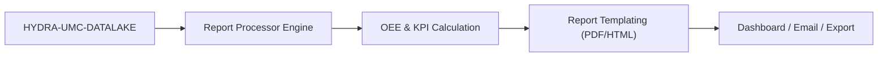

<p align="center">
  
</p>

# 📈 HYDRA-UMC-PRODUCTION-REPORTS

<p align="center"><a href="README.md">🇺🇸 English</a> | <a href="README_spa.md">🇪🇸 Español</a> | <a href="README_fra.md">🇫🇷 Français</a> | <a href="README_ita.md">🇮🇹 Italiano</a> | <a href="README_deu.md">🇩🇪 Deutsch</a> | <a href="README_zho.md">🇨🇳 简体中文</a> | 🇯🇵 <b>日本語</b></p>

### 📑 工場管理者向けの自動化された KPI・OEE レポートエンジン

<p align="left">
  
  
  
</p>

---

## 1. 🛠️ 技術概要

**HYDRA-UMC-PRODUCTION-REPORTS** は、工場管理のための分析頭脳です。
データレイクからの生データを処理し、生産効率、品質、機械の稼働率に
関する自動化された高レベルのレポートを生成します。

スウォーム全体の **OEE（総合設備効率）** を計算し、生産ラインの
ボトルネックを特定し、はんだの熱プロファイルからピック＆プレースの
精度に至るまで、製造されたすべての部品のトレーサビリティを提供します。

### 主な機能：
* 📈 **OEE 計算：** 可用性、パフォーマンス、品質のリアルタイムメトリクス。
* 📑 **自動化されたレポート：** 管理者に送信される日次、週次、月次の PDF/CSV サマリー。
* 🛠️ **ボトルネック分析：** ミッションキューの遅延を引き起こしているロボットやツールを特定します。
* 🌡️ **品質トレーサビリティ：** すべての最終製品を、その特定の組立ログ（熱、視覚、機械）に関連付けます。
* 🕐 **シフト/日境界：** `shift.py` は、シフトや暦日がどこで始まりどこで終わるかについて、すべてのレポートに単一の実在する信頼できる情報源を提供します——真夜中をまたぐ実際の夜勤も含みます。*（実装済み）*
* 🧾 **バージョン管理された計算式 + トレーサビリティ：** すべてのレポートは、実際の `formula_version` と、それを生成した正確なデータに対する sha256 の `input_fingerprint` を保持します。*（実装済み）*
* 📤 **再現可能な CSV エクスポート：** `GET /reports/{oee,availability}/export` —— 同一の入力に対してバイト単位で完全に同一の出力を生成します。単なる「近い値」ではありません。*（実装済み）*

---

## 2. 🔄 レポーティングフロー



---

## 3. 🧱 アーキテクチャと設計上の決定

* **HYDRA-UMC-DATALAKE のサブモジュールではなく兄弟プロジェクトである理由。** レポート生成は、既に保存されたテレメトリに対する定期的な読み取り専用の「クエリ＋計算」処理です——独立させておくことで、レポート生成が、HYDRA-UMC-TELEMETRY-COLLECTOR 自身の同じストアのリソースに対するリアルタイム書き込みと競合することは決してありません。本プロジェクトは自身のデータベースを持ちません。
* **共有ライブラリではなく、実際の HTTP 連携。** `datalake_client.py` はプレーンな HTTP（`GET /query`）を介して実際に稼働中の HYDRA-UMC-DATALAKE インスタンスと通信し、両者が現在同じ開発環境に存在していても、DATALAKE の Python パッケージを直接インポートすることは意図的に避けています——実際の HTTP こそが、本番環境で別々のリポジトリ/サービスが実際にどのように通信するかに一致する、真に疎結合な連携経路です。
* **`production_event` スキーマは本プロジェクト独自の v0 の取り決めであり、エコシステム標準ではありません。** OEE を計算するには、完了した各サイクルについて、良品だったかどうかとサイクル時間を知る必要があります。本プロジェクトはこれを、サイクルごとに1つの DATALAKE `Sample`、`kind="production_event"`、同一タイムスタンプで一緒に書き込まれる2つのフィールド——`"good"`（1.0/0.0）と `"cycleTimeS"`——として定義します。この kind をまだ書き込んでいる他のプロジェクトはありません——HYDRA-UMC-JOB-DISPATCHER がこの形式でサイクル完了を報告するように接続されれば、それが実際の生産データソースとなります（`mejoras_futuras.txt` で追跡）。
* **可用性の計算は、意図的に既存の任意のテレメトリストリームに対して機能します。** OEE とは異なり、`availability.py` は `production_event` の取り決めを一切必要としません——DATALAKE に既に存在する任意のタイムスタンプ列（例えば HYDRA-UMC-TELEMETRY-COLLECTOR が既に書き込んでいる `motor_temp` サンプル）を受け取り、連続するサンプル間の間隔が `expected_interval_ms x gap_factor` を超える場合、それを実際のダウンタイムとして扱います。これこそが、どのプロジェクトも実際の `production_event` データを書き込む前から、本プロジェクトがテレメトリの「兄弟プロジェクト」と実際に「対話」できる理由です。
* **Performance と Availability は `[0, 1]` にクランプされています。** 実際のサイクルは、控えめな「理想」値よりも速く進むことがあり、また稼働時間が誤って設定された計画ウィンドウを超えることもあります。>100% を報告することは算術的には正しくても、実際には誤解を招くため、両方ともクランプされています。
* **一致しない `production_event` フィールドはカウントされ報告されます。決して黙ってデフォルト値に置き換えられることはありません。** `"good"` の値に、まったく同じタイムスタンプで対応する `"cycleTimeS"` がない場合（部分的な/不正な書き込み）、それは除外され、除外された件数はエラー/レスポンスに含まれます。サイクル時間を 0 秒と仮定することは、Performance の数値を損なうため行いません。
* **`shift.py` が `oee.py`/`availability.py` 内のインライン計算ではなく、独立したモジュールである理由。** シフトや暦日の区切りについて静かに食い違う 2 つのレポートは、同じ実際の時間ウィンドウに対して、どちらも一見正当に見える異なる数値を生み出します——これはまさに昇格監査が指摘した矛盾です。シフト/日境界を独立した、実際に動作する、テスト済みのモジュールにすること（真夜中をまたぐ実際の夜勤や、タイムスタンプからシフトへの実際の逆引きを含む）によって、各呼び出し元が個別に再導出するのではなく、すべてのレポートが同じ信頼できる情報源を共有できます。
* **`formula_version` と `input_fingerprint` が CSV だけでなくレポート自体に含まれる理由。** JSON として消費されるレポート（ダッシュボードや他のサービスによって）も、ファイルにエクスポートされるレポートと同じトレーサビリティを持つべきです——この 2 つのフィールドは、既存の `GET /reports/oee`/`GET /reports/availability` のレスポンスに追加されるものであり、`export.py` の出力だけに現れるものではありません。
* **CSV エクスポートが既存ルートへの `?format=csv` フラグではなく、新しいエンドポイントである理由。** `GET /reports/oee`/`GET /reports/availability` に手を加えない（引き続き実際に動作し、引き続き JSON であり、`tests/test_api.py` が既にアサートしている内容とまったく同じ）ことで、既にテスト済みのレスポンスに一切触れることなく、エクスポート機能を追加し、その再現性を証明できました。

---

## 📂 リポジトリ構成

純粋なソフトウェアサービス（レポート生成）であり、独自のハードウェア、
ファームウェア、OS はありません。これらのディレクトリはリポジトリ構造
ポリシーに従って省略されています。

```text
HYDRA-UMC-PRODUCTION-REPORTS/
├── src/hydra_umc_production_reports/
│   ├── __init__.py           # パッケージバージョン
│   ├── datalake_client.py    # HYDRA-UMC-DATALAKE の GET /query API 向けの実際の HTTP クライアント
│   ├── oee.py                 # 実際の OEE 計算式（可用性 x パフォーマンス x 品質）
│   ├── availability.py        # テレメトリの間隔から算出する実際のダウンタイム計算
│   ├── reports.py             # オーケストレーション: DatalakeClient -> oee.py / availability.py
│   ├── shift.py                # 実際のシフト/日境界計算（信頼できる情報源）
│   ├── export.py               # 実際の、バイト単位で再現可能な CSV エクスポート
│   ├── api.py                  # 実際の HTTP API（GET /reports/oee、/reports/availability、/stats、/export）
│   └── main.py                 # エントリポイント - 実際の HTTP サーバーを起動
├── tests/                    # 実際のテスト：OEE/可用性/シフト/エクスポートの計算、偽の DATALAKE に対する往復テスト
├── docs/
│   └── API.md                 # 本物の HTTP エンドポイントリファレンス（リクエスト、レスポンス、ステータスコード）
├── images/                   # メディアと図版
├── systemd/
│   └── hydra-umc-production-reports.service # CM5 上のローカルレポート API 用 systemd ユニット
├── tools/
│   ├── build_test.py         # バージョンを更新しないビルド/コンパイル確認
│   └── ci_validate.py        # CI が使用する manifest/CHANGELOG/docs の検証
├── pyproject.toml            # パッケージメタデータ + [dev] extras（pytest）
├── bump_version.py           # オドメーター式バージョンインクリメント（ビルドが実行）
├── bump_manifest_version.py  # hydra-umc.project.json のバージョンをネイティブ側と同期（--sync）
├── build.sh / build.bat      # 実際のビルド：venv + editable インストール + 実際のテストスイート
├── run.sh / run.bat          # 実際の実行：HTTP API を起動
└── README.md
```

完全な HTTP エンドポイントリファレンスは [`docs/API.md`](docs/API.md) を参照。

---

## 4. ⚙️ ビルドと実行

Python >= 3.10 が必要です。

```bash
# Linux/macOS
./build.sh && ./run.sh --datalake-url http://localhost:8095

# Windows
build.bat
run.bat --datalake-url http://localhost:8095
```

`build` はローカルの `.venv` を作成/アクティブ化し、開発用 extras 込みで
パッケージを editable モードでインストールし、インポートを検証した後、
実際の `pytest` テストスイートを実行します。`run` は実際の HTTP API
（デフォルトポート `8099`）を起動し、`--datalake-url`（デフォルト
`http://localhost:8095`）で指定した HYDRA-UMC-DATALAKE インスタンスに
接続します。

```bash
# ソース "robot-1" の 5 秒間ウィンドウにおける実際の OEE レポート
curl "http://localhost:8099/reports/oee?sourceId=robot-1&start=0&end=5000&plannedTimeS=10.0&idealCycleTimeS=2.0"

# 同じソースの motor_temp ストリームに対する実際の可用性レポート
curl "http://localhost:8099/reports/availability?sourceId=robot-1&kind=motor_temp&field=value&start=0&end=10000&expectedIntervalMs=1000"
```

---

## 🚀 ロードマップ
* **完了（v0）：** 実際の OEE と可用性の計算、HYDRA-UMC-DATALAKE との実際の HTTP 連携、実際の HTTP API。
* **次のステップ：** 実際の `production_event` データソース - HYDRA-UMC-JOB-DISPATCHER を接続し、このスキーマでサイクル完了を報告させる。
* **次のステップ：** 永続化/スケジュールされたレポート（現在、各レポートはオンデマンドでライブ計算されています）。
* **さらに先：** 以下の元のロードマップに沿った、実際の PDF/CSV エクスポートとダッシュボード。
* 工具アップグレードのための AI 駆動 ROI 分析。履歴トレンドが保存され次第、これらと同じ OEE データに接続されます。

---

## 🔗 関連プロジェクト

本プロジェクトは、同じ作者(JuanenRac / Electro Hobby 3D)による HYDRA-UMC ロボティクスエコシステムの一部です。リクエストが実はこの中のどれかについてのものである可能性があるため、知っておく価値があります。

**親プロジェクト**
- **[HYDRA-UMC-DATALAKE](https://github.com/JuanenRac/HYDRA-UMC-DATALAKE)** — 実際の取り込み/クエリ HTTP API を備えた、実際の sqlite3 ベースの時系列ストア。本リポジトリは、その自身のデータ&分析レイヤー内における特定の分析サービスとして、この親の一部を成す。

**兄弟プロジェクト** —— HYDRA-UMC-DATALAKE 自身のデータ&分析レイヤーにおける他の分析サービス
- **[HYDRA-UMC-TELEMETRY-COLLECTOR](https://github.com/JuanenRac/HYDRA-UMC-TELEMETRY-COLLECTOR)** — シーケンス重複排除機能を備えた、DATALAKE への実際の CAN/WebSocket 取り込みパイプライン ——今日では実際のデータソースでもある。本レポート自身の `availability.py` は、その `motor_temp` サンプル(および書き込む他の系列)を Datalake から直接読み取り、そのレポートには `production_event` 規約を必要としない。
- **[HYDRA-UMC-ANOMALY-DETECTOR](https://github.com/JuanenRac/HYDRA-UMC-ANOMALY-DETECTOR)** — ドリフト監視を備えた、実際の FFT + 統計ベースラインによる異常検知器。

**直接関連**
- **[HYDRA-UMC-JOB-DISPATCHER](https://github.com/JuanenRac/HYDRA-UMC-JOB-DISPATCHER)** — 実際の HTTP API 上に構築された、優先度ベースの実際のジョブキュー(重複排除付き) ——ミッション完了処理が書き込みに接続されれば、`production_event` サンプル(OEE 自身の良品/サイクルタイム規約)の実際の情報源になる予定。現時点ではまだ何もこの種類を書き込んでおらず、完了済みと主張せず、将来の作業として正直に追跡されている。

**エコシステムの他のプロジェクト**

*コアハードウェア&プラットフォーム*
- **[HYDRA-UMC](https://github.com/JuanenRac/HYDRA-UMC)** — 実際のロボットアームのマザーボード——CM5 ホスト + デュアルコア STM32H745、CAN-OTA/SPI-OTA 経由で最大 8 本のツールアームを統括。
- **[HYDRA-UMC-OS](https://github.com/JuanenRac/HYDRA-UMC-OS)** — CM5 向けの再現可能な Raspberry Pi OS プロダクト層——読み取り専用エージェント、検証済み設定/プロファイル、WiFi 初回接続プロビジョニング。
- **[HYDRA-UMC-SDK](https://github.com/JuanenRac/HYDRA-UMC-SDK)** — すべてのブリッジが自身のコマンドを検証する共有 JSON-Schema 契約と安全ゲートの境界。

*コアバックエンド&クライアント*
- **[HYDRA-UMC-SERVER](https://github.com/JuanenRac/HYDRA-UMC-SERVER)** — すべての制御クライアントが実際に通信する、本物のヘッドレスバックエンド(REST/WebSocket)。
- **[HYDRA-UMC-STUDIO](https://github.com/JuanenRac/HYDRA-UMC-STUDIO)** — リアルタイムのマルチロボット 3D 可視化を備えたウェブ制御ダッシュボード。
- **[HYDRA-UMC-SUITE](https://github.com/JuanenRac/HYDRA-UMC-SUITE)** — 複数のサーバーを同時に扱えるデスクトップ(PySide6)スウォームコマンドセンター、スタンドアロン実行ファイルとしてパッケージ化。
- **[HYDRA-UMC-ANDROID-CONTROL](https://github.com/JuanenRac/HYDRA-UMC-ANDROID-CONTROL)** — 生体認証ログインとペアリングされた Wear OS コンパニオンを備えたネイティブ Android 制御アプリ。
- **[HYDRA-UMC-IOS-CONTROL](https://github.com/JuanenRac/HYDRA-UMC-IOS-CONTROL)** — リアルタイム WebSocket 同期を備えた iOS/iPadOS 制御アプリ(Flutter)。
- **[HYDRA-UMC-DSI](https://github.com/JuanenRac/HYDRA-UMC-DSI)** — 本体搭載の 7 インチ DSI タッチスクリーン向けネイティブタッチ UI、CM5 自体に組み込み。
- **[HYDRA-UMC-EDITOR-URDF](https://github.com/JuanenRac/HYDRA-UMC-EDITOR-URDF)** — 完成したモデルを STUDIO 自身のカタログへ送信するデスクトップ用グラフィカル URDF 作成/編集ツール。
- **[HYDRA-UMC-BRIDGE-AMR](https://github.com/JuanenRac/HYDRA-UMC-BRIDGE-AMR)** — 実際の VDA 5050 MQTT パブリッシャーによる AGV/AMR フリートの調整境界。
- **[HYDRA-UMC-BRIDGE-CNC](https://github.com/JuanenRac/HYDRA-UMC-BRIDGE-CNC)** — 実際の GRBL ステータス/制御バイトへのアクセスを持つ、CNC セルの高レベルコーディネーター。
- **[HYDRA-UMC-BRIDGE-DROIDS](https://github.com/JuanenRac/HYDRA-UMC-BRIDGE-DROIDS)** — 実際の Boston Dynamics Spot コマンド送信機能を持つ、脚型/ヒューマノイドドロイドの調整境界。
- **[HYDRA-UMC-BRIDGE-LASER](https://github.com/JuanenRac/HYDRA-UMC-BRIDGE-LASER)** — 実際のキー/筐体/インターロック GPIO セーフガード 3 系統を読み取る、レーザーセルの安全コーディネーター。
- **[HYDRA-UMC-BRIDGE-OPENPNP](https://github.com/JuanenRac/HYDRA-UMC-BRIDGE-OPENPNP)** — OpenPnP ピックアンドプレースの基板フローを安全に統括する高レベルコーディネーター。
- **[HYDRA-UMC-BRIDGE-PRINTER3D](https://github.com/JuanenRac/HYDRA-UMC-BRIDGE-PRINTER3D)** — 実際にゲート制御されたジョブコマンドを持つ、Moonraker/Klipper 3D プリンター向けの安全な調整境界。
- **[HYDRA-UMC-BRIDGE-ROS2](https://github.com/JuanenRac/HYDRA-UMC-BRIDGE-ROS2)** — 実際の遅延インポート rclpy ROS 2 トランスポートを持つ安全コーディネーター。
- **[HYDRA-UMC-BRIDGE-UAV](https://github.com/JuanenRac/HYDRA-UMC-BRIDGE-UAV)** — 実際の MAVLink コマンド送信機能を持つ、カメラ搭載 UAV の調整境界。

*URTC ツールプラットフォーム*
- **[URTC](https://github.com/JuanenRac/URTC)** — 物理的な Universal Robot Tool Controller 基板向けファームウェア、CAN バス経由の 25 以上のツールプロファイル。
- **[URTC-FLASHER](https://github.com/JuanenRac/URTC-FLASHER)** — URTC 基板用のデスクトップ GUI 書き込みツール、CAN-OTA およびフルチップ SWD/JTAG。
- **[URTC-TESTER](https://github.com/JuanenRac/URTC-TESTER)** — URTC 基板向けのデスクトップ CAN バスライブ診断ツール、ツールプロファイルごとに 1 パネル。
- **[URTC-WEB-STUDIO](https://github.com/JuanenRac/URTC-WEB-STUDIO)** — Web Serial API を使ったブラウザベースの URTC-TESTER の代替、ローカルインストール不要。

*ビジョン AI ノード(Hailo-8)*
- **[HYDRA-UMC-VISION-NODE](https://github.com/JuanenRac/HYDRA-UMC-VISION-NODE)** — Hailo-8 ビジョンパイプラインの統合ハブ、段階ごとの実際のハードウェア準備状況チェック付き。
- **[HYDRA-UMC-DETECTION-HEF](https://github.com/JuanenRac/HYDRA-UMC-DETECTION-HEF)** — Hailo アーキテクチャ/チェックサムによる安全読み込み検証を備えた、実際のコンパイル済みモデルレジストリ。
- **[HYDRA-UMC-VISION-STREAMER](https://github.com/JuanenRac/HYDRA-UMC-VISION-STREAMER)** — 実際の HailoRT 統合境界を持つ、実際の GStreamer パイプライン + MediaMTX 設定生成器。
- **[HYDRA-UMC-VISUAL-SERVOING-API](https://github.com/JuanenRac/HYDRA-UMC-VISUAL-SERVOING-API)** — 上流のゾーン状態に応じて安全ゲート制御される、実際の Position-Based Visual Servoing 補正則。
- **[HYDRA-UMC-SAFETY-ZONES](https://github.com/JuanenRac/HYDRA-UMC-SAFETY-ZONES)** — キャリブレーションの鮮度を強制する、実際のゾーン侵入チェックと E-STOP 要求。

*コグニティブ AI ノード(Hailo-10)*
- **[HYDRA-UMC-COGNITIVE-NODE](https://github.com/JuanenRac/HYDRA-UMC-COGNITIVE-NODE)** — Hailo-10 コグニティブパイプライン(LLM/VLA/音声オーケストレーション)の統合ハブ。
- **[HYDRA-UMC-VLA-ENGINE](https://github.com/JuanenRac/HYDRA-UMC-VLA-ENGINE)** — Vision-Language-Action モデル向けの、実際のアクショントークンのエンコード/デコードと軌道生成。
- **[HYDRA-UMC-VOICE-UI](https://github.com/JuanenRac/HYDRA-UMC-VOICE-UI)** — 確認ゲート付きの限定的な Watch リレーを備えた、実際の音声フロントエンド(VAD + 意図解析)。
- **[HYDRA-UMC-SEMANTIC-PLANNER](https://github.com/JuanenRac/HYDRA-UMC-SEMANTIC-PLANNER)** — MCU エラーコードに対する、実際のルールベースのタスク分解と意味的エラー復旧。
- **[HYDRA-UMC-DOCS-QA](https://github.com/JuanenRac/HYDRA-UMC-DOCS-QA)** — このエコシステム自身の Markdown ドキュメントに対する、標準ライブラリのみの実際の TF-IDF 文書検索。

*オーケストレーション&スウォーム*
- **[HYDRA-UMC-ORCHESTRATOR](https://github.com/JuanenRac/HYDRA-UMC-ORCHESTRATOR)** — 実際の gRPC/Protobuf ヘルスレポート契約とミッションステートマシンを持つ統合ハブ。
- **[HYDRA-UMC-NODE-HEALING](https://github.com/JuanenRac/HYDRA-UMC-NODE-HEALING)** — リトライ/バックオフとアイデンティティ不一致検出を備えた、実際の gRPC ベースのフリートヘルスウォッチドッグ。
- **[HYDRA-UMC-PATH-PLANNER-3D](https://github.com/JuanenRac/HYDRA-UMC-PATH-PLANNER-3D)** — 実際の障害物/ワークスペース衝突検証を備えた、実際の RRT ベースの 3D 経路プランナー。
- **[HYDRA-UMC-SWARM-SYNC](https://github.com/JuanenRac/HYDRA-UMC-SWARM-SYNC)** — 複数セルの収束についてプロパティテストされた、実際の CRDT LWW-Element-Map 状態同期。

*デジタルツイン&シミュレーション*
- **[HYDRA-UMC-TWIN](https://github.com/JuanenRac/HYDRA-UMC-TWIN)** — 実際のバージョン互換性同期契約を持つ、デジタルツインエンジンの統合ハブ。
- **[HYDRA-UMC-HIL-BRIDGE](https://github.com/JuanenRac/HYDRA-UMC-HIL-BRIDGE)** — シミュレーションと実際のハードウェアの間でコマンドをルーティングする、実際のハードウェア・イン・ザ・ループ安全インターロック。
- **[HYDRA-UMC-PHYSICS-REPLICA](https://github.com/JuanenRac/HYDRA-UMC-PHYSICS-REPLICA)** — 実際の URDF サブセットに対する、実際の順運動学と関節限界検証。
- **[HYDRA-UMC-SYNTHETIC-DATA-GEN](https://github.com/JuanenRac/HYDRA-UMC-SYNTHETIC-DATA-GEN)** — YOLO/COCO アノテーションのエクスポート機能を持つ、実際のプロシージャル 2D シーンジェネレーター。

*産業用ゲートウェイ*
- **[HYDRA-UMC-GATEWAY-INDUSTRIAL](https://github.com/JuanenRac/HYDRA-UMC-GATEWAY-INDUSTRIAL)** — 実際のコマンド許可リスト/バックプレッシャー層を持つ、産業用プロトコルへ中継する統合ハブ。
- **[HYDRA-UMC-OPCUA-SERVER](https://github.com/JuanenRac/HYDRA-UMC-OPCUA-SERVER)** — 実際のバイナリプロトコルクライアントセッションで検証された、実際の OPC-UA アドレス空間。
- **[HYDRA-UMC-MQTT-BROKER](https://github.com/JuanenRac/HYDRA-UMC-MQTT-BROKER)** — クライアント単位のオプション認証とトピック ACL を備えた、実際の MQTT ブローカー。
- **[HYDRA-UMC-MTCONNECT-ADAPTER](https://github.com/JuanenRac/HYDRA-UMC-MTCONNECT-ADAPTER)** — 縮退モード出力を備えた、実際の MTConnect `/probe` および `/current` XML エンドポイント。

*補完ツール&エコシステム運用*
- **[HYDRA-UMC-DASHBOARD-AI](https://github.com/JuanenRac/HYDRA-UMC-DASHBOARD-AI)** — 誠実な統計フォールバックを備えた、DATALAKE/ANOMALY-DETECTOR 上のスマートサマリーと異常ハイライトパネル。
- **[HYDRA-UMC-TOOL-CLI](https://github.com/JuanenRac/HYDRA-UMC-TOOL-CLI)** — 実際の安定した終了コード契約を持つフリート CLI、HYDRA-UMC-SERVER 自身の API の本物のライブクライアント。
- **[HYDRA-UMC-WATCH](https://github.com/JuanenRac/HYDRA-UMC-WATCH)** — 実際の触覚アラートとペアリングされたスマートフォンへの音声リレーを備えた WearOS コンパニオンアプリ。
- **[URTC-SMART-RACK](https://github.com/JuanenRac/URTC-SMART-RACK)** — 実際の工具 ID デコードと Smart Idle 予熱ロジックを備えた、基板搭載ラック用ファームウェア。
- **[URTC-VISION-TOOL](https://github.com/JuanenRac/URTC-VISION-TOOL)** — サーマル/RGB 検査ツールヘッド向けの、ファームウェアと実際の Python ビジョンコンパニオン。
- **[HYDRA-UMC-UPDATER](https://github.com/JuanenRac/HYDRA-UMC-UPDATER)** — このエコシステム内のすべてのリポジトリを検出・クローン・更新する、管理用デスクトップツール。
- **[HYDRA-UMC-OS-REBUILDER](https://github.com/JuanenRac/HYDRA-UMC-OS-REBUILDER)** — エコシステムの最新バージョンをプリロードした、書き込み可能なCM5イメージを構築するWindows/Linuxデスクトップツール。Raspberry Pi Imager方式の初回起動Wi-Fi/ユーザー/SSH設定を備える。


---

## 📚 ドキュメント & コミュニティ

- **[CONTRIBUTING.md](CONTRIBUTING.md)** —— プルリクエストのための技術スタックとコーディング指針。
- **[CODE_OF_CONDUCT.md](CODE_OF_CONDUCT.md)** —— このコミュニティで期待される行動規範。
- **[SECURITY.md](SECURITY.md)** —— 脆弱性の報告方法と、このプロジェクトの実際のセキュリティ重点領域。
- **[SUPPORT.md](SUPPORT.md)** —— 質問の投稿先とバグの報告先。
- **[LICENSE.md](LICENSE.md)** —— このプロジェクト自身のライセンス。

## 👤 作者
**JuanenRac** (Electro Hobby 3D)
📧 electrohobby3d@gmail.com
📺 [youtube.com/@electrohobby3d](https://youtube.com/@electrohobby3d)

## 📜 ライセンス
GPL-3.0 —— 詳細は LICENSE を参照してください。
