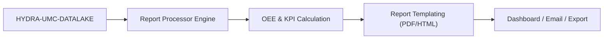

<p align="center">
  
</p>

# 📈 HYDRA-UMC-PRODUCTION-REPORTS

<p align="center"><a href="README.md">🇺🇸 English</a> | <a href="README_spa.md">🇪🇸 Español</a> | <a href="README_fra.md">🇫🇷 Français</a> | <a href="README_ita.md">🇮🇹 Italiano</a> | <a href="README_deu.md">🇩🇪 Deutsch</a> | <a href="README_zho.md">🇨🇳 简体中文</a> | 🇯🇵 <b>日本語</b></p>

### 📑 工場管理者向けの自動化された KPI・OEE レポートエンジン

<p align="left">
  
  
  
</p>

---

## 1. 🛠️ 技術概要

**HYDRA-UMC-PRODUCTION-REPORTS** は、工場管理のための分析頭脳です。
データレイクからの生データを処理し、生産効率、品質、機械の稼働率に
関する自動化された高レベルのレポートを生成します。

スウォーム全体の **OEE（総合設備効率）** を計算し、生産ラインの
ボトルネックを特定し、はんだの熱プロファイルからピック＆プレースの
精度に至るまで、製造されたすべての部品のトレーサビリティを提供します。

### 主な機能：
* 📈 **OEE 計算：** 可用性、パフォーマンス、品質のリアルタイムメトリクス。
* 📑 **自動化されたレポート：** 管理者に送信される日次、週次、月次の PDF/CSV サマリー。
* 🛠️ **ボトルネック分析：** ミッションキューの遅延を引き起こしているロボットやツールを特定します。
* 🌡️ **品質トレーサビリティ：** すべての最終製品を、その特定の組立ログ（熱、視覚、機械）に関連付けます。
* 🕐 **シフト/日境界：** `shift.py` は、シフトや暦日がどこで始まりどこで終わるかについて、すべてのレポートに単一の実在する信頼できる情報源を提供します——真夜中をまたぐ実際の夜勤も含みます。*（実装済み）*
* 🧾 **バージョン管理された計算式 + トレーサビリティ：** すべてのレポートは、実際の `formula_version` と、それを生成した正確なデータに対する sha256 の `input_fingerprint` を保持します。*（実装済み）*
* 📤 **再現可能な CSV エクスポート：** `GET /reports/{oee,availability}/export` —— 同一の入力に対してバイト単位で完全に同一の出力を生成します。単なる「近い値」ではありません。*（実装済み）*

---

## 2. 🔄 レポーティングフロー



---

## 3. 🧱 アーキテクチャと設計上の決定

* **HYDRA-UMC-DATALAKE のサブモジュールではなく兄弟プロジェクトである理由。** レポート生成は、既に保存されたテレメトリに対する定期的な読み取り専用の「クエリ＋計算」処理です——独立させておくことで、レポート生成が、HYDRA-UMC-TELEMETRY-COLLECTOR 自身の同じストアのリソースに対するリアルタイム書き込みと競合することは決してありません。本プロジェクトは自身のデータベースを持ちません。
* **共有ライブラリではなく、実際の HTTP 連携。** `datalake_client.py` はプレーンな HTTP（`GET /query`）を介して実際に稼働中の HYDRA-UMC-DATALAKE インスタンスと通信し、両者が現在同じ開発環境に存在していても、DATALAKE の Python パッケージを直接インポートすることは意図的に避けています——実際の HTTP こそが、本番環境で別々のリポジトリ/サービスが実際にどのように通信するかに一致する、真に疎結合な連携経路です。
* **`production_event` スキーマは本プロジェクト独自の v0 の取り決めであり、エコシステム標準ではありません。** OEE を計算するには、完了した各サイクルについて、良品だったかどうかとサイクル時間を知る必要があります。本プロジェクトはこれを、サイクルごとに1つの DATALAKE `Sample`、`kind="production_event"`、同一タイムスタンプで一緒に書き込まれる2つのフィールド——`"good"`（1.0/0.0）と `"cycleTimeS"`——として定義します。この kind をまだ書き込んでいる他のプロジェクトはありません——HYDRA-UMC-JOB-DISPATCHER がこの形式でサイクル完了を報告するように接続されれば、それが実際の生産データソースとなります（`mejoras_futuras.txt` で追跡）。
* **可用性の計算は、意図的に既存の任意のテレメトリストリームに対して機能します。** OEE とは異なり、`availability.py` は `production_event` の取り決めを一切必要としません——DATALAKE に既に存在する任意のタイムスタンプ列（例えば HYDRA-UMC-TELEMETRY-COLLECTOR が既に書き込んでいる `motor_temp` サンプル）を受け取り、連続するサンプル間の間隔が `expected_interval_ms x gap_factor` を超える場合、それを実際のダウンタイムとして扱います。これこそが、どのプロジェクトも実際の `production_event` データを書き込む前から、本プロジェクトがテレメトリの「兄弟プロジェクト」と実際に「対話」できる理由です。
* **Performance と Availability は `[0, 1]` にクランプされています。** 実際のサイクルは、控えめな「理想」値よりも速く進むことがあり、また稼働時間が誤って設定された計画ウィンドウを超えることもあります。>100% を報告することは算術的には正しくても、実際には誤解を招くため、両方ともクランプされています。
* **一致しない `production_event` フィールドはカウントされ報告されます。決して黙ってデフォルト値に置き換えられることはありません。** `"good"` の値に、まったく同じタイムスタンプで対応する `"cycleTimeS"` がない場合（部分的な/不正な書き込み）、それは除外され、除外された件数はエラー/レスポンスに含まれます。サイクル時間を 0 秒と仮定することは、Performance の数値を損なうため行いません。
* **`shift.py` が `oee.py`/`availability.py` 内のインライン計算ではなく、独立したモジュールである理由。** シフトや暦日の区切りについて静かに食い違う 2 つのレポートは、同じ実際の時間ウィンドウに対して、どちらも一見正当に見える異なる数値を生み出します——これはまさに昇格監査が指摘した矛盾です。シフト/日境界を独立した、実際に動作する、テスト済みのモジュールにすること（真夜中をまたぐ実際の夜勤や、タイムスタンプからシフトへの実際の逆引きを含む）によって、各呼び出し元が個別に再導出するのではなく、すべてのレポートが同じ信頼できる情報源を共有できます。
* **`formula_version` と `input_fingerprint` が CSV だけでなくレポート自体に含まれる理由。** JSON として消費されるレポート（ダッシュボードや他のサービスによって）も、ファイルにエクスポートされるレポートと同じトレーサビリティを持つべきです——この 2 つのフィールドは、既存の `GET /reports/oee`/`GET /reports/availability` のレスポンスに追加されるものであり、`export.py` の出力だけに現れるものではありません。
* **CSV エクスポートが既存ルートへの `?format=csv` フラグではなく、新しいエンドポイントである理由。** `GET /reports/oee`/`GET /reports/availability` に手を加えない（引き続き実際に動作し、引き続き JSON であり、`tests/test_api.py` が既にアサートしている内容とまったく同じ）ことで、既にテスト済みのレスポンスに一切触れることなく、エクスポート機能を追加し、その再現性を証明できました。

---

## 📂 リポジトリ構成

純粋なソフトウェアサービス（レポート生成）であり、独自のハードウェア、
ファームウェア、OS はありません。これらのディレクトリはリポジトリ構造
ポリシーに従って省略されています。

```text
HYDRA-UMC-PRODUCTION-REPORTS/
├── src/hydra_umc_production_reports/
│   ├── __init__.py           # パッケージバージョン
│   ├── datalake_client.py    # HYDRA-UMC-DATALAKE の GET /query API 向けの実際の HTTP クライアント
│   ├── oee.py                 # 実際の OEE 計算式（可用性 x パフォーマンス x 品質）
│   ├── availability.py        # テレメトリの間隔から算出する実際のダウンタイム計算
│   ├── reports.py             # オーケストレーション: DatalakeClient -> oee.py / availability.py
│   ├── shift.py                # 実際のシフト/日境界計算（信頼できる情報源）
│   ├── export.py               # 実際の、バイト単位で再現可能な CSV エクスポート
│   ├── api.py                  # 実際の HTTP API（GET /reports/oee、/reports/availability、/stats、/export）
│   └── main.py                 # エントリポイント - 実際の HTTP サーバーを起動
├── tests/                    # 実際のテスト：OEE/可用性/シフト/エクスポートの計算、偽の DATALAKE に対する往復テスト
├── docs/
│   └── API.md                 # 本物の HTTP エンドポイントリファレンス（リクエスト、レスポンス、ステータスコード）
├── pyproject.toml            # パッケージメタデータ + [dev] extras（pytest）
├── bump_version.py           # オドメーター式バージョンインクリメント（ビルドが実行）
├── build.sh / build.bat      # 実際のビルド：venv + editable インストール + 実際のテストスイート
├── run.sh / run.bat          # 実際の実行：HTTP API を起動
└── README.md
```

完全な HTTP エンドポイントリファレンスは [`docs/API.md`](docs/API.md) を参照。

---

## 4. ⚙️ ビルドと実行

Python >= 3.10 が必要です。

```bash
# Linux/macOS
./build.sh && ./run.sh --datalake-url http://localhost:8095

# Windows
build.bat
run.bat --datalake-url http://localhost:8095
```

`build` はローカルの `.venv` を作成/アクティブ化し、開発用 extras 込みで
パッケージを editable モードでインストールし、インポートを検証した後、
実際の `pytest` テストスイートを実行します。`run` は実際の HTTP API
（デフォルトポート `8099`）を起動し、`--datalake-url`（デフォルト
`http://localhost:8095`）で指定した HYDRA-UMC-DATALAKE インスタンスに
接続します。

```bash
# ソース "robot-1" の 5 秒間ウィンドウにおける実際の OEE レポート
curl "http://localhost:8099/reports/oee?sourceId=robot-1&start=0&end=5000&plannedTimeS=10.0&idealCycleTimeS=2.0"

# 同じソースの motor_temp ストリームに対する実際の可用性レポート
curl "http://localhost:8099/reports/availability?sourceId=robot-1&kind=motor_temp&field=value&start=0&end=10000&expectedIntervalMs=1000"
```

---

## 🚀 ロードマップ
* **完了（v0）：** 実際の OEE と可用性の計算、HYDRA-UMC-DATALAKE との実際の HTTP 連携、実際の HTTP API。
* **次のステップ：** 実際の `production_event` データソース - HYDRA-UMC-JOB-DISPATCHER を接続し、このスキーマでサイクル完了を報告させる。
* **次のステップ：** 永続化/スケジュールされたレポート（現在、各レポートはオンデマンドでライブ計算されています）。
* **さらに先：** 以下の元のロードマップに沿った、実際の PDF/CSV エクスポートとダッシュボード。
* 工具アップグレードのための AI 駆動 ROI 分析。履歴トレンドが保存され次第、これらと同じ OEE データに接続されます。

---

## 🔗 関連プロジェクト

本プロジェクトは、同一著者（JuanenRac / Electro Hobby 3D）による、
ファームウェア、制御ソフトウェア、AI ノード、フリート管理ツールにまたがる、
より大きなロボティクスエコシステムの一部です。ご要望が実際にはこれらの
プロジェクトのいずれかに関するものであり、本リポジトリのものではない
可能性もあるため、知っておく価値があります。

### プロジェクトファミリー

**親プロジェクト：** **[HYDRA-UMC-DATALAKE](https://github.com/JuanenRac/HYDRA-UMC-DATALAKE)** —— 本プロジェクトが保存されたテレメトリについてレポートする統合親プロジェクト。

**兄弟プロジェクト：**
- **[HYDRA-UMC-TELEMETRY-COLLECTOR](https://github.com/JuanenRac/HYDRA-UMC-TELEMETRY-COLLECTOR)** —— 同じ親プロジェクトを持つ兄弟分析サービス。
- **[HYDRA-UMC-ANOMALY-DETECTOR](https://github.com/JuanenRac/HYDRA-UMC-ANOMALY-DETECTOR)** —— 同じ親プロジェクトを持つ兄弟分析サービス。

### 直接関連（ファミリー外）

本プロジェクトは、Data & Analytics ファミリー外に直接関連するプロジェ
クトを持ちません（エコシステム自身の関係図に基づく）——その他すべて
は下記の「エコシステムのその他のプロジェクト」を参照してください。

### エコシステムのその他のプロジェクト

**HYDRA-UMC プラットフォーム** — マルチロボット・マイクロファクトリーセル
- **[HYDRA-UMC](https://github.com/JuanenRac/HYDRA-UMC)** — 最大 8 台のロボットアームを統括する CM5 + STM32H745 マザーボード。
- **[HYDRA-UMC-SERVER](https://github.com/JuanenRac/HYDRA-UMC-SERVER)** — すべての制御クライアントが接続する Express/WebSocket バックエンド。
- **[HYDRA-UMC-STUDIO](https://github.com/JuanenRac/HYDRA-UMC-STUDIO)** — Web ベースの制御ダッシュボード、マルチロボット 3D 可視化。
- **[HYDRA-UMC-ANDROID-CONTROL](https://github.com/JuanenRac/HYDRA-UMC-ANDROID-CONTROL)** — Wi-Fi/Bluetooth 経由の Android 制御アプリ。
- **[HYDRA-UMC-IOS-CONTROL](https://github.com/JuanenRac/HYDRA-UMC-IOS-CONTROL)** — Flutter で構築された iOS/iPadOS 制御アプリ。
- **[HYDRA-UMC-SUITE](https://github.com/JuanenRac/HYDRA-UMC-SUITE)** — デスクトップ版群制御コマンドセンター（Python/PySide6）。
- **[HYDRA-UMC-EDITOR-URDF](https://github.com/JuanenRac/HYDRA-UMC-EDITOR-URDF)** — ロボットカタログ向けのデスクトップ版 URDF モデルエディター。
- **[HYDRA-UMC-DSI](https://github.com/JuanenRac/HYDRA-UMC-DSI)** — 機載 DSI タッチスクリーン用のネイティブタッチ UI。

**URTC プラットフォーム** — すべての HYDRA-UMC ロボットアームが搭載するツールヘッドコントローラー
- **[URTC](https://github.com/JuanenRac/URTC)** — CAN バスツールヘッドコントローラー、25 種類のツールプロファイル。
- **[URTC-FLASHER](https://github.com/JuanenRac/URTC-FLASHER)** — デスクトップ版 CAN-OTA + SWD/JTAG フラッシュツール。
- **[URTC-TESTER](https://github.com/JuanenRac/URTC-TESTER)** — デスクトップ版ライブ CAN バス診断ツール。
- **[URTC-WEB-STUDIO](https://github.com/JuanenRac/URTC-WEB-STUDIO)** — Web Serial API によるブラウザベースの代替版。

**🎥 ビジョン AI ノード（Hailo-8）**
- [HYDRA-UMC-VISION-NODE](https://github.com/JuanenRac/HYDRA-UMC-VISION-NODE)
- [HYDRA-UMC-VISION-STREAMER](https://github.com/JuanenRac/HYDRA-UMC-VISION-STREAMER)
- [HYDRA-UMC-DETECTION-HEF](https://github.com/JuanenRac/HYDRA-UMC-DETECTION-HEF)
- [HYDRA-UMC-SAFETY-ZONES](https://github.com/JuanenRac/HYDRA-UMC-SAFETY-ZONES)
- [HYDRA-UMC-VISUAL-SERVOING-API](https://github.com/JuanenRac/HYDRA-UMC-VISUAL-SERVOING-API)

**🧠 認知 AI ノード（Hailo-10）**
- [HYDRA-UMC-COGNITIVE-NODE](https://github.com/JuanenRac/HYDRA-UMC-COGNITIVE-NODE)
- [HYDRA-UMC-VLA-ENGINE](https://github.com/JuanenRac/HYDRA-UMC-VLA-ENGINE)
- [HYDRA-UMC-VOICE-UI](https://github.com/JuanenRac/HYDRA-UMC-VOICE-UI)
- [HYDRA-UMC-SEMANTIC-PLANNER](https://github.com/JuanenRac/HYDRA-UMC-SEMANTIC-PLANNER)
- [HYDRA-UMC-DOCS-QA](https://github.com/JuanenRac/HYDRA-UMC-DOCS-QA)

**🐝 オーケストレーションと群制御**
- [HYDRA-UMC-ORCHESTRATOR](https://github.com/JuanenRac/HYDRA-UMC-ORCHESTRATOR)
- [HYDRA-UMC-SWARM-SYNC](https://github.com/JuanenRac/HYDRA-UMC-SWARM-SYNC)
- [HYDRA-UMC-PATH-PLANNER-3D](https://github.com/JuanenRac/HYDRA-UMC-PATH-PLANNER-3D)
- [HYDRA-UMC-JOB-DISPATCHER](https://github.com/JuanenRac/HYDRA-UMC-JOB-DISPATCHER)
- [HYDRA-UMC-NODE-HEALING](https://github.com/JuanenRac/HYDRA-UMC-NODE-HEALING)

**🎮 デジタルツインとシミュレーション**
- [HYDRA-UMC-TWIN](https://github.com/JuanenRac/HYDRA-UMC-TWIN)
- [HYDRA-UMC-PHYSICS-REPLICA](https://github.com/JuanenRac/HYDRA-UMC-PHYSICS-REPLICA)
- [HYDRA-UMC-HIL-BRIDGE](https://github.com/JuanenRac/HYDRA-UMC-HIL-BRIDGE)
- [HYDRA-UMC-SYNTHETIC-DATA-GEN](https://github.com/JuanenRac/HYDRA-UMC-SYNTHETIC-DATA-GEN)

**🏭 産業用ゲートウェイ**
- [HYDRA-UMC-GATEWAY-INDUSTRIAL](https://github.com/JuanenRac/HYDRA-UMC-GATEWAY-INDUSTRIAL)
- [HYDRA-UMC-OPCUA-SERVER](https://github.com/JuanenRac/HYDRA-UMC-OPCUA-SERVER)
- [HYDRA-UMC-MQTT-BROKER](https://github.com/JuanenRac/HYDRA-UMC-MQTT-BROKER)
- [HYDRA-UMC-MTCONNECT-ADAPTER](https://github.com/JuanenRac/HYDRA-UMC-MTCONNECT-ADAPTER)

**🛠️ 補完ツール**
- [URTC-SMART-RACK](https://github.com/JuanenRac/URTC-SMART-RACK)
- [URTC-VISION-TOOL](https://github.com/JuanenRac/URTC-VISION-TOOL)
- [HYDRA-UMC-WATCH](https://github.com/JuanenRac/HYDRA-UMC-WATCH)
- [HYDRA-UMC-TOOL-CLI](https://github.com/JuanenRac/HYDRA-UMC-TOOL-CLI)
- [HYDRA-UMC-DASHBOARD-AI](https://github.com/JuanenRac/HYDRA-UMC-DASHBOARD-AI)


## 👤 作者
**JuanenRac**（Electro Hobby 3D）
📧 electrohobby3d@gmail.com

## 📜 ライセンス
GPL-3.0 —— 詳細は LICENSE を参照してください。

## 🛠️ BUILD & RUN

リリースビルドの前に、バージョンを変更しないビルドチェックを使用してください。

| 操作 | Windows | Linux / macOS |
|---|---|---|
| ビルドチェック（バージョンと CHANGELOG を変更しない） | `build-test.bat` | `./build-test.sh` |
| 実行 / 開発（提供されている場合） | `run*.bat` または `dev*.bat` | `./run*.sh` または `./dev*.sh` |

`build-test.bat` と `build-test.sh` は、`hydra-umc.project.json` をインクリメントせず、`CHANGELOG.md` も変更せずにプロジェクトのスタックをコンパイルまたは検証します。通常のコンパイラ出力だけが作成される場合があります。既存の `build*.bat`、`build*.sh`、`run*`、`dev*` は、各プロジェクト固有のバージョン化または実行時の動作を維持します。その動作が必要な場合はそれらを使用してください。