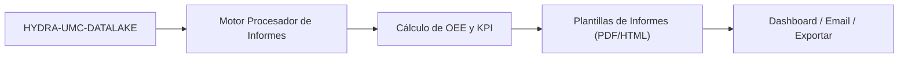

<p align="center">
  
</p>

# 📈 HYDRA-UMC-PRODUCTION-REPORTS

<p align="center"><a href="README.md">🇺🇸 English</a> | 🇪🇸 <b>Español</b> | <a href="README_fra.md">🇫🇷 Français</a> | <a href="README_ita.md">🇮🇹 Italiano</a> | <a href="README_deu.md">🇩🇪 Deutsch</a> | <a href="README_zho.md">🇨🇳 简体中文</a> | <a href="README_jpn.md">🇯🇵 日本語</a></p>

### 📑 Motor de Informes Automatizados de KPI y OEE para Gerentes de Planta

<p align="left">
  
  
  
</p>

---

## 1. 🛠️ VISIÓN GENERAL TÉCNICA

**HYDRA-UMC-PRODUCTION-REPORTS** es el cerebro analítico para la gestión de la fábrica. Procesa datos brutos del Datalake para generar informes automatizados de alto nivel sobre la eficiencia de la producción, la calidad y la disponibilidad de las máquinas.

Calcula el **OEE (Efectividad General del Equipo)** de todo el enjambre, identificando cuellos de botella en la línea de producción y proporcionando trazabilidad para cada componente fabricado, desde los perfiles térmicos de soldadura hasta la precisión de Pick-and-Place.

### Características Clave:
* 📈 **Cálculo de OEE:** Métricas en tiempo real de Disponibilidad, Rendimiento y Calidad.
* 📑 **Informes Automatizados:** Resúmenes diarios, semanales y mensuales en PDF/CSV enviados a los gerentes.
* 🛠️ **Análisis de Cuellos de Botella:** Identifica qué robots o herramientas están causando retrasos en la cola de misiones.
* 🌡️ **Trazabilidad de Calidad:** Vincula cada producto final a sus logs de ensamblaje específicos (térmicos, visuales, mecánicos).
* 🕐 **Límites de Turno/Día:** `shift.py` da a cada informe una única fuente real de verdad sobre dónde empieza y termina un turno o día natural - incluyendo un turno de noche real que cruza la medianoche. *(implementado)*
* 🧾 **Fórmulas Versionadas + Trazabilidad:** Cada informe lleva su `formula_version` real y una `input_fingerprint` sha256 sobre los datos exactos que lo produjeron. *(implementado)*
* 📤 **Exportación CSV Reproducible:** `GET /reports/{oee,availability}/export` - salida idéntica byte a byte para entradas idénticas, no solo "suficientemente parecida". *(implementado)*

---

## 2. 🔄 FLUJO DE INFORMES



---

## 3. 🧱 ARQUITECTURA Y DECISIONES DE DISEÑO

* **Por qué es hermano, no un submódulo, de HYDRA-UMC-DATALAKE.** La generación de informes es un trabajo de consulta+cálculo periódico y de solo lectura sobre telemetría ya almacenada - mantenerlo separado significa que una generación de informe nunca compite con las propias escrituras en tiempo real de HYDRA-UMC-TELEMETRY-COLLECTOR por los recursos del mismo almacén. Este proyecto no tiene base de datos propia.
* **Integración HTTP real, no una librería compartida.** `datalake_client.py` habla con una instancia real de HYDRA-UMC-DATALAKE por HTTP plano (`GET /query`), y deliberadamente NO importa el paquete Python de DATALAKE directamente aunque ambos convivan hoy en el mismo entorno de desarrollo - HTTP real es el punto de integración real y desacoplado que coincide con cómo se hablarían de verdad repos/servicios separados en producción.
* **El schema `production_event` es la convención propia v0 de este proyecto, no un estándar del ecosistema.** El OEE necesita saber, por cada ciclo completado, si la pieza salió buena y cuánto tardó el ciclo. Este proyecto define eso como un `Sample` de DATALAKE por ciclo, `kind="production_event"`, con dos campos escritos juntos en el mismo timestamp: `"good"` (1.0/0.0) y `"cycleTimeS"`. Ningún otro proyecto escribe todavía este kind - HYDRA-UMC-JOB-DISPATCHER sería la fuente real de producción una vez que reporte finalizaciones de esta forma (rastreado en `mejoras_futuras.txt`).
* **La disponibilidad funciona contra CUALQUIER stream de telemetría existente, a propósito.** A diferencia del OEE, `availability.py` no necesita en absoluto la convención `production_event` - toma cualquier serie de timestamps ya presente en DATALAKE (p. ej. muestras `motor_temp` que HYDRA-UMC-TELEMETRY-COLLECTOR ya escribe) y marca como downtime real un hueco entre muestras consecutivas mayor que `expected_interval_ms x gap_factor`. Esto es justo lo que hoy le permite a este proyecto "hablar" con sus hermanos de telemetría, antes de que ningún proyecto escriba datos `production_event` de verdad.
* **Performance y Availability están acotados a `[0, 1]`.** Un ciclo real puede ir más rápido que una cifra "ideal" conservadora, o el tiempo operativo puede superar una ventana planificada mal configurada; reportar >100% sería defendible aritméticamente pero engañoso en la práctica, así que ambos se limitan.
* **Los campos `production_event` sin emparejar se cuentan y se reportan, nunca se rellenan en silencio.** Si una lectura `"good"` no tiene un `"cycleTimeS"` emparejado en el mismo timestamp exacto (una escritura parcial/malformada), se excluye y el número de lecturas excluidas se incluye en el error/respuesta en vez de asumir un tiempo de ciclo de 0s, lo que corrompería la cifra de Performance.
* **Por qué `shift.py` es un módulo separado, no matemática en línea dentro de `oee.py`/`availability.py`.** Dos informes que discrepan silenciosamente sobre dónde corta un turno o un día natural producen dos cifras distintas, ambas defendibles, para la misma ventana real - exactamente la contradicción que señaló la auditoría de promoción. Hacer de los límites de turno/día un módulo propio, real y probado (con un turno de noche real que cruza la medianoche, y una búsqueda inversa real de timestamp a turno) da a cada informe la misma fuente de verdad en vez de que cada llamador la re-derive por su cuenta.
* **Por qué `formula_version` e `input_fingerprint` están en el informe, no solo en el CSV.** Un informe consumido como JSON (por un dashboard, otro servicio) merece la misma trazabilidad que uno exportado a un archivo - ambos campos son aditivos sobre las respuestas ya existentes de `GET /reports/oee`/`GET /reports/availability`, no algo visible solo en la salida de `export.py`.
* **Por qué la exportación CSV es un endpoint nuevo, no un flag `?format=csv` en las rutas existentes.** Mantener `GET /reports/oee`/`GET /reports/availability` intactos (siguen siendo reales, siguen siendo JSON, siguen siendo exactamente lo que `tests/test_api.py` ya verificaba) permitió añadir la función de exportación y demostrar que es reproducible sin tocar una sola respuesta ya probada.

---

## 📂 ESTRUCTURA DE DIRECTORIOS

Servicio de software puro (generación de informes) - sin hardware, firmware ni sistema operativo propios; esas carpetas se omiten por política de estructura del repositorio.

```text
HYDRA-UMC-PRODUCTION-REPORTS/
├── src/hydra_umc_production_reports/
│   ├── __init__.py           # Versión del paquete
│   ├── datalake_client.py    # Cliente HTTP real para la API GET /query de HYDRA-UMC-DATALAKE
│   ├── oee.py                 # Fórmula OEE real (Disponibilidad x Rendimiento x Calidad)
│   ├── availability.py        # Cálculo real de downtime a partir de huecos de telemetría
│   ├── reports.py             # Orquestación: DatalakeClient -> oee.py / availability.py
│   ├── shift.py                # Cálculo real de límites de turno/día (fuente de verdad)
│   ├── export.py               # Exportación CSV real, reproducible byte a byte
│   ├── api.py                  # API HTTP real (GET /reports/oee, /reports/availability, /stats, /export)
│   └── main.py                 # Punto de entrada - arranca el servidor HTTP real
├── tests/                    # Tests reales: matemática de OEE/disponibilidad/turno/exportación, round-trips contra un DATALAKE falso
├── docs/
│   └── API.md                 # Referencia real de endpoints HTTP (peticiones, respuestas, codigos de estado)
├── images/                   # Medios y diagramas
├── systemd/
│   └── hydra-umc-production-reports.service # Unidad systemd de la API local de informes en la CM5
├── tools/
│   ├── build_test.py         # Comprobación de compilación sin versionado
│   └── ci_validate.py        # Validación de manifiesto/CHANGELOG/docs usada por CI
├── pyproject.toml            # Metadatos del paquete + extras [dev] (pytest)
├── bump_version.py           # Incremento de versión nativa tipo cuentakilómetros (lo ejecuta el build)
├── bump_manifest_version.py  # Sincroniza la versión de hydra-umc.project.json con la nativa (--sync)
├── build.sh / build.bat      # Build real: venv + instalación editable + suite de tests real
├── run.sh / run.bat          # Ejecución real: arranca la API HTTP
└── README.md
```

Ver [`docs/API.md`](docs/API.md) para la referencia completa de endpoints HTTP.

---

## 4. ⚙️ BUILD Y EJECUCIÓN

Requiere Python >= 3.10.

```bash
# Linux/macOS
./build.sh && ./run.sh --datalake-url http://localhost:8095

# Windows
build.bat
run.bat --datalake-url http://localhost:8095
```

`build` crea/activa un `.venv` local, instala el paquete en modo editable con extras de desarrollo, verifica la importación y corre la suite de tests real de `pytest`. `run` arranca la API HTTP real (puerto por defecto `8099`) contra una instancia de HYDRA-UMC-DATALAKE en `--datalake-url` (por defecto `http://localhost:8095`).

```bash
# Informe OEE real para la fuente "robot-1" en una ventana de 5 segundos
curl "http://localhost:8099/reports/oee?sourceId=robot-1&start=0&end=5000&plannedTimeS=10.0&idealCycleTimeS=2.0"

# Informe de disponibilidad real para el stream motor_temp de la misma fuente
curl "http://localhost:8099/reports/availability?sourceId=robot-1&kind=motor_temp&field=value&start=0&end=10000&expectedIntervalMs=1000"
```

---

## 🚀 HOJA DE RUTA
* **Hecho (v0):** cálculo real de OEE y disponibilidad, integración HTTP real con HYDRA-UMC-DATALAKE, API HTTP real.
* **Siguiente:** una fuente real de datos `production_event` - conectar HYDRA-UMC-JOB-DISPATCHER para que reporte finalizaciones de ciclo con este schema.
* **Siguiente:** informes persistentes/programados (hoy cada informe se calcula en vivo, bajo demanda).
* **Más adelante:** exportación PDF/CSV real y un dashboard, según la hoja de ruta original abajo.
* Análisis de ROI impulsado por IA para actualizaciones de herramientas, conectado a estos mismos datos de OEE una vez que se almacenen tendencias históricas.

---

## 🔗 Proyectos Relacionados

Este proyecto es parte del ecosistema de robótica HYDRA-UMC del mismo autor (JuanenRac / Electro Hobby 3D). Vale la pena conocerlo, ya que una petición podría en realidad ser sobre alguno de estos en vez de sobre este repositorio.

**Proyecto Padre**
- **[HYDRA-UMC-DATALAKE](https://github.com/JuanenRac/HYDRA-UMC-DATALAKE)** — almacén de series temporales real respaldado por sqlite3, con una API HTTP real de ingesta/consulta; el padre del que este repositorio es un servicio de analítica específico, dentro de su propia capa de datos y analítica.

**Proyectos Hermanos** — los demás servicios de analítica de la propia capa de datos y analítica de HYDRA-UMC-DATALAKE
- **[HYDRA-UMC-TELEMETRY-COLLECTOR](https://github.com/JuanenRac/HYDRA-UMC-TELEMETRY-COLLECTOR)** — pipeline real de ingesta CAN/WebSocket hacia DATALAKE, con deduplicación por secuencia — también una fuente de datos real hoy: el propio `availability.py` de este informe lee sus muestras `motor_temp` (y cualquier otra serie que escriba) directamente desde Datalake, sin necesitar la convención `production_event` para ese informe.
- **[HYDRA-UMC-ANOMALY-DETECTOR](https://github.com/JuanenRac/HYDRA-UMC-ANOMALY-DETECTOR)** — detector de anomalías real basado en FFT + línea base estadística, con monitorización de deriva.

**Directamente Relacionados**
- **[HYDRA-UMC-JOB-DISPATCHER](https://github.com/JuanenRac/HYDRA-UMC-JOB-DISPATCHER)** — cola de trabajos real basada en prioridad con deduplicación, sobre una API HTTP real — la fuente real prevista de las muestras `production_event` (la propia convención de buenas piezas/tiempo de ciclo de OEE) una vez las finalizaciones de misión estén conectadas para escribirlas; nada escribe ese tipo todavía, seguido honestamente como trabajo futuro en vez de darse por hecho.

**También Forma Parte del Ecosistema**

*Hardware y Plataforma Base*
- **[HYDRA-UMC](https://github.com/JuanenRac/HYDRA-UMC)** — la placa madre física del brazo robótico: host CM5 + coprocesador STM32H745 de doble núcleo, coordinando hasta 8 brazos herramienta por CAN-OTA/SPI-OTA.
- **[HYDRA-UMC-OS](https://github.com/JuanenRac/HYDRA-UMC-OS)** — capa de producto reproducible sobre Raspberry Pi OS para el CM5: agente de solo lectura, config/perfiles validados, aprovisionamiento WiFi de primer contacto.
- **[HYDRA-UMC-SDK](https://github.com/JuanenRac/HYDRA-UMC-SDK)** — el contrato JSON-Schema compartido y la barrera de seguridad contra la que cada bridge valida sus comandos.

*Backend Central y Clientes*
- **[HYDRA-UMC-SERVER](https://github.com/JuanenRac/HYDRA-UMC-SERVER)** — el backend headless real (REST/WebSocket) con el que habla de verdad cada cliente de control.
- **[HYDRA-UMC-STUDIO](https://github.com/JuanenRac/HYDRA-UMC-STUDIO)** — panel de control web con visualización 3D multi-robot en tiempo real.
- **[HYDRA-UMC-SUITE](https://github.com/JuanenRac/HYDRA-UMC-SUITE)** — centro de mando de enjambre de escritorio (PySide6) para varios servidores a la vez, empaquetado como ejecutable independiente.
- **[HYDRA-UMC-ANDROID-CONTROL](https://github.com/JuanenRac/HYDRA-UMC-ANDROID-CONTROL)** — app nativa de control para Android con inicio de sesión biométrico y un compañero Wear OS emparejado.
- **[HYDRA-UMC-IOS-CONTROL](https://github.com/JuanenRac/HYDRA-UMC-IOS-CONTROL)** — app de control para iOS/iPadOS (Flutter) con sincronización en tiempo real por WebSocket.
- **[HYDRA-UMC-DSI](https://github.com/JuanenRac/HYDRA-UMC-DSI)** — interfaz táctil nativa para la pantalla táctil DSI de 7" a bordo, embebida en el propio CM5.
- **[HYDRA-UMC-EDITOR-URDF](https://github.com/JuanenRac/HYDRA-UMC-EDITOR-URDF)** — creador/editor gráfico de URDF de escritorio que envía los modelos terminados al propio catálogo de STUDIO.
- **[HYDRA-UMC-BRIDGE-AMR](https://github.com/JuanenRac/HYDRA-UMC-BRIDGE-AMR)** — barrera de coordinación para flotas AGV/AMR mediante un publicador MQTT VDA 5050 real.
- **[HYDRA-UMC-BRIDGE-CNC](https://github.com/JuanenRac/HYDRA-UMC-BRIDGE-CNC)** — coordinador de alto nivel para celdas CNC con acceso real a estado/bytes de control GRBL.
- **[HYDRA-UMC-BRIDGE-DROIDS](https://github.com/JuanenRac/HYDRA-UMC-BRIDGE-DROIDS)** — barrera de coordinación para droides con patas/humanoides, con un emisor de comandos real para Boston Dynamics Spot.
- **[HYDRA-UMC-BRIDGE-LASER](https://github.com/JuanenRac/HYDRA-UMC-BRIDGE-LASER)** — coordinador de seguridad para celdas láser que lee 3 salvaguardas GPIO reales de llave/carcasa/enclavamiento.
- **[HYDRA-UMC-BRIDGE-OPENPNP](https://github.com/JuanenRac/HYDRA-UMC-BRIDGE-OPENPNP)** — coordinador de alto nivel seguro para el flujo de placas de pick-and-place OpenPnP.
- **[HYDRA-UMC-BRIDGE-PRINTER3D](https://github.com/JuanenRac/HYDRA-UMC-BRIDGE-PRINTER3D)** — barrera de coordinación segura para impresoras 3D Moonraker/Klipper, con comandos de trabajo reales y controlados.
- **[HYDRA-UMC-BRIDGE-ROS2](https://github.com/JuanenRac/HYDRA-UMC-BRIDGE-ROS2)** — coordinador de seguridad con un transporte ROS 2 rclpy real, importado de forma perezosa.
- **[HYDRA-UMC-BRIDGE-UAV](https://github.com/JuanenRac/HYDRA-UMC-BRIDGE-UAV)** — barrera de coordinación para UAV equipados con cámara, con un emisor de comandos MAVLink real.

*Plataforma de Herramientas URTC*
- **[URTC](https://github.com/JuanenRac/URTC)** — firmware para la placa física del Universal Robot Tool Controller, más de 25 perfiles de herramienta por bus CAN.
- **[URTC-FLASHER](https://github.com/JuanenRac/URTC-FLASHER)** — herramienta de escritorio con GUI para flashear placas URTC, CAN-OTA más SWD/JTAG de chip completo.
- **[URTC-TESTER](https://github.com/JuanenRac/URTC-TESTER)** — herramienta de escritorio de diagnóstico CAN-bus en vivo para placas URTC, un panel por perfil de herramienta.
- **[URTC-WEB-STUDIO](https://github.com/JuanenRac/URTC-WEB-STUDIO)** — alternativa basada en navegador a URTC-TESTER mediante la Web Serial API, sin instalación local.

*Nodo IA de Visión (Hailo-8)*
- **[HYDRA-UMC-VISION-NODE](https://github.com/JuanenRac/HYDRA-UMC-VISION-NODE)** — nodo de integración para el pipeline de visión Hailo-8, con una comprobación real de disponibilidad de hardware por etapa.
- **[HYDRA-UMC-DETECTION-HEF](https://github.com/JuanenRac/HYDRA-UMC-DETECTION-HEF)** — registro real de modelos compilados con verificación de carga segura por arquitectura Hailo/checksum.
- **[HYDRA-UMC-VISION-STREAMER](https://github.com/JuanenRac/HYDRA-UMC-VISION-STREAMER)** — generador real de pipeline GStreamer + config MediaMTX, con una frontera de integración HailoRT real.
- **[HYDRA-UMC-VISUAL-SERVOING-API](https://github.com/JuanenRac/HYDRA-UMC-VISUAL-SERVOING-API)** — ley de corrección real de Position-Based Visual Servoing, con puerta de seguridad según el estado de zona previo.
- **[HYDRA-UMC-SAFETY-ZONES](https://github.com/JuanenRac/HYDRA-UMC-SAFETY-ZONES)** — comprobación real de invasión de zona y solicitud de E-STOP, con exigencia de vigencia de calibración.

*Nodo IA Cognitivo (Hailo-10)*
- **[HYDRA-UMC-COGNITIVE-NODE](https://github.com/JuanenRac/HYDRA-UMC-COGNITIVE-NODE)** — nodo de integración para el pipeline cognitivo Hailo-10 (orquestación de LLM/VLA/voz).
- **[HYDRA-UMC-VLA-ENGINE](https://github.com/JuanenRac/HYDRA-UMC-VLA-ENGINE)** — codificación/decodificación real de tokens de acción y generación de trayectoria para un modelo Vision-Language-Action.
- **[HYDRA-UMC-VOICE-UI](https://github.com/JuanenRac/HYDRA-UMC-VOICE-UI)** — front-end de voz real (VAD + analizador de intención) con un relé a Watch acotado y con confirmación.
- **[HYDRA-UMC-SEMANTIC-PLANNER](https://github.com/JuanenRac/HYDRA-UMC-SEMANTIC-PLANNER)** — descomposición real de tareas basada en reglas y recuperación semántica de errores sobre códigos de error del MCU.
- **[HYDRA-UMC-DOCS-QA](https://github.com/JuanenRac/HYDRA-UMC-DOCS-QA)** — búsqueda real de documentos TF-IDF (solo librería estándar) sobre los propios documentos Markdown de este ecosistema.

*Orquestación y Enjambre*
- **[HYDRA-UMC-ORCHESTRATOR](https://github.com/JuanenRac/HYDRA-UMC-ORCHESTRATOR)** — nodo de integración con un contrato real de informe de salud gRPC/Protobuf y una máquina de estados de misión.
- **[HYDRA-UMC-NODE-HEALING](https://github.com/JuanenRac/HYDRA-UMC-NODE-HEALING)** — watchdog de salud de flota real basado en gRPC, con reintento/backoff y detección de discrepancia de identidad.
- **[HYDRA-UMC-PATH-PLANNER-3D](https://github.com/JuanenRac/HYDRA-UMC-PATH-PLANNER-3D)** — planificador de rutas 3D real basado en RRT, con validación real de colisión de obstáculos/espacio de trabajo.
- **[HYDRA-UMC-SWARM-SYNC](https://github.com/JuanenRac/HYDRA-UMC-SWARM-SYNC)** — sincronización de estado real mediante CRDT LWW-Element-Map, con pruebas de propiedades para convergencia multi-celda.

*Gemelo Digital y Simulación*
- **[HYDRA-UMC-TWIN](https://github.com/JuanenRac/HYDRA-UMC-TWIN)** — nodo de integración para el motor de gemelo digital, con un contrato real de sincronización por compatibilidad de versión.
- **[HYDRA-UMC-HIL-BRIDGE](https://github.com/JuanenRac/HYDRA-UMC-HIL-BRIDGE)** — enclavamiento de seguridad real hardware-in-the-loop que enruta comandos entre simulación y hardware real.
- **[HYDRA-UMC-PHYSICS-REPLICA](https://github.com/JuanenRac/HYDRA-UMC-PHYSICS-REPLICA)** — cinemática directa real y validación de límites articulares sobre un subconjunto real de URDF.
- **[HYDRA-UMC-SYNTHETIC-DATA-GEN](https://github.com/JuanenRac/HYDRA-UMC-SYNTHETIC-DATA-GEN)** — generador real de escenas 2D procedurales con exportación de anotaciones YOLO/COCO.

*Pasarela Industrial*
- **[HYDRA-UMC-GATEWAY-INDUSTRIAL](https://github.com/JuanenRac/HYDRA-UMC-GATEWAY-INDUSTRIAL)** — nodo de integración que retransmite a protocolos industriales, con una capa real de lista blanca de comandos/contrapresión.
- **[HYDRA-UMC-OPCUA-SERVER](https://github.com/JuanenRac/HYDRA-UMC-OPCUA-SERVER)** — espacio de direcciones OPC-UA real, verificado con una sesión de cliente real del protocolo binario.
- **[HYDRA-UMC-MQTT-BROKER](https://github.com/JuanenRac/HYDRA-UMC-MQTT-BROKER)** — broker MQTT real con autenticación por cliente opcional y ACL de tópicos.
- **[HYDRA-UMC-MTCONNECT-ADAPTER](https://github.com/JuanenRac/HYDRA-UMC-MTCONNECT-ADAPTER)** — endpoints XML reales `/probe` y `/current` de MTConnect, con salida en modo degradado.

*Herramientas Complementarias y Operaciones del Ecosistema*
- **[HYDRA-UMC-DASHBOARD-AI](https://github.com/JuanenRac/HYDRA-UMC-DASHBOARD-AI)** — paneles de Resúmenes Inteligentes y Resaltado de Anomalías sobre DATALAKE/ANOMALY-DETECTOR, con un respaldo estadístico honesto.
- **[HYDRA-UMC-TOOL-CLI](https://github.com/JuanenRac/HYDRA-UMC-TOOL-CLI)** — CLI de flota con un contrato real y estable de códigos de salida, cliente real y en vivo de la propia API de HYDRA-UMC-SERVER.
- **[HYDRA-UMC-WATCH](https://github.com/JuanenRac/HYDRA-UMC-WATCH)** — app compañera de WearOS con alertas hápticas reales y un relé de voz al teléfono emparejado.
- **[URTC-SMART-RACK](https://github.com/JuanenRac/URTC-SMART-RACK)** — firmware para un rack de montaje de placas con decodificación real de ID de herramienta y lógica de precalentamiento Smart Idle.
- **[URTC-VISION-TOOL](https://github.com/JuanenRac/URTC-VISION-TOOL)** — firmware más un compañero de visión real en Python para un cabezal de inspección térmica/RGB.
- **[HYDRA-UMC-UPDATER](https://github.com/JuanenRac/HYDRA-UMC-UPDATER)** — herramienta administrativa de escritorio que descubre, clona y actualiza cada repositorio de este ecosistema.
- **[HYDRA-UMC-OS-REBUILDER](https://github.com/JuanenRac/HYDRA-UMC-OS-REBUILDER)** — herramienta de escritorio Windows/Linux que construye una imagen de la CM5 lista para grabar, precargada con las versiones más actuales del ecosistema, con configuración de primer arranque de Wi-Fi/usuario/SSH al estilo de Raspberry Pi Imager.


---

## 📚 Documentación y Comunidad

- **[CONTRIBUTING.md](CONTRIBUTING.md)** — stack tecnológico y pautas de codificación para un pull request.
- **[CODE_OF_CONDUCT.md](CODE_OF_CONDUCT.md)** — los estándares de comportamiento esperados en esta comunidad.
- **[SECURITY.md](SECURITY.md)** — cómo reportar una vulnerabilidad, y las áreas reales de enfoque en seguridad de este proyecto.
- **[SUPPORT.md](SUPPORT.md)** — dónde hacer preguntas y reportar errores.
- **[LICENSE.md](LICENSE.md)** — la licencia propia de este proyecto.

## 👤 AUTOR
**JuanenRac** (Electro Hobby 3D)
📧 electrohobby3d@gmail.com
📺 [youtube.com/@electrohobby3d](https://youtube.com/@electrohobby3d)

## 📜 LICENCIA
GPL-3.0 - Ver archivo LICENSE para más detalles.
