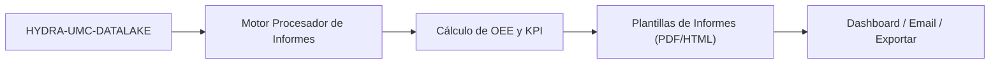

<p align="center">
  
</p>

# 📈 HYDRA-UMC-PRODUCTION-REPORTS

<p align="center"><a href="README.md">🇺🇸 English</a> | 🇪🇸 <b>Español</b> | <a href="README_fra.md">🇫🇷 Français</a> | <a href="README_ita.md">🇮🇹 Italiano</a> | <a href="README_deu.md">🇩🇪 Deutsch</a> | <a href="README_zho.md">🇨🇳 简体中文</a> | <a href="README_jpn.md">🇯🇵 日本語</a></p>

### 📑 Motor de Informes Automatizados de KPI y OEE para Gerentes de Planta

<p align="left">
  
  
  
</p>

---

## 1. 🛠️ VISIÓN GENERAL TÉCNICA

**HYDRA-UMC-PRODUCTION-REPORTS** es el cerebro analítico para la gestión de la fábrica. Procesa datos brutos del Datalake para generar informes automatizados de alto nivel sobre la eficiencia de la producción, la calidad y la disponibilidad de las máquinas.

Calcula el **OEE (Efectividad General del Equipo)** de todo el enjambre, identificando cuellos de botella en la línea de producción y proporcionando trazabilidad para cada componente fabricado, desde los perfiles térmicos de soldadura hasta la precisión de Pick-and-Place.

### Características Clave:
* 📈 **Cálculo de OEE:** Métricas en tiempo real de Disponibilidad, Rendimiento y Calidad.
* 📑 **Informes Automatizados:** Resúmenes diarios, semanales y mensuales en PDF/CSV enviados a los gerentes.
* 🛠️ **Análisis de Cuellos de Botella:** Identifica qué robots o herramientas están causando retrasos en la cola de misiones.
* 🌡️ **Trazabilidad de Calidad:** Vincula cada producto final a sus logs de ensamblaje específicos (térmicos, visuales, mecánicos).
* 🕐 **Límites de Turno/Día:** `shift.py` da a cada informe una única fuente real de verdad sobre dónde empieza y termina un turno o día natural - incluyendo un turno de noche real que cruza la medianoche. *(implementado)*
* 🧾 **Fórmulas Versionadas + Trazabilidad:** Cada informe lleva su `formula_version` real y una `input_fingerprint` sha256 sobre los datos exactos que lo produjeron. *(implementado)*
* 📤 **Exportación CSV Reproducible:** `GET /reports/{oee,availability}/export` - salida idéntica byte a byte para entradas idénticas, no solo "suficientemente parecida". *(implementado)*

---

## 2. 🔄 FLUJO DE INFORMES



---

## 3. 🧱 ARQUITECTURA Y DECISIONES DE DISEÑO

* **Por qué es hermano, no un submódulo, de HYDRA-UMC-DATALAKE.** La generación de informes es un trabajo de consulta+cálculo periódico y de solo lectura sobre telemetría ya almacenada - mantenerlo separado significa que una generación de informe nunca compite con las propias escrituras en tiempo real de HYDRA-UMC-TELEMETRY-COLLECTOR por los recursos del mismo almacén. Este proyecto no tiene base de datos propia.
* **Integración HTTP real, no una librería compartida.** `datalake_client.py` habla con una instancia real de HYDRA-UMC-DATALAKE por HTTP plano (`GET /query`), y deliberadamente NO importa el paquete Python de DATALAKE directamente aunque ambos convivan hoy en el mismo entorno de desarrollo - HTTP real es el punto de integración real y desacoplado que coincide con cómo se hablarían de verdad repos/servicios separados en producción.
* **El schema `production_event` es la convención propia v0 de este proyecto, no un estándar del ecosistema.** El OEE necesita saber, por cada ciclo completado, si la pieza salió buena y cuánto tardó el ciclo. Este proyecto define eso como un `Sample` de DATALAKE por ciclo, `kind="production_event"`, con dos campos escritos juntos en el mismo timestamp: `"good"` (1.0/0.0) y `"cycleTimeS"`. Ningún otro proyecto escribe todavía este kind - HYDRA-UMC-JOB-DISPATCHER sería la fuente real de producción una vez que reporte finalizaciones de esta forma (rastreado en `mejoras_futuras.txt`).
* **La disponibilidad funciona contra CUALQUIER stream de telemetría existente, a propósito.** A diferencia del OEE, `availability.py` no necesita en absoluto la convención `production_event` - toma cualquier serie de timestamps ya presente en DATALAKE (p. ej. muestras `motor_temp` que HYDRA-UMC-TELEMETRY-COLLECTOR ya escribe) y marca como downtime real un hueco entre muestras consecutivas mayor que `expected_interval_ms x gap_factor`. Esto es justo lo que hoy le permite a este proyecto "hablar" con sus hermanos de telemetría, antes de que ningún proyecto escriba datos `production_event` de verdad.
* **Performance y Availability están acotados a `[0, 1]`.** Un ciclo real puede ir más rápido que una cifra "ideal" conservadora, o el tiempo operativo puede superar una ventana planificada mal configurada; reportar >100% sería defendible aritméticamente pero engañoso en la práctica, así que ambos se limitan.
* **Los campos `production_event` sin emparejar se cuentan y se reportan, nunca se rellenan en silencio.** Si una lectura `"good"` no tiene un `"cycleTimeS"` emparejado en el mismo timestamp exacto (una escritura parcial/malformada), se excluye y el número de lecturas excluidas se incluye en el error/respuesta en vez de asumir un tiempo de ciclo de 0s, lo que corrompería la cifra de Performance.
* **Por qué `shift.py` es un módulo separado, no matemática en línea dentro de `oee.py`/`availability.py`.** Dos informes que discrepan silenciosamente sobre dónde corta un turno o un día natural producen dos cifras distintas, ambas defendibles, para la misma ventana real - exactamente la contradicción que señaló la auditoría de promoción. Hacer de los límites de turno/día un módulo propio, real y probado (con un turno de noche real que cruza la medianoche, y una búsqueda inversa real de timestamp a turno) da a cada informe la misma fuente de verdad en vez de que cada llamador la re-derive por su cuenta.
* **Por qué `formula_version` e `input_fingerprint` están en el informe, no solo en el CSV.** Un informe consumido como JSON (por un dashboard, otro servicio) merece la misma trazabilidad que uno exportado a un archivo - ambos campos son aditivos sobre las respuestas ya existentes de `GET /reports/oee`/`GET /reports/availability`, no algo visible solo en la salida de `export.py`.
* **Por qué la exportación CSV es un endpoint nuevo, no un flag `?format=csv` en las rutas existentes.** Mantener `GET /reports/oee`/`GET /reports/availability` intactos (siguen siendo reales, siguen siendo JSON, siguen siendo exactamente lo que `tests/test_api.py` ya verificaba) permitió añadir la función de exportación y demostrar que es reproducible sin tocar una sola respuesta ya probada.

---

## 📂 ESTRUCTURA DE DIRECTORIOS

Servicio de software puro (generación de informes) - sin hardware, firmware ni sistema operativo propios; esas carpetas se omiten por política de estructura del repositorio.

```text
HYDRA-UMC-PRODUCTION-REPORTS/
├── src/hydra_umc_production_reports/
│   ├── __init__.py           # Versión del paquete
│   ├── datalake_client.py    # Cliente HTTP real para la API GET /query de HYDRA-UMC-DATALAKE
│   ├── oee.py                 # Fórmula OEE real (Disponibilidad x Rendimiento x Calidad)
│   ├── availability.py        # Cálculo real de downtime a partir de huecos de telemetría
│   ├── reports.py             # Orquestación: DatalakeClient -> oee.py / availability.py
│   ├── shift.py                # Cálculo real de límites de turno/día (fuente de verdad)
│   ├── export.py               # Exportación CSV real, reproducible byte a byte
│   ├── api.py                  # API HTTP real (GET /reports/oee, /reports/availability, /stats, /export)
│   └── main.py                 # Punto de entrada - arranca el servidor HTTP real
├── tests/                    # Tests reales: matemática de OEE/disponibilidad/turno/exportación, round-trips contra un DATALAKE falso
├── docs/
│   └── API.md                 # Referencia real de endpoints HTTP (peticiones, respuestas, codigos de estado)
├── pyproject.toml            # Metadatos del paquete + extras [dev] (pytest)
├── bump_version.py           # Incremento de versión tipo cuentakilómetros (lo ejecuta el build)
├── build.sh / build.bat      # Build real: venv + instalación editable + suite de tests real
├── run.sh / run.bat          # Ejecución real: arranca la API HTTP
└── README.md
```

Ver [`docs/API.md`](docs/API.md) para la referencia completa de endpoints HTTP.

---

## 4. ⚙️ BUILD Y EJECUCIÓN

Requiere Python >= 3.10.

```bash
# Linux/macOS
./build.sh && ./run.sh --datalake-url http://localhost:8095

# Windows
build.bat
run.bat --datalake-url http://localhost:8095
```

`build` crea/activa un `.venv` local, instala el paquete en modo editable con extras de desarrollo, verifica la importación y corre la suite de tests real de `pytest`. `run` arranca la API HTTP real (puerto por defecto `8099`) contra una instancia de HYDRA-UMC-DATALAKE en `--datalake-url` (por defecto `http://localhost:8095`).

```bash
# Informe OEE real para la fuente "robot-1" en una ventana de 5 segundos
curl "http://localhost:8099/reports/oee?sourceId=robot-1&start=0&end=5000&plannedTimeS=10.0&idealCycleTimeS=2.0"

# Informe de disponibilidad real para el stream motor_temp de la misma fuente
curl "http://localhost:8099/reports/availability?sourceId=robot-1&kind=motor_temp&field=value&start=0&end=10000&expectedIntervalMs=1000"
```

---

## 🚀 HOJA DE RUTA
* **Hecho (v0):** cálculo real de OEE y disponibilidad, integración HTTP real con HYDRA-UMC-DATALAKE, API HTTP real.
* **Siguiente:** una fuente real de datos `production_event` - conectar HYDRA-UMC-JOB-DISPATCHER para que reporte finalizaciones de ciclo con este schema.
* **Siguiente:** informes persistentes/programados (hoy cada informe se calcula en vivo, bajo demanda).
* **Más adelante:** exportación PDF/CSV real y un dashboard, según la hoja de ruta original abajo.
* Análisis de ROI impulsado por IA para actualizaciones de herramientas, conectado a estos mismos datos de OEE una vez que se almacenen tendencias históricas.

---

## 🔗 Proyectos Relacionados

Este proyecto forma parte de un ecosistema de robótica más amplio del mismo autor (JuanenRac / Electro Hobby 3D), que abarca firmware, software de control, nodos de IA y herramientas de flota. Vale la pena conocerlo, ya que una petición podría en realidad ser sobre uno de estos proyectos en vez de sobre este repositorio.

### Familia

**Padre:** **[HYDRA-UMC-DATALAKE](https://github.com/JuanenRac/HYDRA-UMC-DATALAKE)** — el padre de integración sobre cuya telemetría almacenada informa este proyecto.

**Hermanos:**
- **[HYDRA-UMC-TELEMETRY-COLLECTOR](https://github.com/JuanenRac/HYDRA-UMC-TELEMETRY-COLLECTOR)** — servicio de analítica hermano, mismo padre.
- **[HYDRA-UMC-ANOMALY-DETECTOR](https://github.com/JuanenRac/HYDRA-UMC-ANOMALY-DETECTOR)** — servicio de analítica hermano, mismo padre.

### Relación Directa (fuera de la familia)

Este proyecto no tiene relación directa fuera de la familia Data & Analytics (según el mapa de relaciones del ecosistema) - ver "Resto del Ecosistema" abajo para todo lo demás.

### Resto del Ecosistema

**Plataforma HYDRA-UMC** — la célula de micro-fábrica multi-robot
- **[HYDRA-UMC](https://github.com/JuanenRac/HYDRA-UMC)** — la placa base CM5 + STM32H745 que orquesta hasta 8 brazos robóticos.
- **[HYDRA-UMC-SERVER](https://github.com/JuanenRac/HYDRA-UMC-SERVER)** — el backend Express/WebSocket con el que habla cada cliente de control.
- **[HYDRA-UMC-STUDIO](https://github.com/JuanenRac/HYDRA-UMC-STUDIO)** — panel de control web, visualización 3D multi-robot.
- **[HYDRA-UMC-ANDROID-CONTROL](https://github.com/JuanenRac/HYDRA-UMC-ANDROID-CONTROL)** — app de control Android por Wi-Fi/Bluetooth.
- **[HYDRA-UMC-IOS-CONTROL](https://github.com/JuanenRac/HYDRA-UMC-IOS-CONTROL)** — app de control iOS/iPadOS construida en Flutter.
- **[HYDRA-UMC-SUITE](https://github.com/JuanenRac/HYDRA-UMC-SUITE)** — centro de mando de enjambre de escritorio (Python/PySide6).
- **[HYDRA-UMC-EDITOR-URDF](https://github.com/JuanenRac/HYDRA-UMC-EDITOR-URDF)** — editor de modelos URDF de escritorio para el catálogo de robots.
- **[HYDRA-UMC-DSI](https://github.com/JuanenRac/HYDRA-UMC-DSI)** — interfaz táctil nativa para la pantalla DSI integrada.

**Plataforma URTC** — el controlador de cabezal de herramienta que lleva cada brazo HYDRA-UMC
- **[URTC](https://github.com/JuanenRac/URTC)** — controlador de cabezal de herramienta CAN, 25 perfiles de herramienta.
- **[URTC-FLASHER](https://github.com/JuanenRac/URTC-FLASHER)** — herramienta de escritorio de flasheo CAN-OTA + SWD/JTAG.
- **[URTC-TESTER](https://github.com/JuanenRac/URTC-TESTER)** — herramienta de escritorio de diagnóstico CAN en vivo.
- **[URTC-WEB-STUDIO](https://github.com/JuanenRac/URTC-WEB-STUDIO)** — alternativa basada en navegador vía Web Serial API.

**🎥 Vision AI Node (Hailo-8)**
- [HYDRA-UMC-VISION-NODE](https://github.com/JuanenRac/HYDRA-UMC-VISION-NODE)
- [HYDRA-UMC-VISION-STREAMER](https://github.com/JuanenRac/HYDRA-UMC-VISION-STREAMER)
- [HYDRA-UMC-DETECTION-HEF](https://github.com/JuanenRac/HYDRA-UMC-DETECTION-HEF)
- [HYDRA-UMC-SAFETY-ZONES](https://github.com/JuanenRac/HYDRA-UMC-SAFETY-ZONES)
- [HYDRA-UMC-VISUAL-SERVOING-API](https://github.com/JuanenRac/HYDRA-UMC-VISUAL-SERVOING-API)

**🧠 Cognitive AI Node (Hailo-10)**
- [HYDRA-UMC-COGNITIVE-NODE](https://github.com/JuanenRac/HYDRA-UMC-COGNITIVE-NODE)
- [HYDRA-UMC-VLA-ENGINE](https://github.com/JuanenRac/HYDRA-UMC-VLA-ENGINE)
- [HYDRA-UMC-VOICE-UI](https://github.com/JuanenRac/HYDRA-UMC-VOICE-UI)
- [HYDRA-UMC-SEMANTIC-PLANNER](https://github.com/JuanenRac/HYDRA-UMC-SEMANTIC-PLANNER)
- [HYDRA-UMC-DOCS-QA](https://github.com/JuanenRac/HYDRA-UMC-DOCS-QA)

**🐝 Orchestration & Swarm**
- [HYDRA-UMC-ORCHESTRATOR](https://github.com/JuanenRac/HYDRA-UMC-ORCHESTRATOR)
- [HYDRA-UMC-SWARM-SYNC](https://github.com/JuanenRac/HYDRA-UMC-SWARM-SYNC)
- [HYDRA-UMC-PATH-PLANNER-3D](https://github.com/JuanenRac/HYDRA-UMC-PATH-PLANNER-3D)
- [HYDRA-UMC-JOB-DISPATCHER](https://github.com/JuanenRac/HYDRA-UMC-JOB-DISPATCHER)
- [HYDRA-UMC-NODE-HEALING](https://github.com/JuanenRac/HYDRA-UMC-NODE-HEALING)

**🎮 Digital Twin & Simulation**
- [HYDRA-UMC-TWIN](https://github.com/JuanenRac/HYDRA-UMC-TWIN)
- [HYDRA-UMC-PHYSICS-REPLICA](https://github.com/JuanenRac/HYDRA-UMC-PHYSICS-REPLICA)
- [HYDRA-UMC-HIL-BRIDGE](https://github.com/JuanenRac/HYDRA-UMC-HIL-BRIDGE)
- [HYDRA-UMC-SYNTHETIC-DATA-GEN](https://github.com/JuanenRac/HYDRA-UMC-SYNTHETIC-DATA-GEN)

**🏭 Industrial Gateway**
- [HYDRA-UMC-GATEWAY-INDUSTRIAL](https://github.com/JuanenRac/HYDRA-UMC-GATEWAY-INDUSTRIAL)
- [HYDRA-UMC-OPCUA-SERVER](https://github.com/JuanenRac/HYDRA-UMC-OPCUA-SERVER)
- [HYDRA-UMC-MQTT-BROKER](https://github.com/JuanenRac/HYDRA-UMC-MQTT-BROKER)
- [HYDRA-UMC-MTCONNECT-ADAPTER](https://github.com/JuanenRac/HYDRA-UMC-MTCONNECT-ADAPTER)

**🛠️ Complementary Tools**
- [URTC-SMART-RACK](https://github.com/JuanenRac/URTC-SMART-RACK)
- [URTC-VISION-TOOL](https://github.com/JuanenRac/URTC-VISION-TOOL)
- [HYDRA-UMC-WATCH](https://github.com/JuanenRac/HYDRA-UMC-WATCH)
- [HYDRA-UMC-TOOL-CLI](https://github.com/JuanenRac/HYDRA-UMC-TOOL-CLI)
- [HYDRA-UMC-DASHBOARD-AI](https://github.com/JuanenRac/HYDRA-UMC-DASHBOARD-AI)


## 👤 AUTOR
**JuanenRac** (Electro Hobby 3D)
📧 electrohobby3d@gmail.com

## 📜 LICENCIA
GPL-3.0 - Ver archivo LICENSE para más detalles.
