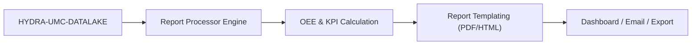

<p align="center">
  
</p>

# 📈 HYDRA-UMC-PRODUCTION-REPORTS

<p align="center"><a href="README.md">🇺🇸 English</a> | <a href="README_spa.md">🇪🇸 Español</a> | <a href="README_fra.md">🇫🇷 Français</a> | <a href="README_ita.md">🇮🇹 Italiano</a> | <a href="README_deu.md">🇩🇪 Deutsch</a> | 🇨🇳 <b>简体中文</b> | <a href="README_jpn.md">🇯🇵 日本語</a></p>

### 📑 面向工厂管理者的自动化 KPI 与 OEE 报告引擎

<p align="left">
  
  
  
</p>

---

## 1. 🛠️ 技术概述

**HYDRA-UMC-PRODUCTION-REPORTS** 是工厂管理的分析大脑。它处理来自数据
湖的原始数据，生成关于生产效率、质量和机器可用性的自动化高层报告。

它计算整个集群的 **OEE（整体设备效率）**，识别生产线中的瓶颈，并为
制造的每一个组件提供可追溯性——从热焊剖面到抓取放置精度。

### 关键特性：
* 📈 **OEE 计算：** 可用性、性能和质量的实时指标。
* 📑 **自动化报告：** 发送给管理者的每日、每周、每月 PDF/CSV 摘要。
* 🛠️ **瓶颈分析：** 识别哪些机器人或工具正在造成任务队列延迟。
* 🌡️ **质量可追溯性：** 将每个最终产品与其特定的装配日志（热、视觉、机械）关联起来。

---

## 2. 🔄 报告流程



---

## 3. 🧱 架构与设计决策

* **为何这是 HYDRA-UMC-DATALAKE 的兄弟项目，而非子模块。** 报告生成是一项针对已存储遥测数据的周期性、只读的“查询+计算”任务——将其保持独立，意味着报告生成永远不会与 HYDRA-UMC-TELEMETRY-COLLECTOR 自身对同一存储资源的实时写入相竞争。本项目没有自己的数据库。
* **真实的 HTTP 集成，而非共享库。** `datalake_client.py` 通过纯 HTTP（`GET /query`）与一个真实运行中的 HYDRA-UMC-DATALAKE 实例通信，并且刻意不直接导入 DATALAKE 的 Python 包——尽管两者目前处于同一个开发环境中。真实的 HTTP 才是真正解耦的集成接口，符合生产环境中独立仓库/服务之间实际通信的方式。
* **`production_event` schema 是本项目自己的 v0 约定，并非生态系统标准。** OEE 需要知道每个完成周期的零件是否合格、周期耗时多久。本项目将其定义为每个周期一个 DATALAKE `Sample`，`kind="production_event"`，在同一个时间戳下一起写入两个字段：`"good"`（1.0/0.0）和 `"cycleTimeS"`。目前还没有其他项目写入这个 kind——一旦 HYDRA-UMC-JOB-DISPATCHER 被接入以这种方式报告周期完成情况，它将成为真正的生产数据来源（在 `mejoras_futuras.txt` 中跟踪）。
* **可用性计算故意针对任意已存在的遥测流生效。** 与 OEE 不同，`availability.py` 完全不需要 `production_event` 约定——它使用 DATALAKE 中已存在的任意时间戳序列（例如 HYDRA-UMC-TELEMETRY-COLLECTOR 已经写入的 `motor_temp` 样本），并将连续样本之间大于 `expected_interval_ms x gap_factor` 的间隔标记为真实的停机时间。这正是让本项目在任何项目写入真实 `production_event` 数据之前，就已经能与其遥测“兄弟项目”真正“对话”的原因。
* **Performance 和 Availability 都被限制在 `[0, 1]` 之间。** 真实周期可能比一个保守的“理想”数值更快，或者运行时间可能超出配置有误的计划窗口；报告 >100% 在算术上是站得住脚的，但在实践中具有误导性，因此两者都会被截断。
* **未匹配的 `production_event` 字段会被计数并报告，绝不会被静默地赋予默认值。** 如果某条 `"good"` 记录在完全相同的时间戳上没有对应的 `"cycleTimeS"`（一次部分/格式错误的写入），它会被排除在外，被排除的条数会包含在错误/响应中，而不是假设周期时间为 0 秒——那样会破坏 Performance 数值的准确性。

---

## 📂 目录结构

纯软件服务（报告生成）——没有自己的硬件/固件/操作系统，已从模板中
省略（生态系统惯例参见 `SONNET/_papelera/`）。

```text
HYDRA-UMC-PRODUCTION-REPORTS/
├── src/hydra_umc_production_reports/
│   ├── __init__.py           # 包版本
│   ├── datalake_client.py    # 针对 HYDRA-UMC-DATALAKE 的 GET /query API 的真实 HTTP 客户端
│   ├── oee.py                 # 真实的 OEE 公式（可用性 x 性能 x 质量）
│   ├── availability.py        # 基于遥测间隔的真实停机计算
│   ├── reports.py             # 编排层：DatalakeClient -> oee.py / availability.py
│   ├── api.py                  # 真实的 HTTP API（GET /reports/oee、/reports/availability、/stats）
│   └── main.py                 # 入口点——启动真实的 HTTP 服务器
├── tests/                    # 真实测试，包括针对伪造 DATALAKE 的往返测试
├── pyproject.toml            # 包元数据 + [dev] extras（pytest）
├── bump_version.py           # 里程表式版本递增（由构建运行）
├── build.sh / build.bat      # 真实构建：venv + 可编辑安装 + 真实测试套件
├── run.sh / run.bat          # 真实运行：启动 HTTP API
└── README.md
```

---

## 4. ⚙️ 构建与运行

需要 Python >= 3.10。

```bash
# Linux/macOS
./build.sh && ./run.sh --datalake-url http://localhost:8095

# Windows
build.bat
run.bat --datalake-url http://localhost:8095
```

`build` 创建/激活本地 `.venv`，以可编辑模式安装该包（含开发 extras），
验证导入，并运行真实的 `pytest` 测试套件。`run` 启动真实的 HTTP API
（默认端口 `8099`），连接到 `--datalake-url` 指定的 HYDRA-UMC-DATALAKE
实例（默认 `http://localhost:8095`）。

```bash
# robot-1 在 5 秒窗口内的真实 OEE 报告
curl "http://localhost:8099/reports/oee?sourceId=robot-1&start=0&end=5000&plannedTimeS=10.0&idealCycleTimeS=2.0"

# 同一来源 motor_temp 数据流的真实可用性报告
curl "http://localhost:8099/reports/availability?sourceId=robot-1&kind=motor_temp&field=value&start=0&end=10000&expectedIntervalMs=1000"
```

---

## 🚀 路线图
* **已完成（v0）：** 真实的 OEE 与可用性计算、与 HYDRA-UMC-DATALAKE 的真实 HTTP 集成、真实的 HTTP API。
* **下一步：** 真实的 `production_event` 数据源——连接 HYDRA-UMC-JOB-DISPATCHER，使其以此 schema 报告周期完成情况。
* **下一步：** 持久化/定时生成的报告（目前每份报告都是按需实时计算的）。
* **稍后：** 真实的 PDF/CSV 导出以及仪表盘，参见下方原始路线图。
* 面向工具升级的 AI 驱动 ROI 分析，一旦存储了历史趋势数据，将与这些相同的 OEE 数据相连接。

---

## 🔗 相关项目

本项目是同一作者（JuanenRac / Electro Hobby 3D）打造的更大规模机器人生态
系统的一部分，涵盖固件、控制软件、AI 节点和车队工具。值得了解，因为某个
需求实际上可能是关于这些项目之一，而非本仓库。

### 项目族

**父项目：** **[HYDRA-UMC-DATALAKE](https://github.com/JuanenRac/HYDRA-UMC-DATALAKE)** —— 本项目所报告其存储遥测数据的集成父项目。

**同族项目：**
- **[HYDRA-UMC-TELEMETRY-COLLECTOR](https://github.com/JuanenRac/HYDRA-UMC-TELEMETRY-COLLECTOR)** —— 同级分析服务，同一父项目。
- **[HYDRA-UMC-ANOMALY-DETECTOR](https://github.com/JuanenRac/HYDRA-UMC-ANOMALY-DETECTOR)** —— 同级分析服务，同一父项目。

### 直接相关（项目族之外）

本项目在 Data & Analytics 系列之外没有直接关联的项目（根据生态系统自身
的关系图谱）——其余所有内容请见下方"生态系统的其余部分"。

### 生态系统的其余部分

**HYDRA-UMC 平台** —— 多机器人微工厂单元
- **[HYDRA-UMC](https://github.com/JuanenRac/HYDRA-UMC)** —— 协调最多 8 条机械臂的 CM5 + STM32H745 主板。
- **[HYDRA-UMC-SERVER](https://github.com/JuanenRac/HYDRA-UMC-SERVER)** —— 每个控制客户端所对接的 Express/WebSocket 后端。
- **[HYDRA-UMC-STUDIO](https://github.com/JuanenRac/HYDRA-UMC-STUDIO)** —— 基于 Web 的控制仪表盘，多机器人 3D 可视化。
- **[HYDRA-UMC-ANDROID-CONTROL](https://github.com/JuanenRac/HYDRA-UMC-ANDROID-CONTROL)** —— 通过 Wi-Fi/蓝牙的 Android 控制应用。
- **[HYDRA-UMC-IOS-CONTROL](https://github.com/JuanenRac/HYDRA-UMC-IOS-CONTROL)** —— 基于 Flutter 构建的 iOS/iPadOS 控制应用。
- **[HYDRA-UMC-SUITE](https://github.com/JuanenRac/HYDRA-UMC-SUITE)** —— 桌面端集群指挥中心（Python/PySide6）。
- **[HYDRA-UMC-EDITOR-URDF](https://github.com/JuanenRac/HYDRA-UMC-EDITOR-URDF)** —— 用于机器人目录的桌面端 URDF 模型编辑器。
- **[HYDRA-UMC-DSI](https://github.com/JuanenRac/HYDRA-UMC-DSI)** —— 机载 DSI 触摸屏的原生触控 UI。

**URTC 平台** —— 每台 HYDRA-UMC 机械臂搭载的工具头控制器
- **[URTC](https://github.com/JuanenRac/URTC)** —— CAN 总线工具头控制器，25 种工具配置。
- **[URTC-FLASHER](https://github.com/JuanenRac/URTC-FLASHER)** —— 桌面端 CAN-OTA + SWD/JTAG 刷写工具。
- **[URTC-TESTER](https://github.com/JuanenRac/URTC-TESTER)** —— 桌面端实时 CAN 总线诊断工具。
- **[URTC-WEB-STUDIO](https://github.com/JuanenRac/URTC-WEB-STUDIO)** —— 通过 Web Serial API 的浏览器端替代方案。

**🎥 视觉 AI 节点（Hailo-8）**
- [HYDRA-UMC-VISION-NODE](https://github.com/JuanenRac/HYDRA-UMC-VISION-NODE)
- [HYDRA-UMC-VISION-STREAMER](https://github.com/JuanenRac/HYDRA-UMC-VISION-STREAMER)
- [HYDRA-UMC-DETECTION-HEF](https://github.com/JuanenRac/HYDRA-UMC-DETECTION-HEF)
- [HYDRA-UMC-SAFETY-ZONES](https://github.com/JuanenRac/HYDRA-UMC-SAFETY-ZONES)
- [HYDRA-UMC-VISUAL-SERVOING-API](https://github.com/JuanenRac/HYDRA-UMC-VISUAL-SERVOING-API)

**🧠 认知 AI 节点（Hailo-10）**
- [HYDRA-UMC-COGNITIVE-NODE](https://github.com/JuanenRac/HYDRA-UMC-COGNITIVE-NODE)
- [HYDRA-UMC-VLA-ENGINE](https://github.com/JuanenRac/HYDRA-UMC-VLA-ENGINE)
- [HYDRA-UMC-VOICE-UI](https://github.com/JuanenRac/HYDRA-UMC-VOICE-UI)
- [HYDRA-UMC-SEMANTIC-PLANNER](https://github.com/JuanenRac/HYDRA-UMC-SEMANTIC-PLANNER)
- [HYDRA-UMC-DOCS-QA](https://github.com/JuanenRac/HYDRA-UMC-DOCS-QA)

**🐝 编排与集群**
- [HYDRA-UMC-ORCHESTRATOR](https://github.com/JuanenRac/HYDRA-UMC-ORCHESTRATOR)
- [HYDRA-UMC-SWARM-SYNC](https://github.com/JuanenRac/HYDRA-UMC-SWARM-SYNC)
- [HYDRA-UMC-PATH-PLANNER-3D](https://github.com/JuanenRac/HYDRA-UMC-PATH-PLANNER-3D)
- [HYDRA-UMC-JOB-DISPATCHER](https://github.com/JuanenRac/HYDRA-UMC-JOB-DISPATCHER)
- [HYDRA-UMC-NODE-HEALING](https://github.com/JuanenRac/HYDRA-UMC-NODE-HEALING)

**🎮 数字孪生与仿真**
- [HYDRA-UMC-TWIN](https://github.com/JuanenRac/HYDRA-UMC-TWIN)
- [HYDRA-UMC-PHYSICS-REPLICA](https://github.com/JuanenRac/HYDRA-UMC-PHYSICS-REPLICA)
- [HYDRA-UMC-HIL-BRIDGE](https://github.com/JuanenRac/HYDRA-UMC-HIL-BRIDGE)
- [HYDRA-UMC-SYNTHETIC-DATA-GEN](https://github.com/JuanenRac/HYDRA-UMC-SYNTHETIC-DATA-GEN)

**🏭 工业网关**
- [HYDRA-UMC-GATEWAY-INDUSTRIAL](https://github.com/JuanenRac/HYDRA-UMC-GATEWAY-INDUSTRIAL)
- [HYDRA-UMC-OPCUA-SERVER](https://github.com/JuanenRac/HYDRA-UMC-OPCUA-SERVER)
- [HYDRA-UMC-MQTT-BROKER](https://github.com/JuanenRac/HYDRA-UMC-MQTT-BROKER)
- [HYDRA-UMC-MTCONNECT-ADAPTER](https://github.com/JuanenRac/HYDRA-UMC-MTCONNECT-ADAPTER)

**🛠️ 配套工具**
- [URTC-SMART-RACK](https://github.com/JuanenRac/URTC-SMART-RACK)
- [URTC-VISION-TOOL](https://github.com/JuanenRac/URTC-VISION-TOOL)
- [HYDRA-UMC-WATCH](https://github.com/JuanenRac/HYDRA-UMC-WATCH)
- [HYDRA-UMC-TOOL-CLI](https://github.com/JuanenRac/HYDRA-UMC-TOOL-CLI)
- [HYDRA-UMC-DASHBOARD-AI](https://github.com/JuanenRac/HYDRA-UMC-DASHBOARD-AI)


## 👤 作者
**JuanenRac**（Electro Hobby 3D）
📧 electrohobby3d@gmail.com

## 📜 许可证
GPL-3.0 —— 详见 LICENSE。
