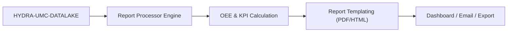

<p align="center">
  
</p>

# 📈 HYDRA-UMC-PRODUCTION-REPORTS

<p align="center"><a href="README.md">🇺🇸 English</a> | <a href="README_spa.md">🇪🇸 Español</a> | <a href="README_fra.md">🇫🇷 Français</a> | <a href="README_ita.md">🇮🇹 Italiano</a> | <a href="README_deu.md">🇩🇪 Deutsch</a> | 🇨🇳 <b>简体中文</b> | <a href="README_jpn.md">🇯🇵 日本語</a></p>

### 📑 面向工厂管理者的自动化 KPI 与 OEE 报告引擎

<p align="left">
  
  
  
</p>

---

## 1. 🛠️ 技术概述

**HYDRA-UMC-PRODUCTION-REPORTS** 是工厂管理的分析大脑。它处理来自数据
湖的原始数据，生成关于生产效率、质量和机器可用性的自动化高层报告。

它计算整个集群的 **OEE（整体设备效率）**，识别生产线中的瓶颈，并为
制造的每一个组件提供可追溯性——从热焊剖面到抓取放置精度。

### 关键特性：
* 📈 **OEE 计算：** 可用性、性能和质量的实时指标。
* 📑 **自动化报告：** 发送给管理者的每日、每周、每月 PDF/CSV 摘要。
* 🛠️ **瓶颈分析：** 识别哪些机器人或工具正在造成任务队列延迟。
* 🌡️ **质量可追溯性：** 将每个最终产品与其特定的装配日志（热、视觉、机械）关联起来。
* 🕐 **班次/日边界：** `shift.py` 为每份报告提供了唯一的真实基准，用于确定班次或自然日的起止时间——包括真实的跨越午夜的夜班。*（已实现）*
* 🧾 **版本化公式 + 可追溯性：** 每份报告都携带其真实的 `formula_version`，以及基于产生该报告的确切数据计算的 sha256 `input_fingerprint`。*（已实现）*
* 📤 **可复现的 CSV 导出：** `GET /reports/{oee,availability}/export` —— 对相同输入产生逐字节完全一致的输出，而不仅仅是“足够接近”。*（已实现）*

---

## 2. 🔄 报告流程



---

## 3. 🧱 架构与设计决策

* **为何这是 HYDRA-UMC-DATALAKE 的兄弟项目，而非子模块。** 报告生成是一项针对已存储遥测数据的周期性、只读的“查询+计算”任务——将其保持独立，意味着报告生成永远不会与 HYDRA-UMC-TELEMETRY-COLLECTOR 自身对同一存储资源的实时写入相竞争。本项目没有自己的数据库。
* **真实的 HTTP 集成，而非共享库。** `datalake_client.py` 通过纯 HTTP（`GET /query`）与一个真实运行中的 HYDRA-UMC-DATALAKE 实例通信，并且刻意不直接导入 DATALAKE 的 Python 包——尽管两者目前处于同一个开发环境中。真实的 HTTP 才是真正解耦的集成接口，符合生产环境中独立仓库/服务之间实际通信的方式。
* **`production_event` schema 是本项目自己的 v0 约定，并非生态系统标准。** OEE 需要知道每个完成周期的零件是否合格、周期耗时多久。本项目将其定义为每个周期一个 DATALAKE `Sample`，`kind="production_event"`，在同一个时间戳下一起写入两个字段：`"good"`（1.0/0.0）和 `"cycleTimeS"`。目前还没有其他项目写入这个 kind——一旦 HYDRA-UMC-JOB-DISPATCHER 被接入以这种方式报告周期完成情况，它将成为真正的生产数据来源（在 `mejoras_futuras.txt` 中跟踪）。
* **可用性计算故意针对任意已存在的遥测流生效。** 与 OEE 不同，`availability.py` 完全不需要 `production_event` 约定——它使用 DATALAKE 中已存在的任意时间戳序列（例如 HYDRA-UMC-TELEMETRY-COLLECTOR 已经写入的 `motor_temp` 样本），并将连续样本之间大于 `expected_interval_ms x gap_factor` 的间隔标记为真实的停机时间。这正是让本项目在任何项目写入真实 `production_event` 数据之前，就已经能与其遥测“兄弟项目”真正“对话”的原因。
* **Performance 和 Availability 都被限制在 `[0, 1]` 之间。** 真实周期可能比一个保守的“理想”数值更快，或者运行时间可能超出配置有误的计划窗口；报告 >100% 在算术上是站得住脚的，但在实践中具有误导性，因此两者都会被截断。
* **未匹配的 `production_event` 字段会被计数并报告，绝不会被静默地赋予默认值。** 如果某条 `"good"` 记录在完全相同的时间戳上没有对应的 `"cycleTimeS"`（一次部分/格式错误的写入），它会被排除在外，被排除的条数会包含在错误/响应中，而不是假设周期时间为 0 秒——那样会破坏 Performance 数值的准确性。
* **为何 `shift.py` 是一个独立模块，而不是 `oee.py`/`availability.py` 中的内联计算。** 两份报告若在班次或自然日的切分点上悄悄产生分歧，就会对同一个真实时间窗口给出两个不同、却又都能自圆其说的数字——这正是晋升审计所指出的矛盾。将班次/日边界做成一个独立的、真实的、经过测试的模块（包含真实的跨越午夜的夜班，以及真实的时间戳到班次的反向查找），可以让每份报告共享同一个真实基准，而不是让每个调用方各自重新推导。
* **为何 `formula_version` 和 `input_fingerprint` 在报告本身上，而不仅仅在 CSV 中。** 以 JSON 形式被消费的报告（被仪表盘、其他服务读取）应当享有与导出到文件的报告同等的可追溯性——这两个字段是对现有 `GET /reports/oee`/`GET /reports/availability` 响应的增量添加，而不是只在 `export.py` 输出中才能看到的东西。
* **为何 CSV 导出是一个新端点，而不是在现有路由上加一个 `?format=csv` 标志。** 保持 `GET /reports/oee`/`GET /reports/availability` 不变（依旧真实、依旧是 JSON、依旧完全符合 `tests/test_api.py` 已有的断言），意味着可以在不碰触任何已测试响应的前提下添加导出功能，并证明其可复现性。

---

## 📂 目录结构

纯软件服务（报告生成）——没有自己的硬件、固件或操作系统；这些目录按照
仓库结构策略予以省略。

```text
HYDRA-UMC-PRODUCTION-REPORTS/
├── src/hydra_umc_production_reports/
│   ├── __init__.py           # 包版本
│   ├── datalake_client.py    # 针对 HYDRA-UMC-DATALAKE 的 GET /query API 的真实 HTTP 客户端
│   ├── oee.py                 # 真实的 OEE 公式（可用性 x 性能 x 质量）
│   ├── availability.py        # 基于遥测间隔的真实停机计算
│   ├── reports.py             # 编排层：DatalakeClient -> oee.py / availability.py
│   ├── shift.py                # 真实的班次/日边界计算（真实基准）
│   ├── export.py               # 真实的、逐字节可复现的 CSV 导出
│   ├── api.py                  # 真实的 HTTP API（GET /reports/oee、/reports/availability、/stats、/export）
│   └── main.py                 # 入口点——启动真实的 HTTP 服务器
├── tests/                    # 真实测试：OEE/可用性/班次/导出的计算逻辑，针对伪造 DATALAKE 的往返测试
├── docs/
│   └── API.md                 # 真实的 HTTP 端点参考（请求、响应、状态码）
├── images/                   # 媒体与图示
├── systemd/
│   └── hydra-umc-production-reports.service # CM5 本地报告 API 的 systemd 单元
├── tools/
│   ├── build_test.py         # 不递增版本号的构建/编译检查
│   └── ci_validate.py        # CI 使用的 manifest/CHANGELOG/docs 校验
├── pyproject.toml            # 包元数据 + [dev] extras（pytest）
├── bump_version.py           # 里程表式版本递增（由构建运行）
├── bump_manifest_version.py  # 将 hydra-umc.project.json 的版本与原生版本同步（--sync）
├── build.sh / build.bat      # 真实构建：venv + 可编辑安装 + 真实测试套件
├── run.sh / run.bat          # 真实运行：启动 HTTP API
└── README.md
```

完整的 HTTP 端点参考见 [`docs/API.md`](docs/API.md)。

---

## 4. ⚙️ 构建与运行

需要 Python >= 3.10。

```bash
# Linux/macOS
./build.sh && ./run.sh --datalake-url http://localhost:8095

# Windows
build.bat
run.bat --datalake-url http://localhost:8095
```

`build` 创建/激活本地 `.venv`，以可编辑模式安装该包（含开发 extras），
验证导入，并运行真实的 `pytest` 测试套件。`run` 启动真实的 HTTP API
（默认端口 `8099`），连接到 `--datalake-url` 指定的 HYDRA-UMC-DATALAKE
实例（默认 `http://localhost:8095`）。

```bash
# robot-1 在 5 秒窗口内的真实 OEE 报告
curl "http://localhost:8099/reports/oee?sourceId=robot-1&start=0&end=5000&plannedTimeS=10.0&idealCycleTimeS=2.0"

# 同一来源 motor_temp 数据流的真实可用性报告
curl "http://localhost:8099/reports/availability?sourceId=robot-1&kind=motor_temp&field=value&start=0&end=10000&expectedIntervalMs=1000"
```

---

## 🚀 路线图
* **已完成（v0）：** 真实的 OEE 与可用性计算、与 HYDRA-UMC-DATALAKE 的真实 HTTP 集成、真实的 HTTP API。
* **下一步：** 真实的 `production_event` 数据源——连接 HYDRA-UMC-JOB-DISPATCHER，使其以此 schema 报告周期完成情况。
* **下一步：** 持久化/定时生成的报告（目前每份报告都是按需实时计算的）。
* **稍后：** 真实的 PDF/CSV 导出以及仪表盘，参见下方原始路线图。
* 面向工具升级的 AI 驱动 ROI 分析，一旦存储了历史趋势数据，将与这些相同的 OEE 数据相连接。

---

## 🔗 相关项目

本项目是同一作者(JuanenRac / Electro Hobby 3D)打造的 HYDRA-UMC 机器人生态系统的一部分。值得了解,因为某个请求实际上可能是关于这些项目之一,而非本仓库本身。

**父项目**
- **[HYDRA-UMC-DATALAKE](https://github.com/JuanenRac/HYDRA-UMC-DATALAKE)** — 具备真实数据摄入/查询 HTTP API 的真实 sqlite3 时序数据存储;本仓库是其自身数据与分析层中一个具体分析服务所属的父项目。

**兄弟项目** —— HYDRA-UMC-DATALAKE 自身数据与分析层中的其他分析服务
- **[HYDRA-UMC-TELEMETRY-COLLECTOR](https://github.com/JuanenRac/HYDRA-UMC-TELEMETRY-COLLECTOR)** — 面向 DATALAKE 的真实 CAN/WebSocket 数据摄入管道，支持序列去重 —— 如今也是真实的数据来源:本报告自身的 `availability.py` 直接从 Datalake 读取其 `motor_temp` 样本(及其写入的其他任何序列),该报告无需 `production_event` 约定。
- **[HYDRA-UMC-ANOMALY-DETECTOR](https://github.com/JuanenRac/HYDRA-UMC-ANOMALY-DETECTOR)** — 具备漂移监测能力的真实 FFT + 统计基线异常检测器。

**直接相关**
- **[HYDRA-UMC-JOB-DISPATCHER](https://github.com/JuanenRac/HYDRA-UMC-JOB-DISPATCHER)** — 基于真实 HTTP API 的真实优先级任务队列，支持去重 —— 一旦任务完成事件被接入以写入数据,将成为 `production_event` 样本(OEE 自身的良品率/周期时间约定)的设想真实来源;目前尚无任何组件写入此类数据,诚实地作为未来工作跟踪,而非宣称已完成。

**生态系统中的其他项目**

*核心硬件与平台*
- **[HYDRA-UMC](https://github.com/JuanenRac/HYDRA-UMC)** — 机器人手臂的真实主板——CM5 主机 + 双核 STM32H745，通过 CAN-OTA/SPI-OTA 协调最多 8 条工具臂。
- **[HYDRA-UMC-OS](https://github.com/JuanenRac/HYDRA-UMC-OS)** — 面向 CM5 的可复现 Raspberry Pi OS 产品层——只读代理、经过验证的配置/配置文件、WiFi 首次配网。
- **[HYDRA-UMC-SDK](https://github.com/JuanenRac/HYDRA-UMC-SDK)** — 每个桥接都据此校验自身指令的共享 JSON-Schema 契约与安全门限边界。

*核心后端与客户端*
- **[HYDRA-UMC-SERVER](https://github.com/JuanenRac/HYDRA-UMC-SERVER)** — 每个控制客户端真正通信的真实无头后端(REST/WebSocket)。
- **[HYDRA-UMC-STUDIO](https://github.com/JuanenRac/HYDRA-UMC-STUDIO)** — 具有实时多机器人 3D 可视化的网页控制面板。
- **[HYDRA-UMC-SUITE](https://github.com/JuanenRac/HYDRA-UMC-SUITE)** — 面向多台服务器的桌面(PySide6)集群指挥中心，打包为独立可执行文件。
- **[HYDRA-UMC-ANDROID-CONTROL](https://github.com/JuanenRac/HYDRA-UMC-ANDROID-CONTROL)** — 具有生物识别登录和配对 Wear OS 伴侣应用的原生 Android 控制应用。
- **[HYDRA-UMC-IOS-CONTROL](https://github.com/JuanenRac/HYDRA-UMC-IOS-CONTROL)** — 具有实时 WebSocket 同步的 iOS/iPadOS 控制应用(Flutter)。
- **[HYDRA-UMC-DSI](https://github.com/JuanenRac/HYDRA-UMC-DSI)** — 面向机载 7 英寸 DSI 触摸屏的原生触控界面，直接嵌入 CM5 本体。
- **[HYDRA-UMC-EDITOR-URDF](https://github.com/JuanenRac/HYDRA-UMC-EDITOR-URDF)** — 将完成的模型推送到 STUDIO 自身目录的桌面版图形化 URDF 创建/编辑工具。
- **[HYDRA-UMC-BRIDGE-AMR](https://github.com/JuanenRac/HYDRA-UMC-BRIDGE-AMR)** — 通过真实的 VDA 5050 MQTT 发布者为 AGV/AMR 车队提供的协调边界。
- **[HYDRA-UMC-BRIDGE-CNC](https://github.com/JuanenRac/HYDRA-UMC-BRIDGE-CNC)** — 具备真实 GRBL 状态/控制字节访问能力的高层 CNC 单元协调器。
- **[HYDRA-UMC-BRIDGE-DROIDS](https://github.com/JuanenRac/HYDRA-UMC-BRIDGE-DROIDS)** — 面向足式/人形机器人的协调边界，具备真实的 Boston Dynamics Spot 指令发送器。
- **[HYDRA-UMC-BRIDGE-LASER](https://github.com/JuanenRac/HYDRA-UMC-BRIDGE-LASER)** — 读取 3 项真实钥匙/外壳/联锁 GPIO 安全信号的激光单元安全协调器。
- **[HYDRA-UMC-BRIDGE-OPENPNP](https://github.com/JuanenRac/HYDRA-UMC-BRIDGE-OPENPNP)** — 面向 OpenPnP 贴片机板级流程的安全高层协调器。
- **[HYDRA-UMC-BRIDGE-PRINTER3D](https://github.com/JuanenRac/HYDRA-UMC-BRIDGE-PRINTER3D)** — 面向 Moonraker/Klipper 3D 打印机的安全协调边界，具备真实的受控作业指令。
- **[HYDRA-UMC-BRIDGE-ROS2](https://github.com/JuanenRac/HYDRA-UMC-BRIDGE-ROS2)** — 具备真实的惰性导入 rclpy ROS 2 传输层的安全协调器。
- **[HYDRA-UMC-BRIDGE-UAV](https://github.com/JuanenRac/HYDRA-UMC-BRIDGE-UAV)** — 面向搭载摄像头的无人机的协调边界，具备真实的 MAVLink 指令发送器。

*URTC 工具平台*
- **[URTC](https://github.com/JuanenRac/URTC)** — 面向实体 Universal Robot Tool Controller 板卡的固件，通过 CAN 总线支持 25 种以上工具配置。
- **[URTC-FLASHER](https://github.com/JuanenRac/URTC-FLASHER)** — 面向 URTC 板卡的桌面图形烧录工具，支持 CAN-OTA 以及全芯片 SWD/JTAG。
- **[URTC-TESTER](https://github.com/JuanenRac/URTC-TESTER)** — 面向 URTC 板卡的桌面实时 CAN 总线诊断工具，每种工具配置对应一个面板。
- **[URTC-WEB-STUDIO](https://github.com/JuanenRac/URTC-WEB-STUDIO)** — 通过 Web Serial API 实现的浏览器版 URTC-TESTER 替代方案，无需本地安装。

*视觉 AI 节点(Hailo-8)*
- **[HYDRA-UMC-VISION-NODE](https://github.com/JuanenRac/HYDRA-UMC-VISION-NODE)** — 面向 Hailo-8 视觉流水线的集成中枢，具备逐阶段的真实硬件就绪检测。
- **[HYDRA-UMC-DETECTION-HEF](https://github.com/JuanenRac/HYDRA-UMC-DETECTION-HEF)** — 具备 Hailo 架构/校验和安全加载验证的真实编译模型注册表。
- **[HYDRA-UMC-VISION-STREAMER](https://github.com/JuanenRac/HYDRA-UMC-VISION-STREAMER)** — 具备真实 HailoRT 集成边界的真实 GStreamer 流水线 + MediaMTX 配置生成器。
- **[HYDRA-UMC-VISUAL-SERVOING-API](https://github.com/JuanenRac/HYDRA-UMC-VISUAL-SERVOING-API)** — 具备真实 Position-Based Visual Servoing 修正律，并依据上游区域状态进行安全门控。
- **[HYDRA-UMC-SAFETY-ZONES](https://github.com/JuanenRac/HYDRA-UMC-SAFETY-ZONES)** — 具备校准新鲜度强制检查的真实区域入侵检测与 E-STOP 请求。

*认知 AI 节点(Hailo-10)*
- **[HYDRA-UMC-COGNITIVE-NODE](https://github.com/JuanenRac/HYDRA-UMC-COGNITIVE-NODE)** — 面向 Hailo-10 认知流水线(LLM/VLA/语音编排)的集成中枢。
- **[HYDRA-UMC-VLA-ENGINE](https://github.com/JuanenRac/HYDRA-UMC-VLA-ENGINE)** — 面向 Vision-Language-Action 模型的真实动作 token 编解码与轨迹生成。
- **[HYDRA-UMC-VOICE-UI](https://github.com/JuanenRac/HYDRA-UMC-VOICE-UI)** — 具备受限、需确认的 Watch 中继的真实语音前端(VAD + 意图解析)。
- **[HYDRA-UMC-SEMANTIC-PLANNER](https://github.com/JuanenRac/HYDRA-UMC-SEMANTIC-PLANNER)** — 基于真实规则的任务分解，以及针对 MCU 错误码的语义化错误恢复。
- **[HYDRA-UMC-DOCS-QA](https://github.com/JuanenRac/HYDRA-UMC-DOCS-QA)** — 面向本生态系统自身 Markdown 文档的真实纯标准库 TF-IDF 文档检索。

*编排与集群*
- **[HYDRA-UMC-ORCHESTRATOR](https://github.com/JuanenRac/HYDRA-UMC-ORCHESTRATOR)** — 具备真实 gRPC/Protobuf 健康报告契约与任务状态机的集成中枢。
- **[HYDRA-UMC-NODE-HEALING](https://github.com/JuanenRac/HYDRA-UMC-NODE-HEALING)** — 具备重试/退避与身份不匹配检测的真实基于 gRPC 的车队健康看门狗。
- **[HYDRA-UMC-PATH-PLANNER-3D](https://github.com/JuanenRac/HYDRA-UMC-PATH-PLANNER-3D)** — 具备真实障碍物/工作空间碰撞校验的真实基于 RRT 的三维路径规划器。
- **[HYDRA-UMC-SWARM-SYNC](https://github.com/JuanenRac/HYDRA-UMC-SWARM-SYNC)** — 经过多单元收敛属性测试的真实 CRDT LWW-Element-Map 状态同步。

*数字孪生与仿真*
- **[HYDRA-UMC-TWIN](https://github.com/JuanenRac/HYDRA-UMC-TWIN)** — 面向数字孪生引擎的集成中枢，具备真实的版本兼容性同步契约。
- **[HYDRA-UMC-HIL-BRIDGE](https://github.com/JuanenRac/HYDRA-UMC-HIL-BRIDGE)** — 在仿真与真实硬件之间路由指令的真实硬件在环安全联锁。
- **[HYDRA-UMC-PHYSICS-REPLICA](https://github.com/JuanenRac/HYDRA-UMC-PHYSICS-REPLICA)** — 面向真实 URDF 子集的真实正向运动学与关节限位校验。
- **[HYDRA-UMC-SYNTHETIC-DATA-GEN](https://github.com/JuanenRac/HYDRA-UMC-SYNTHETIC-DATA-GEN)** — 具备 YOLO/COCO 标注导出功能的真实程序化 2D 场景生成器。

*工业网关*
- **[HYDRA-UMC-GATEWAY-INDUSTRIAL](https://github.com/JuanenRac/HYDRA-UMC-GATEWAY-INDUSTRIAL)** — 中继至工业协议的集成中枢，具备真实的指令白名单/背压控制层。
- **[HYDRA-UMC-OPCUA-SERVER](https://github.com/JuanenRac/HYDRA-UMC-OPCUA-SERVER)** — 经真实二进制协议客户端会话验证的真实 OPC-UA 地址空间。
- **[HYDRA-UMC-MQTT-BROKER](https://github.com/JuanenRac/HYDRA-UMC-MQTT-BROKER)** — 具备可选按客户端认证与主题 ACL 的真实 MQTT 代理。
- **[HYDRA-UMC-MTCONNECT-ADAPTER](https://github.com/JuanenRac/HYDRA-UMC-MTCONNECT-ADAPTER)** — 具备降级模式输出的真实 MTConnect `/probe` 与 `/current` XML 端点。

*辅助工具与生态系统运维*
- **[HYDRA-UMC-DASHBOARD-AI](https://github.com/JuanenRac/HYDRA-UMC-DASHBOARD-AI)** — 基于 DATALAKE/ANOMALY-DETECTOR 的智能摘要与异常高亮面板，具备诚实的统计回退机制。
- **[HYDRA-UMC-TOOL-CLI](https://github.com/JuanenRac/HYDRA-UMC-TOOL-CLI)** — 具备真实、稳定退出码契约的车队 CLI，是 HYDRA-UMC-SERVER 自身 API 的真实在线客户端。
- **[HYDRA-UMC-WATCH](https://github.com/JuanenRac/HYDRA-UMC-WATCH)** — 具备真实触觉提醒与配对手机语音中继功能的 WearOS 伴侣应用。
- **[URTC-SMART-RACK](https://github.com/JuanenRac/URTC-SMART-RACK)** — 面向板卡安装机架的固件，具备真实的工具 ID 解码与 Smart Idle 预热逻辑。
- **[URTC-VISION-TOOL](https://github.com/JuanenRac/URTC-VISION-TOOL)** — 面向热成像/RGB 检测工具头的固件及真实 Python 视觉伴侣程序。
- **[HYDRA-UMC-UPDATER](https://github.com/JuanenRac/HYDRA-UMC-UPDATER)** — 发现、克隆并更新本生态系统中每个仓库的管理类桌面工具。
- **[HYDRA-UMC-OS-REBUILDER](https://github.com/JuanenRac/HYDRA-UMC-OS-REBUILDER)** —— 构建即刻可烧录、预装生态系统最新版本的 CM5 镜像的 Windows/Linux 桌面工具,具备类似 Raspberry Pi Imager 风格的首次启动 Wi-Fi/用户/SSH 配置。


---

## 📚 文档与社区

- **[CONTRIBUTING.md](CONTRIBUTING.md)** —— 提交 Pull Request 所需的技术栈和编码规范。
- **[CODE_OF_CONDUCT.md](CODE_OF_CONDUCT.md)** —— 本社区所期望的行为准则。
- **[SECURITY.md](SECURITY.md)** —— 如何报告漏洞，以及本项目真实的安全关注重点。
- **[SUPPORT.md](SUPPORT.md)** —— 在哪里提问和报告缺陷。
- **[LICENSE.md](LICENSE.md)** —— 本项目自身的许可证。

## 👤 作者
**JuanenRac** (Electro Hobby 3D)
📧 electrohobby3d@gmail.com
📺 [youtube.com/@electrohobby3d](https://youtube.com/@electrohobby3d)

## 📜 许可证
GPL-3.0 —— 详见 LICENSE。
